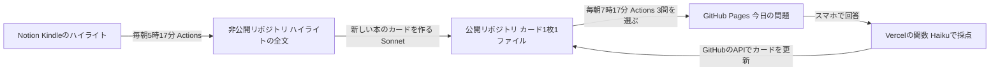
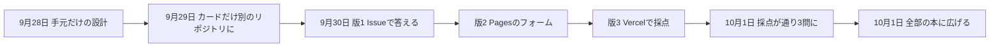

みなさん、こんな経験ありませんか？

「本を読むのは好きなんだけど、読んだ内容を忘れてしまうので実際に自分のものになっている気がしない・・・」

私、読書好きです。漫画が一番好きなのですが、ビジネス書も小説もまんべんなく読みます（お陰で積ん読がすごい・・・ｗ）

ただ、漫画や小説はさておき、ビジネス書で「あ、これ新しい学びだ」と思った部分って、ことごとく頭に残ってないんですよ（涙）

年齢も50歳近くになり記憶力も落ちているのでしょうか。

さて、今回はそんなお悩みを解決する仕組みを作っちゃったぜ！っていう話です。

今回の最も重要なポイントを結論から申し上げます。それは、AIに本を覚えさせるのではなく、AIに問題を出させて、自分が思い出すことです。

## この回の4点

| 困っていたこと | 人間が決めたこと | AI部下がやったこと | 結果 |
|---|---|---|---|
| Kindleの117冊・ハイライト約16,400行をAIが探せる形にしたが、私は仕事の場面で思い出せなかった | AIは出題係にする。主張と「なぜ自分に重要か」は自分で書く。毎朝スマホで1日3問。リポジトリを公開にする | 設計書、出題・採点・カード更新のコード、285枚のカードの一括作成 | 9月30日の1日で3回作り直して、今の形になった。10月1日に全部の本へ広げ、今は303枚・118冊 |

「非エンジニアのAI業務自動化」の別編です。前の2つの編（EX領収書自動出力編、Orcaマルチエージェント編）は仕事の道具でした。今回は、自分の読書に使っている仕組みです。

全3本で、1回目は、なぜ作ったかと、全体の構成、1日で3回作り直した経緯を書きます。

## noteに書いたことの続き

この仕組みを作った理由と、使ってみた手応えは、noteに書きました。

ひとことで言うと、こうです。

**「読んだ本を、AIではなく自分の頭から取り出せるようにしたい」**

noteは「なぜ」と「使ってみて」の話です。Qiitaでは「どう作り、何を決め、どこで直したか」を書きます。設定やコードの実物も載せます。

この編は、次の3本です。

- #1なぜ作ったか、全体の構成、1日で3回作り直した経緯（この記事）
- #2カード・出題・採点の実物
- #3運用でつまずいて直したことと、使ってみた数字

## 探せるのはAIで、私ではなかった

私は本をKindleで読み、線を引きます。引いた線（ハイライト）は、BookNotion Zというサービスが自動でNotionに保存してくれます。

9月28日に数えると、手元には117冊、ハイライトは約16,400行ありました。自分のメモが付いているのは、約25冊・約150件です。

これを、Claude Codeで自分用のwiki（ナレッジのまとめ）に取り込んでいました。AIが本の要約を書き、ページどうしをリンクでつなぎます。聞けば、どの本に何が書いてあったかをすぐ答えてくれます。

ただ、困っていたことは、少しも変わりませんでした。会議の途中で「あの本に書いてあった考え方」を使いたくても、出てこないのです。

AIに整理させたのは、「AIが探せる状態」でした。私の頭の中は、何も変わっていません。要約を読み返すだけでは、分かった気になるだけです。

そこで、AIにさせる仕事を変えることにしました。要約をさせるのをやめて、問題を出させます。

## 学習法の記事を、本に置き換えた

下敷きにしたのは、Qiitaで読んだ学習法の記事です。覚えたい項目ごとに「今どの段階か」と「最後に確かめた日」を記録し、自分の力で解き直していく方法でした。

この記事の要素を、本のハイライトに置き換えるとどうなるかを、AIと一緒に表にしました。

| 記事の要素 | 本での置き換え |
|---|---|
| 項目ごとに状態・優先度・最後に確かめた日を持つ | 本のアイデア1つを「カード」1枚にし、カードごとに状態・優先度・次に出す日を持たせる |
| 一度の正解を信用しない | 合格しても1段階ずつしか進めない。不合格なら1段階戻す。安定しても間を空けて確かめ直す |
| 日々の記録を、活動の目次にする | 各カードに回答の記録を残す。別に日記は書かせない |
| AIの説明のあと、自分で解いて、自分の言葉で説明する | AIは答えを先に出さない。自分の回答が先で、採点はあと |
| 答えを決まった観点で確かめる | 主張の正確さ・自分の具体例・使える条件と限界・次の行動の4つの観点で採点する |
| 仕事そのものを教材にする | 実際の仕事の場面を問いに使う |
| 毎日ゼロから考えない | 今日の3問は、仕組みが決める |

表の中の「自分の回答が先」は、今の仕組みでも変えていません。模範解答は、答えて採点されたあとにだけ出ます。

## 最初は手元だけで完結させた

9月28日の最初の設計では、データを外に出さないことにしていました。カードはObsidian（手元のMarkdownを読むノートアプリ）で開くファイルにし、Claude Codeのコマンドで問題を出させる形です。

1枚のカードは、次のような形でした。

```yaml:9月28日の設計にあったカードの例
---
title: マネジャーの成果は隣接組織のアウトプットまで含む
type: card
book: "[[entities/HIGH OUTPUT MANAGEMENT]]"
status: 要復習          # 未履修 / 要復習 / 学習中 / 要確認 / 安定
priority: 高            # 高 / 中 / 低
last_reviewed: 2026-09-28
next_review: 2026-09-29
streak: 0               # 別形式で連続合格した回数
tags: [マネジメント]
---
```

上の`---`で囲んだ部分は、frontmatterといいます。ファイルの先頭に置く、項目と値の一覧です。状態（`status`）・次に出す日（`next_review`）・続けて合格した回数（`streak`）を、ここに持たせました。この形は、今もほとんど変わっていません。

最初の決まりは、今とは少し違います。

- 1冊から作るカードは最大5枚
- AIが候補を最大8件出し、私が選ぶ
- まず3冊で試す（自分のメモが多い『HIGH OUTPUT MANAGEMENT』『V字回復の経営』『世界一流エンジニアの思考法』）

困ったのは、続けることでした。Macを開いてClaude Codeを起動しないと、問題が出ません。毎日欠かさず答えるには、Macに頼らない形が要りました。

## 毎日続けるため、スマホに出した

そこで、スマホで毎朝答えられる形に変えました。

スマホで答えるには、カードをネットの上に置く必要があります。9月29日に、カードだけを別の小さなリポジトリ（GitHubの保管場所）に分けました。wikiの側には個人の記録やキャリアの情報もあるので、そちらは混ぜません。

9月30日には、このリポジトリを公開にしました。問題のページを出すGitHub Pagesは、Freeプランでは非公開のリポジトリに使えないためです。

公開にすると、カードに書いた本の引用と、自分の振り返りが、誰でも読める場所に出ます。それを分かったうえで決めました。その代わり、本の引用は1枚あたり約100字の要点だけにし、全文はKindleのその場所へのリンクで辿る形にしています。

公開のリポジトリに置くことで、もう1つ守ることが増えました。秘密の値（APIのキーやGitHubのトークン）を、リポジトリにもページにも置かないことです。これが、次の作り直しにつながります。

## 全体の構成

今の構成は、次のとおりです。



- 出題とページは、GitHub ActionsとGitHub Pagesだけで動きます。ページは静的なHTMLで、その日の問題をJSONで持ちます。
- 回答の受け付けと採点だけ、Vercelのサーバーレス関数（Python）を1つ挟みます。関数がClaude APIで採点し、GitHubのAPIでカードのファイルを書き換えます。
- 秘密の値は、Vercelの環境変数にだけ置きます。
- Macを開いていなくても、毎朝問題が届きます。

## 毎朝動く2つのワークフロー

毎朝、2つのワークフローが順に動きます。

1つ目は5時17分です。非公開のリポジトリで、NotionからKindleのハイライトを取り込みます。続けて、新しく読んだ本のカードを作ります。本の全文を扱う処理は、ここで済ませます。公開のリポジトリは、Actionsのログも誰でも読めるからです。

2つ目は7時17分です。公開のリポジトリで、その日の3問を選び、ページを作り直します。

```yaml:.github/workflows/daily-question.yml（一部）
on:
  schedule:
    - cron: "17 22 * * *"  # 22:17 UTC = 07:17 JST (next day)。毎時0分は GitHub 側の混雑で数時間遅れるため分をずらしている（2026-10-02 変更。それまでは 08:00 JST）

      - name: Select due cards, build the interactive Pages site, and fire a notification Issue
        env:
          GH_TOKEN: ${{ secrets.GITHUB_TOKEN }}
          PYTHONPATH: scripts
          # 1日の出題数（現在 RECALL_LIMIT=3）。変更は `gh variable set RECALL_LIMIT --body N`（コード変更不要）
          RECALL_LIMIT: ${{ github.event.inputs.limit || vars.RECALL_LIMIT || '1' }}
          # 補完（未記入カードの記入）の1日あたり上限。採点ありの問いが足りない日は上限を超えて補完で埋める
          RECALL_FILL_LIMIT: ${{ vars.RECALL_FILL_LIMIT || '1' }}
        run: python scripts/select_and_post.py
```

出題の数は、リポジトリの変数`RECALL_LIMIT`で変えられます。コードを直さなくても、1問にも5問にもできます。この変数は、9月30日に「1問から始める」ために足したものです。

時刻が17分なのは、毎時0分に動かすと数時間遅れたからです。この話は#3で書きます。

問題ができたことは、GitHubの通知メールで知らせます。ワークフローがIssue（GitHubの課題の票）を1つ作ってすぐ閉じると、GitHubから通知メールが届きます。

メールのリンクを押すと、その日のページが開きます。メールを送る仕組みを別に作らずに済みました。Issueの本文には、ページへのリンクだけを書きます。Issueに答えることはないので、通知専用です。1つ目の版の名残で、この形だけが残りました。

## 1日で3回作り直した

スマホで答える形は、9月30日の1日で3回作り直しています。13時49分の最初のcommitから、16時3分にVercelへ切り替えるまで、約2時間でした。

| 版 | 回答の場所 | 採点する場所 | やめた理由 |
|---|---|---|---|
| 1 | GitHubのIssueのコメント | GitHub Actions | 同じ名前のIssueの取り違えと、番号のない回答の割り当て違い |
| 2 | Pagesのフォーム | GitHub Actions | ページにトークンを埋めると、自動で失効させられる |
| 3 | Pagesのフォーム | Vercelの関数 | 今の形 |

1つ目は、問題をIssueで出し、Issueのコメントに「A1.」のように番号を付けて答える形でした。これで2つの事故が起きました。

- 同じ日に同じタイトルのIssueができ、閉じた古い方に答えてしまった
- 番号を付けずに答えたら、1問目への答えとして扱われ、関係のないカードが書き換わった

2つ目では、答える場所をページのフォームにしました。どのカードへの答えかを、フォームが一緒に送ります。取り違えは、仕組みの上で起きなくなりました。

ただ、ページからActionsを起動するには、GitHubのトークンをページに埋める必要があります。公開のリポジトリでは、GitHubのsecret scanning（秘密の値の検出）がトークンを見つけて、自動で失効させます。何度入れても、使えなくなりました。

このとき、AIは原因を調べるために、一時的なワークフローを足しました。登録した秘密の値の長さだけをログに出すものです。値そのものは出さないものです。確かめたあと、5分後には消しています。原因が「埋めたトークンが失効させられている」と分かったので、ページにトークンを置く形そのものをやめることにしました。

そこで、秘密の値をGitHubの外に置くために、サーバーレス関数を1つ挟むことにしました。AIの案はCloudflare Workersでしたが、私はVercelを選びました。

もう1つ、つまずきがありました。Vercelの「Deployment Protection」がオンのままだと、ページから関数を呼べません。これを切って、ようやく3つ目の版が動きました。



## 1問から始めて、3問にした

9月30日は、「小さく始めるため、1問だけで試す」と決めました。最初の何日かは、まだ自分の言葉が入っていないカードが優先して出ます。この問いは記入だけで、採点はしません。

採点のある問いを初めて試した9月30日は、失敗しました。APIのクレジットが足りなかったためです。

10月1日に、採点まで通りました。「会議は場で完結させる」というカードの、思い出す問いです。8点中6点で合格し、カードは「学習中」に進みました。採点が通ったのを見て、その日のうちに1日3問に増やしました。

採点の結果は、カードの「回答履歴」に1行ずつ足していきます。

```markdown:回答履歴の1行の形（中身は架空の文）
## 回答履歴

- 2026-10-01 | 想起 | 6/8 | 合格 | （AIの一言のフィードバック）
  - 問い: 本を見ずに、この考えを自分の言葉で説明してください。
  - 回答: （自分の回答）
  - 内訳: 正確さ2・具体例2・適用条件1・次の行動1
  - 模範解答例: （AIが書いた模範解答）
```

最初の版では、1行目しか残していませんでした。何と答えて何点だったかを、あとで振り返れません。10月1日に、問い・回答・内訳・模範解答も残すようにしました。

リポジトリは公開なので、回答もネットに出ます。それでよいと決め、回答には顧客の名前などの固有名詞を書かないことにしました。

## 全部の本に広げた

3冊で採点まで動いたので、10月1日に全部の本へ広げました。

広げる前に、決まりを2つ変えています。

- 1冊のカードは5枚から3枚にした
- カードにするアイデアは、AIが選ぶことにした（自分のメモが付いたハイライトを優先する。合わないカードは、あとで消す）

AIが285枚を作り、全部で293枚・114冊になりました。ハイライトのない2冊は、カードがありません。同じ本の2つの版は、1冊として扱いました。

AIが書いた引用が、原文どおりとは限りません。そこで、カードに入れた引用が、Kindleのハイライトの原文に一字一句含まれるかを、スクリプトが確かめます。

```python:scripts/kindle_update.py（引用の確かめ）
def quote_in(quote, text):
    """A card quote may skip words with … ; every piece must be in the highlight."""
    parts = [p for p in re.split(r"…|\.\.\.", quote) if squash(p)]
    return bool(parts) and all(squash(p) in squash(text) for p in parts)
```

途中を「…」で省いた引用も、省いた前後のそれぞれが原文に含まれていれば通します。通らないカードは捨てます。

macOSのファイル名で、同じ本が別の本として扱われたこともあります。文字の表し方（Unicodeの正規化）がファイルによって違ったためで、全部をそろえて直しました。

新しいカードは、主張だけAIの下書きで、「なぜ自分に重要か」と「使う場面」は空けてあります。ここを埋める問いは1日1問までなので、全部のカードを埋め終わるには、約9か月かかります。早めたいときは、変数`RECALL_FILL_LIMIT`を2にすれば1日2問になります。その分、採点のある問いの枠が減るので、進み具合を見て決めます。

今は、新しく読んだ本のカードを、毎朝5時17分にAIが足しています。10月9日の時点で、303枚・118冊です。

## 任せたところ、決めたところ

コード・ワークフロー・テスト・設計書は、すべてClaude Codeが書きました。私が決めたのは、次のことです。

| 日付 | 私が決めたこと | 理由 |
|---|---|---|
| 9月28日 | 主張と「なぜ自分に重要か」は、AIに代わりに書かせない | AIが書くと、また読むだけに戻るため |
| 9月30日 | リポジトリを公開にする。引用は約100字まで | GitHub PagesをFreeプランで使うため |
| 9月30日 | 秘密の値の置き場所はVercelにする | 秘密の値をGitHubの外に置くため |
| 9月30日 | 1問から始める | 小さく試してから増やすため |
| 10月1日 | 3問に増やす。同じ本は1日1枚。進むのは1日1段階まで | 採点が通ったため。詳しくは#2 |
| 10月1日 | 回答も公開のリポジトリに残す。固有名詞は書かない | あとで振り返るため |
| 10月1日 | 1冊3枚にし、選ぶのはAIに任せる | 全部の本に広げるとき。合わないカードはあとで消す |

どれも、決め方によって「何のための仕組みか」や、何が外に出るかが変わる所です。コードの書き方は任せても困りませんでした。ここは任せると、あとで自分の意図と違うものになると思いました。

## この回のマネージャーの仕事

この回で、人間（私）が決めたことと、AIがやったことを分けて書きます。

私が決めたのは、AIを要約係から出題係に替えることでした。手元だけで完結させる設計から、毎日続けるためにスマホへ出すと決めたのも私です。公開にするか、秘密の値をどこに置くか、1問から始めるか、全部の本に広げるかも決めました。

AIがやったのは、学習法の記事を本に置き換えた設計、3つの版のコードとワークフロー、285枚のカードの作成、引用の確かめです。2つ目の版でトークンが失効した原因を見つけたのもAIです。

1日で3回作り直したとき、私がしたのは「Issueで答えるのはやめる」「Vercelにする」と決めることでした。書き直しは、毎回AIがしました。

## 次回

次回は、カード・出題・採点の実物を見せます。カードのファイルの形、3問の選び方のコード、採点の指示文と合格の線、カードが次に出る日の決め方です。

連載の目次

- #1AIには、要約より出題をさせる（この記事）
- #2状態は、カード1枚に持たせる
- #3書く前に試すと、ずれが見つかる

## 参考

- 下敷きにした学習法の記事（Qiita）：[https://qiita.com/SHIBATATA/items/c40eaabbe4a283f706e0](https://qiita.com/SHIBATATA/items/c40eaabbe4a283f706e0)
- BookNotion Z：[https://z.booknotion.site/ja](https://z.booknotion.site/ja)
- GitHub Pages：[https://docs.github.com/ja/pages](https://docs.github.com/ja/pages)
- Vercelの関数（Python）：[https://vercel.com/docs/functions/runtimes/python](https://vercel.com/docs/functions/runtimes/python)
- GitHubのsecret scanning：[https://docs.github.com/ja/code-security/secret-scanning](https://docs.github.com/ja/code-security/secret-scanning)
- 前の編（Orcaマルチエージェント編）#1：[https://qiita.com/horiken1977/items/7a3437f61b74b064f13c](https://qiita.com/horiken1977/items/7a3437f61b74b064f13c)
