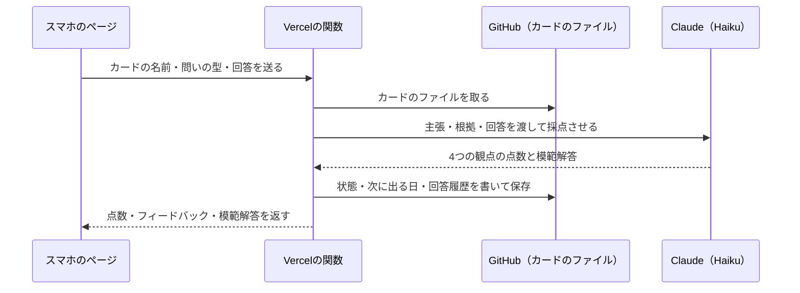
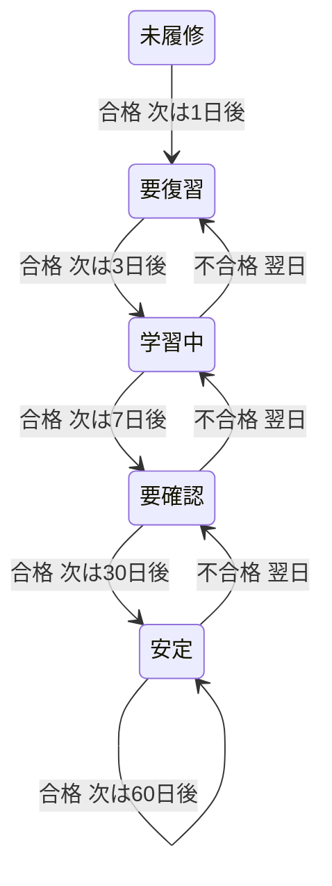

今回の最も重要なポイントを結論から申し上げます。それは、状態はカードのMarkdown1枚に全部持たせ、出題と採点はそれを読み書きするだけにすることです。

## この回の4点

| 困っていたこと | 人間が決めたこと | AI部下がやったこと | 結果 |
|---|---|---|---|
| 最初の版は回答の本文を残さず、何と答えて何点だったかを振り返れなかった。同じ日に型を変えて答えると、1日に2段階進むカードがあった | 回答はカードの回答履歴に残す（公開でよい。固有名詞は書かない）。進むのは1日1段階まで。模範解答に、本に書いていないことを足させない | カードの形、3問の選び方、採点の指示文、状態の更新、テスト | カード1枚に、状態と回答の全部が入る。出題も採点も、そのファイルを読んで書くだけで動く |

前回（#1）は、なぜ作ったかと、9月30日の1日で3回作り直した経緯を書きました。今回は、今動いているカード・出題・採点の実物を見せます。

## 1回の回答の流れ

スマホで1問に答えると、次の順に動きます。



カードのファイルが、ただ1つの正本です。ページはその日の問題を見せるだけで、状態は持ちません。関数も、カードを読んで書いたら終わりです。データベースは使っていません。

1回答えるたびに、カードのファイルへのcommitが1つできます。書き込むのは`recall-bot`という名前で、commitの見出しには日付が入ります。GitHubの履歴を見れば、いつどのカードに答えたかも追えます。

## カードは1アイデア1ファイル

カードは、本のアイデア1つにつき、Markdownのファイル1つです。ファイル名がカードの名前になります。

```yaml:カードのfrontmatter
---
title: カードタイトル（アイデアの一言）
type: card
book: "[[entities/書籍エンティティ名]]"
status: 未履修          # 未履修 / 要復習 / 学習中 / 要確認 / 安定
priority: 中            # 高 / 中 / 低
last_reviewed:          # YYYY-MM-DD（未実施なら空）
next_review: YYYY-MM-DD
streak: 0               # 連続で合格した回数（1日に増えるのは1回まで）。問いの型を決める
tags: []
---
```

本文の見出しは、次の5つです。

- 主張：アイデアを自分の言葉で1文にしたもの
- 根拠：ハイライトの要点（約100字）と、Kindleのその場所へのリンク、自分のメモ
- なぜ自分に重要か：自分の仕事や生活に照らして1行
- 使う場面：「〇〇のとき、これを使う」の形
- 回答履歴：新しい順に、1回の回答を1つの箇条で

回答履歴は、1行目に日付・問いの型・点数・合否・一言のフィードバックを書きます。その下に、字下げして問い・回答・点数の内訳・模範解答を足します（形は#1に載せました）。

1行目の区切りは「|」です。フィードバックの中に「|」や改行が入ると、行の形が崩れて読めなくなります。そこで、書く前に必ずこの関数を通します。

```python:api/grade.py（回答履歴に書く前の整形）
def sanitize(text):
    """Keep a value on one history line: no pipes (column separator) or newlines."""
    text = html.unescape(str(text or ""))
    text = text.replace("|", "｜")
    return " / ".join(part.strip() for part in text.splitlines() if part.strip())
```

「|」は全角の「｜」に、改行は「 / 」に置き換えます。この1行の形がそろっているので、あとで合格率を数えるときも、この行を読むだけで済みます。

## 「書いた」の合図は目印を消すこと

AIが作ったばかりのカードは、主張だけがAIの下書きです。「なぜ自分に重要か」と「使う場面」は空けてあり、代わりに目印の行が入っています。

| 節 | 目印の行 |
|---|---|
| 主張 | （AIの下書き。初回の /recall で自分の言葉に直す） |
| なぜ自分に重要か | （未記入：初回の /recall で自分の言葉で1行書く） |
| 使う場面 | - （未記入：使う場面を初回の補完で書く） |

この目印の行が1つでも残っていれば、そのカードは「まだ書いていない」カードです。毎朝、1日1問まで、ここを埋める問い（補完）が出ます。補完の問いは採点しません。

目印は、行がまるごと一致したときだけ目印として扱います。回答の中に「（未記入」という文字があっても、反応しません。

出題する側と採点する側は、別の場所で動きます。出題はGitHub Actions、採点はVercelです。Vercelの関数は出題側のコードを読み込めないので、同じ判定を2か所に書いています。2つの判定がずれないように、全部のカードで両方の答えが同じかを確かめるテストがあります。

## 3問の選び方

毎朝のActionsは、全部のカードを読み、次のコードで3問を選びます。

```python:scripts/lib.py（select_cards の中心）
    # 補完の候補は、自分のメモが付いたハイライトを根拠に持つカードを先に出す
    unfilled = sorted([c for c in cards if is_unfilled(c)],
                      key=lambda c: (prio(c), 0 if "自分のメモ" in c["body"] else 1))
    # 期限到来の採点の問いは、前回不合格のカードを先に（翌日に確実に出し直す）、続いて正答率の低い順、priority・超過日数の順
    due = sorted([c for c in cards if not is_unfilled(c) and is_due(c)],
                 key=lambda c: (0 if last_failed(c) else 1, pass_rate(c), prio(c), -days_overdue(c)))
    candidates = [(c, "fill") for c in unfilled] + [(c, qtype_for(c)) for c in due]

    picked = []
    used_books = set()
    fills = 0
    for card, qtype in candidates:
        if len(picked) >= limit:
            break
        book = book_name(card)
        if book in used_books:
            continue
        if qtype == "fill":
            if fills >= MAX_FILL_PER_DAY:
                continue
            fills += 1
        picked.append((card, qtype))
        used_books.add(book)
```

並べる順は、次のとおりです。

- まだ書いていないカードの補完（優先度の高い順、自分のメモ付きを先に）
- 次に出す日が来たカードのうち、前回不合格だったもの
- 合格率の低いもの
- 優先度の高いもの、期限を過ぎた日数の長いもの

上から取っていき、同じ本のカードは1日1枚までにします。補完の問いは1日1問までです。採点のある問いが足りない日は、空いた枠を補完で埋めます。別の本のカードが足りなければ、3問より少なくてかまいません。

「同じ本は1日1枚」は、10月1日に私が決めました。9月28日の最初の設計にも、「別の本を混ぜる（インターリーブ）」と書いていました。

前回不合格のカードを一番先に置いたのは10月4日、合格率の低い順を足したのは10月8日です。不合格だったカードを、翌日に確実に出し直すためです。

合格率は、回答履歴の1行目のうち、合否の付いた行だけを数えて出します。補完の行は数えません。まだ採点の記録がないカードは、合格率を1（100%）として扱います。記録のないカードが、合格率の低いカードより先に出ないようにするためです。

## 問いの型は合格で上がる

同じカードでも、続けて合格した回数（`streak`）で、問いの型が変わります。

| streak | 型 | 問い方 | 回答の軸 |
|---|---|---|---|
| 0 | 想起 | 本を見ずに、自分の言葉で説明する | 正確さ・具体例・適用条件・次の行動 |
| 1 | 適用 | 今週の実際の場面でどう使うか | 場面・使い方・適用条件・次の行動 |
| 2 | 対比・接続 | 別のカードの考えと、どこで対立し補い合うか | 対立・補完する点・具体例・効く条件・次の行動 |
| 3 | 反証 | 成り立たない場面はどこか | 成り立たない場面・理由・使える範囲・次の行動 |

4回目より先は、この4つを回します。

問いの終わりには、「回答の軸」を付けています。10月4日に足しました。何を書けばよいかの枠があると、白紙で止まらずに書き始められます。

```python:scripts/select_and_post.py（問いの文と回答の軸）
QUESTION_TEXT = {
    "recall": "本を見ずに、この考えを自分の言葉で説明してください。",
    "apply": "今週の実際の場面を1つ挙げ、その場面でこの考えをどう使うか説明してください。",
    "contrast": "この考えと、下の別の考え方がどこで対立・補完するかを説明してください。",
    "refute": "この考えが成り立たない場面を1つ挙げて説明してください。",
}

# 回答の軸（型ごと。問いの本文・比較対象のあとに付ける）
ANSWER_AXES = {
    "recall": "①正確さ ②具体例 ③適用条件 ④次の行動",
    "apply": "①場面 ②使い方（何をどうするか） ③適用条件 ④次の行動",
    "contrast": "①対立・補完する点 ②具体例 ③どちらが効く条件 ④次の行動",
    "refute": "①成り立たない場面 ②理由 ③それでも使える範囲 ④次の行動",
}
```

スマホでは、次のように出ます。


*「適用の問い」と、その下の回答の軸です*

対比の問いでは、比べる相手のカードを1枚選んで、問いに添えます。相手は、すでに自分の言葉が入っていて、別の本のカードから、カードと日付で決まる1枚です。日が変わると相手も変わります。この選び方は、記事を書く前の試験で見つかったずれを直したものです。#3で書きます。

## ページはJSON1つで作る

毎朝のActionsは、選んだ3問を1つのJSONに書き、ページと一緒にGitHub Pagesへ出します。

```json:docs/today.json（例）
{
  "date": "2026-09-30",
  "questions": [
    {
      "card": "会議は場で完結させる.md",
      "qtype": "apply",
      "title": "会議は場で完結させる",
      "book": "世界一流エンジニアの思考法",
      "text": "今週の実際の場面を1つ挙げ、その場面でこの考えをどう使うか説明してください。",
      "fields": ["text"]
    }
  ]
}
```

JSONは毎朝上書きし、前の日の分は残しません。過去の回答は、各カードの回答履歴を見れば分かるからです。問いの文やカードの名前は、JSONに書く前にHTML用の書き方に直しておきます。

ページの中の小さなスクリプトが、このJSONを読んで問いを並べます。`fields`は、その問いに出す入力欄です。補完の問いでは、主張・なぜ重要か・使う場面の3つの欄を最初から分けて出します。1つの欄に書かせてあとで分ける形にすると、分け方を間違える心配が出るからです。

答えを送るときは、カードの名前と問いの型を一緒に送ります。#1で書いた、Issueで答えていたころの取り違えは、これで起きなくなりました。

答えたあとの結果は、ブラウザの中にだけ残します。同じ日にページを開き直しても、結果が出ます。消えても困りません。正本はカードのファイルだからです。

## 採点の指示文

採点は、VercelのPythonの関数が、Claude Haiku 4.5を1回だけ呼んで行います。指示文は次のとおりです。

```python:api/grade.py（採点の指示文）
    prompt = f"""あなたは学習コーチです。以下のカードの主張と、ユーザーの回答を4軸で採点してください。

カード「{title}」
主張: {claim_text}
根拠: {evidence_text}
問いの型: {qtype_label}
ユーザーの回答: {answer}

4軸を各0〜2点で採点してください。あわせて、この問いの型に対する模範解答例を1つ書いてください。
模範解答例は、カードの主張・根拠に沿い、4軸（主張の正確さ／自分の具体例／適用条件と限界／次の行動）をすべて満たす、本人が書いたような一人称の日本語で3〜5文。
模範解答例で本の内容として書くのは、上の「主張」と「根拠」（ハイライトの引用と本人のメモ）にあることだけにする。根拠にない本の記述・エピソード・数字・人名・用語を付け足したり、根拠にないことを本が述べているかのように書いたりしない。
「自分の具体例」の部分だけは、主張が当てはまる場面を例として作ってよい（ただし本の内容としては書かない）。
必ず次のJSON形式のみで返してください（説明文やマークダウンは付けない）：
{{"accuracy": 0-2, "example": 0-2, "conditions": 0-2, "action": 0-2, "feedback": "1〜2文の短いフィードバック（日本語）", "model_answer": "模範解答例（日本語・3〜5文）"}}
"""
```

点数とフィードバックと模範解答を、1回の呼び出しでJSONにして返させます。関数は返ってきた文から`{`と`}`で囲まれた部分を取り出して読みます。

AIに渡すのは、カードの主張と根拠と、私の回答だけです。本の全文は渡しません。採点は、カードに書いたことを基準にします。

採点を待つ間、ページのボタンは「送信中…」になります。採点が返ると、その問いの欄に点数と模範解答が出ます。通信が失敗したときは、入力を消さずにボタンを「再送信」に戻します。スマホで長く書いた答えが、失敗で消えることはありません。

## 合格の線は5点と正確さ

4つの観点を0〜2点で付け、8点満点です。合否は、次の2行で決まります。

```python:api/grade.py（合否と1日1段階）
    score = result["accuracy"] + result["example"] + result["conditions"] + result["action"]
    passed = score >= 5 and result["accuracy"] >= 1

    # 1日1段階まで：今日すでに合格して昇格していれば、2回目以降の合格では状態を進めない
    passed_today = any(d == today.isoformat() and v.strip().startswith("合格")
                       for d, _, _, v in HIST_RE.findall(body))
```

合計5点以上で、かつ主張の正確さが1点以上なら合格です。主張を外した答えは、具体例や次の行動で点を取っても通りません。


*合格の点数と内訳、フィードバック、模範解答例です*

この回のフィードバックには、「本の根拠にない概念を持ち込んでいる」と書かれていました。採点も、カードに書いた主張と根拠を基準に見ているようです。

## 状態と次に出る日

合格すると状態が1段階進み、次に出る日が延びます。不合格なら1段階戻り、翌日にまた出ます。



| 結果 | カードの更新 |
|---|---|
| その日はじめての合格 | 状態を1段階進め、streakを1つ増やす |
| 同じ日の2回目以降の合格 | 状態もstreakも次に出る日も変えない |
| 不合格 | 状態を1段階戻す（未履修・要復習はそのまま）。streakを1つ減らす。次は翌日 |
| 補完で書いた | 書いていない節だけを書き換え、要復習にする。次は翌日 |

不合格でstreakが1つ減ると、問いの型も1つ前に戻ります。たとえば対比の問いで不合格になると、翌日は適用の問いが出ます。

安定のカードは、初めて上がったときは30日後、安定のまま合格したら60日後に出ます。この決まりも、記事を書く前の試験で、コードとずれていたのを見つけて直しました。

## 補完は、空いた節だけ書く

補完の問いには、AIを呼びません。送られた3つの欄を、カードの節に書き込むだけです。

書き込むのは、まだ目印の行が残っている節だけです。すでに書いた節は、送られてきても書き換えません。3つとも書いてあれば、何も書かずに「もう記入済み」と返します。

書いたカードは「要復習」になり、翌日から採点のある問いに回ります。書いた直後は、思い出す練習にならないからです。ただし、すでに「学習中」より先に進んでいるカードは、状態を戻しません。

回答は1行にそろえてから書きます。改行は「 / 」に置き換え、行の頭の「#」は見出しと読まれないように「\#」にします。

## 1日1段階にした理由

10月1日に、同じカードを1日のうちに2回答えました。思い出す問いで合格して「学習中」に、続けて使う場面の問いで合格して「要確認」に進みました。1日で2段階です。

最初の決まりは「前と別の日・別の型の問いに合格したときだけ進む」でした。コードは「同じ日で、かつ同じ型」のときだけ止めていたので、型を変えると同じ日でも進んでいたのです。

AIは、もう1つ不具合を見つけました。新しい回答は履歴の一番上に足すのに、「直前の回答」として一番古い行と比べていました。

私は、型を問わず「1日1段階まで」と決めました。その日はじめての合格だけで進めます。上の`passed_today`が、その判定です。次の段階に進むのは、別の日にもう一度合格したときになりました。

## 本にないことを足させない

採点の指示文で一番長いのは、模範解答の決まりです。10月2日に足しました。

模範解答は、AIが「本人が書いたような一人称」で書きます。模範解答は、答えたあとに必ず読みます。もし本にない話や数字が混ざっていたら、それを本の内容として覚えてしまいます。

そこで、本の内容として書くのは、カードの主張と根拠にあることだけにしました。「自分の具体例」だけは、例として作ってよいことにしています。具体例が作り話でも、本の内容の嘘にはならないからです。

## 新しい本はSonnetが作る

新しく読んだ本のカードは、毎朝5時17分にClaude Sonnet 5.5が作ります。渡すのは、その本のハイライトとメモ、すでにあるカードの名前の一覧、タグの一覧です。

決まりは、次のとおりです。

- 作るのは、その本に足りない枚数まで（1冊3枚まで）。価値のあるアイデアが少なければ、少なくてよく、0枚でもよい
- 選ぶ順は、自分のメモが付いたハイライト、本の中心の主張、ほかの本のカードとつながる論点
- すでにあるカードと同じ論点は避ける。一覧を渡して、重ならないようにさせる
- 引用は、ハイライトの本文から要点だけを一字一句そのまま抜き出す。言い換え・要約・語の追加はしない。途中を省くときは「…」を使う
- 引用を抜き出したハイライトの位置（Location）を、渡した値のまま返す
- 主張は1〜2文の下書き。私があとで自分の言葉に直す

答えは決まった形のJSONで返させ、スクリプトが1枚ずつ疑います。

```python:scripts/kindle_update.py（作ったカードの検査）
        h = next((x for x in candidates if x["loc"] == loc and quote_in(quote, x["text"])), None)
        if not title or title in used_titles or os.path.exists(os.path.join(CARDS_DIR, title + ".md")):
            print(f"  skip (title taken): {title}")
            continue
        if h is None or len(quote) > MAX_QUOTE_CHARS:
            print(f"  skip (quote not verbatim or too long): {title} / L{c['loc']} {quote[:40]}")
            continue
```

タイトルが既存のカードと重なるもの、引用が原文に一字一句含まれないもの、長すぎるものは捨てます。引用の上限は120字にしています。決まりの「約100字」に、少し余裕を持たせた数です。

新しいカードは優先度を「高」にします。補完の問いは優先度の高い順に出るので、読んだばかりの本のカードが、翌朝の補完に出ます。

## この回のマネージャーの仕事

この回で、人間（私）が決めたことと、AIがやったことを分けて書きます。

私が決めたのは、次のことです。

- 回答の本文もカードに残す。公開のリポジトリに出てよい。その代わり、回答には固有名詞を書かない（10月1日）
- 進むのは1日1段階まで。問いの型は問わない（10月1日）
- 同じ本のカードは1日1枚まで（10月1日）
- 模範解答に、本に書いていないことを足させない（10月2日）

AIがやったのは、カードの形、選び方のコード、採点の指示文、状態の更新、補完の書き換え、目印の判定、テストです。1日に2段階進んだ原因と、履歴の比べ方の不具合を見つけたのもAIでした。

カードを1枚のMarkdownにしたのは、9月28日の最初の設計からです。Obsidianで開いても、GitHubで開いても、同じ1枚が読めます。

Macで答えたり、カードを作ったりもできます。Claude Codeのコマンドを動かす前に、カードのリポジトリを取り込み、終わったら送り返します。同じカードをMacとスマホで同じ日に書くと衝突するので、毎日の回答はスマホに任せ、Macでは新しいカードを作るときや、じっくり振り返るときだけ使います。

テストは、今は106件あります。ネットワークには出ず、GitHubとClaudeは偽物に差し替えて動かします。

## 次回

次回は、使い始めてからつまずいて直したことと、記事を書く前に試験をして見つけた2つのずれ、10日間の数字を書きます。

## 参考

- Claude APIの料金：[https://www.anthropic.com/pricing](https://www.anthropic.com/pricing)
- Mermaidの状態遷移図：[https://mermaid.js.org/syntax/stateDiagram.html](https://mermaid.js.org/syntax/stateDiagram.html)
- Mermaidシーケンス図：[https://mermaid.js.org/syntax/sequenceDiagram.html](https://mermaid.js.org/syntax/sequenceDiagram.html)
- Obsidian：[https://obsidian.md/](https://obsidian.md/)
