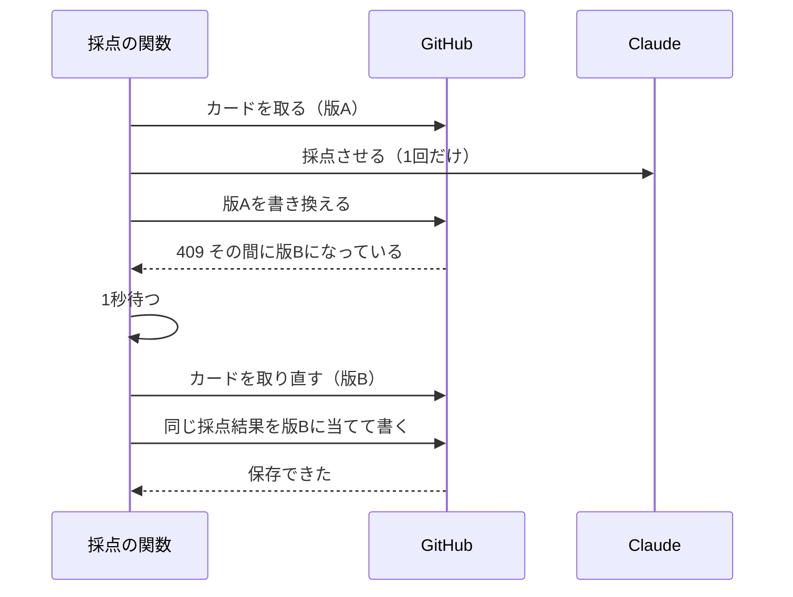
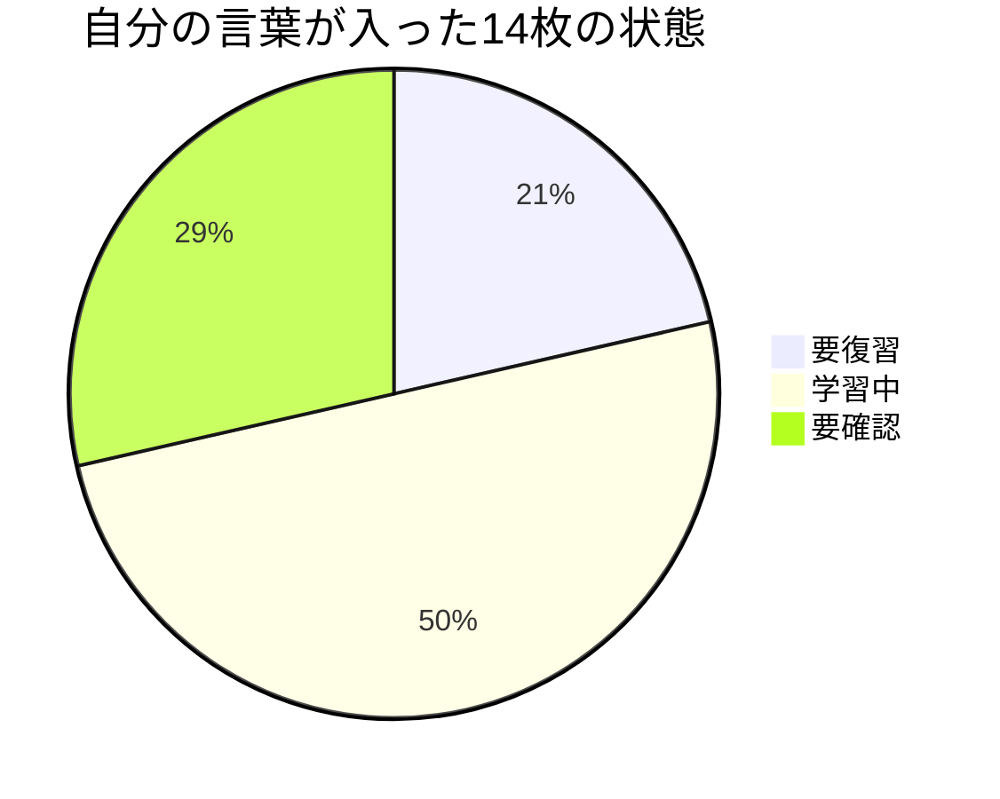

今回の最も重要なポイントを結論から申し上げます。それは、AIが作った仕組みは、使って、数えて、試してから直すことです。

## この回の4点

| 困っていたこと | 人間が決めたこと | AI部下がやったこと | 結果 |
|---|---|---|---|
| 動き始めてから、遅れ・取りこぼし・改行の消え・誰でも呼べる採点のAPIが順に見つかった。この記事を書く前の試験で、設計と違う動きが2つ見つかった | 共有のキーを使わず、送信元の検査と1日30件の上限にする。ずれは設計どおりに直す。直してから記事を書く | 原因の調査と修正、テスト、設計書の更新、数え直し、記事の試験 | 10日で回答35回。採点のある問いは21回中16回が合格。テストは101件から106件になった |

前回（#2）は、カード・出題・採点の実物を見せました。今回は、使い始めてから直したことと、この記事を書く前にした試験、10日間の数字を書きます。

## 10日間に直したこと

使い始めた9月30日から10月9日までに、主に次のことを直しました。

| 日付 | 起きたこと | 直し方 |
|---|---|---|
| 10月2日 | 毎朝の出題が数時間遅れた | 8時0分から7時17分にずらした |
| 10月2日 | 同じ位置の別のハイライトを捨てていた | 位置と本文の2つで照らすようにした。9冊・30件を取り戻した |
| 10月2日 | 同時に保存すると失敗した | 1回だけ取り直して、同じ採点結果を当て直す |
| 10月4日 | 不合格のカードを、翌日に確実に出す決まりがなかった | 前回不合格のカードを一番先に出す |
| 10月8日 | 合格率を、出題の順に使っていなかった | 合格率の低い順に出す |
| 10月8日 | 補完のあと、カードの末尾の改行が消えた | 元の改行を残して書く |
| 10月9日 | 採点のAPIを誰でも呼べた | 送信元の検査と、1日30件の上限 |
| 10月9日 | 安定の日数と、対比の相手が設計とずれていた | 設計どおりに直した（この記事を書く前の試験で見つけた） |

どれも、原因を調べて直したのはAIです。直し方に選択肢があるときは、私が選びました（採点のAPIの守り方など）。

## 毎時0分は数時間遅れた

最初は、毎朝8時0分に出題のワークフローを動かしていました。ところが、問題が届くのが数時間遅れる日がありました。

GitHub Actionsの定時実行は、毎時0分に混みます。混むと、起動が遅れたり抜けたりします。そこで10月2日に、17分にずらしました。

```yaml:.github/workflows/daily-question.yml
  schedule:
    - cron: "17 22 * * *"  # 22:17 UTC = 07:17 JST (next day)。毎時0分は GitHub 側の混雑で数時間遅れるため分をずらしている（2026-10-02 変更。それまでは 08:00 JST）
```

時刻はUTC（協定世界時）で書きます。22時17分UTCは、日本時間の翌朝7時17分です。Kindleの取り込みも、毎時0分を避けて5時17分にしています。

## 同じ位置の別のハイライト

Kindleのハイライトには、位置（Location）の番号が付きます。この番号は粗く、同じ番号に別のハイライトが入ることがあります。

10月2日に、新しく読んだ本のカードを自動で作る仕組みを足しました。そのとき、取り込みの処理が、同じ位置のハイライトを1件にまとめて、2件目以降の本文を捨てていたことが分かりました。直すと、9冊・30件のハイライトが戻りました。

カードの根拠になったハイライトを探すときも、位置だけでなく本文で照らします。

```python:scripts/kindle_update.py（根拠のハイライトを探す）
def evidence_highlights(info, hls):
    """loc -> the raw highlight the card quotes at that location (None if not found)."""
    out = {}
    for loc in info["locs"]:
        at_loc = [h for h in hls if h["loc"] == loc]
        hit = next((h for h in at_loc if any(quote_in(q, h["text"]) for q in info["quotes"])), None)
        if hit is None and len(at_loc) == 1 and not info["quotes"]:
            hit = at_loc[0]
        out[loc] = hit
    return out
```

同じ位置のハイライトの中から、カードの引用を含むものを選びます。毎朝のKindleの取り込みでは、カードについて次の4つを見ています。

- 根拠のハイライトに自分のメモが付いた・変わった：カードのメモの行を足す・置き換える
- 根拠の引用が、ハイライトの本文に見つからない：書き換えずに、メールで「要確認」と知らせる
- カードのない本や、3枚に満たない本に、新しいハイライトが入った：AIが新しいカードを作る
- カードが3枚ある本に、メモ付きのハイライトが入った：作らずに、入れ替えの候補としてメールで知らせる

カードの主張・なぜ重要か・使う場面・回答履歴には、取り込みの処理は触りません。消すこともしません。入れ替えや削除は、メールを見て私が決めます。

## 同時に保存すると409

カードを書き換えるときは、GitHubのAPIに「このファイルの、この版を書き換える」と送ります。その間に、ほかの誰かが同じファイルを書き換えていると、GitHubは409（衝突）を返します。Macからカードを送った直後や、別のタブから答えたときに起きます。

10月2日に、採点のAPIをまとめて直しました。このときは、前の編で書いたOrcaの仕組みで、設計とレビューを複数のAIに回させています。経緯は前の編の#4に書きました。

衝突したときの動きは、次のとおりです。

```python:api/grade.py（衝突したら1回だけやり直す）
def commit_with_retry(filename, card, apply_fn, date):
    """Apply and save. On a 409, wait, re-read the card once and re-apply the same result
    (Claude is not called again); a second 409 is save_conflict."""
    new_text, response = apply_fn(card)
    try:
        save_card(filename, new_text, card["sha"], date)
        return response
    except SaveConflict:
        print(f"save conflict on {filename}; retrying once", file=sys.stderr)

    time.sleep(RETRY_WAIT_SEC)
    fresh = load_card(filename)
    new_text, response = apply_fn(fresh)
    try:
        save_card(filename, new_text, fresh["sha"], date)
        return response
    except SaveConflict:
        raise ApiError(409, "save_conflict", extra=unsaved_of(response)) from None
```



大事なのは、Claudeを呼び直さないことです。採点の結果はそのまま使い、取り直したカードに当て直します。Claudeを呼ぶのは、1回の回答につき1回だけです。

取り直す前に1秒待つのは、衝突の直後にカードを取ると、まだ古い版が返ってくることがあるためです。状態や1日1段階の判定は、取り直したカードから計算し直します。

2回目も衝突したら、ページに「保存できなかった」と返し、私が送り直します。このときも採点の結果は一緒に返すので、点数とフィードバックは読めます。GitHubが時間切れや5xxを返したときは、やり直しません。GitHubの側では保存できていることがあり、やり直すと回答履歴が2行になるからです。

この日は、送られてくる中身の検査も足しました。本文の大きさ、カードの名前の形（ファイルの外を指す名前は受け付けない）、回答の長さ（4,000字まで）などです。だめなものは、GitHubもClaudeも呼ぶ前に止めます。

## 不合格を翌日、先に出す

10月4日に、前回不合格だったカードを、次の日の一番先に出すようにしました。10月8日には、合格率の低い順を足しました。どちらも、回答履歴の1行目だけを読んで決めます。

```python:scripts/lib.py（前回の合否と合格率）
def last_failed(card):
    for _, qtype, _, verdict in HIST_RE.findall(card["body"]):
        verdict = verdict.strip()
        if qtype.strip() == "補完" or "テスト" in verdict:
            continue
        return verdict == "不合格"
    return False


def parse_history(card):
    graded = passed = 0
    for _, qtype, _, verdict in HIST_RE.findall(card["body"]):
        verdict = verdict.strip()
        if qtype.strip() == "補完" or "テスト" in verdict:
            continue
        if verdict in ("合格", "不合格"):
            graded += 1
            passed += verdict == "合格"
    return graded, passed
```

回答履歴は新しい順に並んでいるので、上から読んで、最初に見つかった採点ありの行が前回です。補完の行と、試しのページで答えた「テスト」の行は飛ばします。#2で書いた「1行の形をそろえる」決まりが、ここで効いています。

## 補完で末尾の改行が消えた

10月8日に、補完で書いたカードの末尾の改行が消えているのが見つかりました。回答履歴がまだ空のカードで起きます。

書き込むときに、元のカードの末尾の改行を残すように直しました。直したあとは、回答履歴が空のカードでも、補完の前と後で末尾が変わらないことをテストで確かめています。

こうした小さなずれは、カードのファイルを開くと見えます。#2で書いたように、カード1枚が正本なので、おかしいと思ったら、そのファイルを見れば済みます。

## 採点のAPIは誰でも呼べた

採点のAPIのURLは、公開のページに載っています。ページからしか呼ばれない作りに見えますが、URLを知っていれば、誰でも外から送れます。

関数は、私のページだけに返事を読ませる設定（CORS）にしてあります。ただ、これはブラウザが守る決まりです。ブラウザを通さずにコマンドで送れば、関数は動きます。悪用されると、Claudeの費用がかかり、カードも書き換えられます。

10月9日に、これを塞ぎました。最初に考えたのは、合言葉（共有のキー）をページに埋める方法です。ところが、ページは公開のHTMLなので、埋めたキーは誰でも読めます。これは採りませんでした。

代わりに、2つを足しました。

```python:api/grade.py（送信元の検査と1日の上限）
def origin_error(origin):
    """送信元の検査（2026-10-09 の方式 (b)）。ページ（ALLOWED_ORIGIN）以外からの呼び出しを止める。
    curl などは Origin を偽れるので、防げるのはブラウザで他のサイトから使われることまで。"""
    if origin != ALLOWED_ORIGIN:
        return ApiError(403, "forbidden_origin")
    return None

    n = int(counts.get(key, 0)) if isinstance(counts, dict) else 0
    if n >= DAILY_LIMIT:
        raise ApiError(429, "daily_limit", {"message": DAILY_LIMIT_MESSAGE})
```

1つ目は、送信元（Origin）の検査です。私のページ以外から送られたものは、中身を読まずに断ります。

2つ目は、1日30件の上限です。私の1日の回答は4回ほどなので、30件あれば足ります。

件数は、カードのリポジトリの小さなJSONファイルに、その日の分だけ書きます。Vercelの関数は呼ばれるたびに別の場所で動くので、関数の中では数えられないためです。上限に達すると、「今日の採点はここまで。明日また」と返します。同じ瞬間に2件が来て、件数の書き込みがぶつかったときは、片方に「少し待ってからもう一度」と返します。

正直に書くと、これで全部を防げるわけではありません。送信元は、コマンドから送れば偽れます。防げるのは、ほかのサイトのページから使われることと、費用とカードの書き換えの上限までです。URLを知っている人が、1日30件まで使うことは防げません。それでよいと決めました。

## 記事を書く前に試験をした

この連載は、最初は1本の記事でした。読み直して浅いと感じたので、前の編（Orca）と同じ量と深さで3本に組み直すことにしました。そのとき、書く前に2つの試験をすると決めました。

1つ目は、記事の試験です。前の編の4本の型を、スクリプトで調べられるようにしました。調べるのは次のことです。

- 冒頭が結論から始まり、「この回の4点」の表があり、「この回のマネージャーの仕事」「次回」「参考」の節があるか
- 字数、節の数、コード・図・表の数が、前の編の4本の一番少ない値に届いているか
- 和文と英数字の間に空白がないか、です・ます調か、見出しが20字以内か
- 採点のAPIのURLや、秘密の値、手元のフォルダの名前が出ていないか

前の編の4本では合格し、浅かった1本では不合格になることを、書く前に確かめました。わざと違反を入れた見本でも、全部の違反を拾うことを確かめています。

```text:記事の試験（書く前の1本）
不合格  cards-01.md  本文3431 コード除く2698 節9 コード3 Mermaid1 表1
  ✗ 冒頭が「今回の最も重要なポイントを結論から申し上げます。」で始まっていない
  ✗ 本文 3431字 < 9500字
  ✗ コードブロック 3 < 5
  ✗ 「## この回の4点」の節がない
```

2つ目は、事実の試験です。記事に書く数字は数え直し、記事に書く動きは、実際のコードに点数を入れて確かめました。カードのリポジトリのテストは、101件が全部通りました。

## 見つかったずれ2つ

事実の試験で、設計書と違う動きが2つ見つかりました。

試し方は単純です。採点の関数に、こちらで決めた点数を入れ、カードの状態と次に出る日がどう変わるかを見ました。Claudeは呼ばず、ネットワークにも出ません。

```text:採点の関数に点数を入れて確かめた結果（一部）
合格の線 5点・正確さ0: 不合格
合格の線 5点・正確さ1: 合格
合格 要確認 streak2 -> 安定 次回 60日後
合格 要確認 streak3 -> 安定 次回 60日後
対比の相手（記入済み 14 枚に対して）: 2種類
```

1つ目は、安定のカードが次に出る日です。設計書では、初めて安定に上がったら30日後、安定のまま合格したら60日後です。コードは、続けて合格した回数（streak）で分けていました。安定に上がるころには回数が3以上になっているので、初めてでも60日後になります。

テストは、この動きを「今の挙動」として決め込んでいました。10月2日にAPIをまとめて直したとき、直す前の動きを壊さないために、今の動きをテストに固定していました。テストは通っていても、設計とは違っていたのです。

2つ目は、対比の問いで比べる相手です。相手は、自分の言葉が入ったカードのうち、名前の順で先頭の1枚でした。14枚のどのカードの問いでも、ほぼ同じ1枚と比べることになります。

どちらも、設計どおりに直しました。安定の日数は、前の状態で分けます。比べる相手は、別の本のカードから、カードと日付で決まる1枚にしました。今の14枚で同じ日の相手を数えると、2種類から8種類に増えました。日が変わると、また別の相手になります。テストは106件になり、10月9日に本番に出しています。

安定のカードはまだ0枚、対比の問いもまだ出始めていません。どちらも、使って困る前に見つかりました。テストが通っていることと、設計どおりに動くことは別です。書く前に試したことで、それが分かりました。

## 10日間の数字

10月9日の昼までの数字です。カードは303枚、本は118冊です。

数えたのは、全部のカードの回答履歴の1行目です。#2で書いた1行の形がそろっているので、短いスクリプトで数えられます。

| 項目 | 数 |
|---|---|
| 答えた日 | 10日（9月30日〜10月9日） |
| 答えた回数 | 35回（9月30日は5回、10月1日は6回、ほかは毎日3回） |
| 補完（自分の言葉を書いた） | 14回 |
| 採点のある問い | 21回中16回合格（76%） |
| 思い出す問い | 16回中11回合格 |
| 使う場面の問い | 5回中5回合格 |

自分の言葉が入った14枚の、今の状態です。



残りの289枚は、まだ自分の言葉が入っていません。補完は1日1問なので、全部を埋めるには約9か月かかります。

9月30日と10月1日は、仕組みを試していた日で、同じ日に何度か答えています。10月2日からは、毎日3問ずつです。

前の記事を書いた時点（10月7日までの8日）は、29回、採点のある問いは17回中12回の合格でした。数え直すと、この数字もそのまま合いました。

## 費用は月数十円

作るのにかかったのは、Claudeのプランの範囲だけです。

動かすのにかかるのは、採点（Claude Haiku 4.5）と、新しい本のカード作成（Claude Sonnet 5.5）のAPIの費用です。

料金表から見積もると、次のとおりです。

- Haiku 4.5は、100万トークンあたり入力1ドル、出力5ドル
- 採点1回は、入力が約1,000トークン、出力が約400トークン。1回で約0.003ドル
- 採点のある問いは、1日に約2回。1か月で約0.2ドル
- Sonnet 5.5（入力2ドル、出力10ドル）は、新しい本を読んだ日だけ動く

トークンの数は、指示文とカードの主張・根拠・回答の長さから出した目安で、測った値ではありません。

合わせて、月数十円程度です。1日30件の上限を付けたので、悪用されても上限があります。

## 次にやること

次の3つを考えています。

- 自分が書いた記事（Qiita・note・昔のブログ）も、カードのもとにする。昔の考えを思い出すときに、今の考えとの違いに気づけるからです。まず3〜5本で試します
- カードで自分の言葉にした要点を、wikiの本のページにも写す。Claude Codeを起動するたびに写すようにしました
- 補完の進み具合を見て、1日の補完の数を決め直す

## この回のマネージャーの仕事

この回で、人間（私）が決めたことと、AIがやったことを分けて書きます。

私が決めたのは、次のことです。

- 採点のAPIは、共有のキーを使わず、送信元の検査と1日30件の上限で守る。防げない範囲があることも受け入れる
- 記事を書く前に、記事の試験と事実の試験をする
- 見つかったずれは、設計どおりに直す。直してから記事を書く
- 本番に出す前に、私が確かめる

AIがやったのは、遅れ・取りこぼし・衝突・改行の原因の調査と修正、送信元の検査と上限の実装、テストの追加、記事の試験のスクリプト、数え直し、点数を入れての確かめです。

この記事の試験は、私が「試験をしてから書く」と決めたことで始まりました。AIにテストを書かせても、テストが今の動きをそのまま写していれば、ずれは残ります。設計書とコードと数字を、記事に書く前に突き合わせるところまでが、私の確かめる仕事です。

## 次回

この回で、読書カード編は終わりです。

## 参考

- GitHub Actionsのscheduleイベント：[https://docs.github.com/ja/actions/writing-workflows/choosing-when-your-workflow-runs/events-that-trigger-workflows#schedule](https://docs.github.com/ja/actions/writing-workflows/choosing-when-your-workflow-runs/events-that-trigger-workflows#schedule)
- GitHubのContents API：[https://docs.github.com/ja/rest/repos/contents](https://docs.github.com/ja/rest/repos/contents)
- 前の編（Orcaマルチエージェント編）#4：[https://qiita.com/horiken1977/items/143bc83e278929f51196](https://qiita.com/horiken1977/items/143bc83e278929f51196)
- Mermaidの円グラフ：[https://mermaid.js.org/syntax/pie.html](https://mermaid.js.org/syntax/pie.html)
