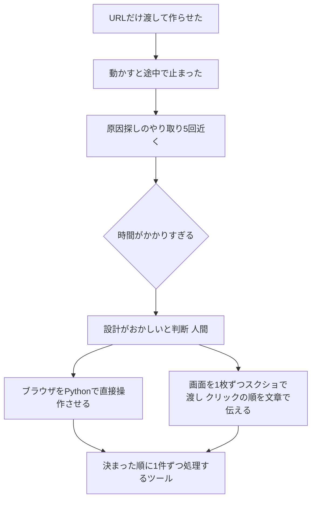
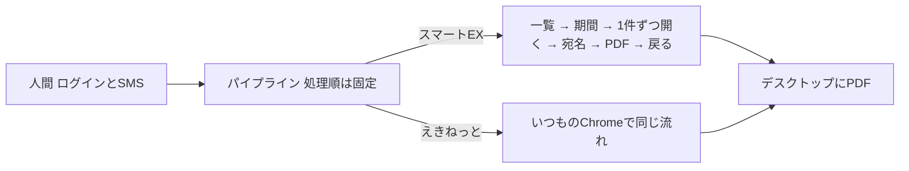

## この回の入口

| 困っていた作業                                       | AIに伝えた指示                                                                              | AIが作った仕組み                       | 動かした結果                   |
| --------------------------------------------- | -------------------------------------------------------------------------------------- | -------------------------------- | ------------------------ |
| 新幹線の予約サイトで、領収書を1枚ずつ表示して保存する。重複していないかを何度も確かめ直す | 最初は「Dynamic Workflowで作って」と予約サイトのURLだけ。止まったあとは「ブラウザを直接プログラムで操作して。画面は1画面ずつスクショして渡します」 | 決まった順番で領収書を1件ずつ開き、PDFで保存するプログラム | ひと月分（約20枚）が、30分以上から5分未満に |

この連載は、技術の知識がないままAIに業務の道具を作らせた記録です。題材は、新幹線の領収書をまとめて保存するツールです。1回目は、最初のやり方が途中で止まり、作り方を変えるまでの話を書きます。

## この連載を書き直した理由

以前、同じツールを題材に「サルでもわかるバイブコーディング！ 実践編」という5本の記事を書きました。読み返すと、心構えの話が中心で、何をどう作ったのか、どこで誰が何を決めたのかが書けていませんでした。そこで前の5本は取り下げ、ツールの中身と判断の場面を中心に書き直します。

扱うツールは、スマートEX（JR東海の新幹線予約サービス）とえきねっと（JR東日本）の予約サイトから、指定した期間の領収書を1件ずつ開き、宛名を入れてPDFでデスクトップに保存するものです。ログインだけは私が手で行い、そこから先はプログラムが画面を順番にクリックします。6月に作り、今も毎月使っています。

## 毎月の領収書の保存で困っていたこと

スマートEXの領収書は、ひと月に約20枚あります（私の場合）。予約サイトの領収書は1枚ずつ画面を移って表示し、印刷して保存する作りです。ひと月分を出力するだけで30分以上かかっていました。

時間以上に困ったのは、確認のやり直しです。「あれ？これダウンロードしたっけ？重複してない？」と思うたびにファイルを開き直し、同じ領収書をもう一度出し直すこともありました。毎月これを繰り返すので、イライラも相当なものでした。

えきねっとの領収書も月に数枚あります。こちらも同じように1枚ずつの作業です。

## 最初にAIへ送った依頼

作るのに使った道具は、Antigravity（Googleのエディタ）の中で動くClaude Codeのプラグインです。プラグインは、エディタにあとから足して使う追加の機能のことです。Claude Codeは、文章で頼むとプログラムを書いてくれるAnthropicのAIです。契約はProプランで、月額3,000円程度です。

最初に送った依頼は次のとおりです。「画面の繊維」は「画面の遷移」の打ち間違いですが、原文のまま載せます。

```text
スマートEX 予約サイトから指定した月の領収書をすべてダウンロードしたいです。そのためのアプリを Dynamic Workflow を使って作ってください。なるべくサブエージェントに分けて細かく作業を分割して並列分散処理するように実装していただきたいです。

画面の繊維などについては、Claudeさん自身で調べて実装してください。
```

続けて「調査と実装を続けてください。私にはいろいろと聞かなくて結構です。」とも送りました。

このときAIが作った「ワークフロー」は、作業の手順をあらかじめ一覧に書いておき、プログラムが動くときにその一覧を読んで順番に動かす作りでした（次の節で中身を見せます）。「サブエージェント」は、作業を分担する小さなAIのことです。当時の私は、どちらも聞きかじった言葉を並べただけで、意味をよく分かっていませんでした。渡したのは予約サイトのURLと、この文章だけです。画面がどう移っていくかは、AIに調べてもらうつもりでした。

## URLだけを渡したら、途中で止まった

AIは、手順をJSON（データを書くための決まった書式）で並べたワークフローを作りました。下はその一部です。領収書のボタンを数え、その数だけ「1件を処理する」手順を繰り返す、という書き方になっています。

```json:旧版/workflow.json
        {
          "id": "find_buttons",
          "type": "tool",
          "tool": "find_receipt_buttons",
          "parameters": {},
          "output": "receipt_count"
        },
        {
          "id": "process_all",
          "type": "loop",
          "iterator": "i",
          "range": "${receipt_count}",
          "steps": [
            {
              "id": "process_single",
              "type": "tool",
              "tool": "process_receipt",
              "parameters": {
                "button_index": "${i}",
                …（以下略）
```

旧版の`workflow.json` 156〜174行目です（175行目以降は省略しました）。`find_buttons`でボタンの数を数え、`process_all`でその数だけ`process_receipt`（1件の処理）を繰り返します。

これを動かすと、途中で止まりました。どこで止まったのかをAIに調べてもらい、直してもらい、また動かす。このやり取りを5回近く繰り返した記憶がありますが、原因ははっきりしませんでした。

後で分かったことですが、この手順には「一覧の画面へ戻る」がありません。旧版は、領収書のボタンを押すと別のウィンドウが開く、という前提で作られていました。実際の予約サイトは、ボタンを押すと同じ画面が領収書の明細に切り替わります。1件見るたびに一覧へ戻らないと、2件目のボタンは押せません。URLだけでは、AIは画面の実際の動きを知ることができず、思い込みで手順を組んでいた、と今は考えています。

## 「設計がおかしい」と判断した

やり取りを重ねても進まない状態で、私が見ていたのは時間でした。何度直してもらっても止まる。原因の特定に時間がかかりすぎる。この時点で、直し方ではなく作り方そのものがおかしいのだろう、と判断しました。

そこで思い出したのが、何年か前にYouTubeで見た、エンジニアの方がPythonでブラウザを自動で操作している動画です。Pythonはプログラミング言語の1つです。ブラウザの自動操作とは、人がマウスでするクリックや入力を、プログラムにさせることです。「Pythonで直接操作させればできるのでは」と考え、次のように頼みました。手元に記録は残っていないので、記憶による原文です。

```text
ブラウザを直接プログラムで操作できるようにして印刷する仕組みにしてもらえますか？画面は1画面ずつスクショして渡します。
```

私が「Pythonで」と言えたのは、たまたま動画を見たことがあったからです。言語の名前を知らなくても、「ブラウザを直接プログラムで操作して」と頼めば、同じところにたどり着けると思います。

このときから、渡すものを変えました。予約サイトの画面を1枚ずつスクショ（画面を写した画像）で撮って貼り、「この画面のこのボタンを押すと、次はこの画面に移る」という手順を文章で書きました。スクショに印を書き込むことはせず、どこを押すかは言葉で伝えています。



細かい順番は私の記憶によるものです。「直接操作して」と頼んだ直後も、しばらくはURLだけを渡していた記憶があります。

## でき上がったツールの流れ

画面を渡すやり方に変えてから作り直したのが、今も使っているツールです。全体の流れは次の図のとおりです。図のSMSは、スマートフォンに届く確認番号のことです。パイプラインは、決まった順番で処理を流していく作りのことです。



プログラムの中心にある`pipeline.py`というファイルの先頭には、AIが書いた説明文が残っています。プログラムの先頭に書く、このような説明文をdocstringと呼びます。

```python:pipeline.py
"""
決定論的なダウンロードパイプライン。

処理順は固定:
  login（手入力） → 会員メニューから一覧へ → From年月初日〜To年月末日で照会
  → 表示された領収書を1件ずつ取得 → PDF/ファイル保存（デスクトップ）。
（以下略）
```

`pipeline.py`の1〜6行目です（7行目以降は省略しました）。「決定論的」は、同じ入力なら毎回同じ順番で同じ動きをする、という意味です。ログインは手入力、そのあとは一覧へ進み、期間を指定して、1件ずつ取得して保存する。この説明文を書いたのはAIですが、書かれている順番は、私がスクショと文章で伝えた順番と同じです。

1件ずつ処理する部分は、次のようになっています。ループは同じ処理を繰り返す書き方、関数は1つのまとまった処理に名前を付けたものです。ここでは、領収書のボタンを1つ押し、保存し、一覧へ戻る、を件数分だけ繰り返します。

```python:pipeline.py
            for j in range(n):
                # この時点で一覧（page_no）が表示されている前提
                if not await discovery_agent.click_receipt(page, j):
                    self.failed.append(f"p{page_no}/{j}")
                    print(f"[Pipeline] {j}番目の領収書ボタンが見つかりません")
                    continue
                seq += 1
                try:
                    path = await download_agent.save_current_receipt(page, config.RECIPIENT_NAME, seq)
                    self.downloaded.append(str(path))
                except Exception as e:
                    self.failed.append(f"p{page_no}/{j}")
                    print(f"[Pipeline] 保存失敗 (p{page_no}/{j}): {e}")

                # 次の領収書のため一覧へ戻る
                if not await discovery_agent.return_to_list(
                    page, self.from_year, self.from_month, self.to_year, self.to_month
                ):
                    print("[Pipeline] 一覧へ戻れませんでした。処理を中断します。")
                    return
```

`pipeline.py`の90〜109行目です。`click_receipt`でj番目の領収書を開き、`save_current_receipt`で宛名を入れてPDFにし、`return_to_list`で一覧に戻ります。旧版になかった「一覧へ戻る」が、ここでは1件ごとに入っています。

戻る必要がある理由も、別のファイルのコメントに書かれています。

```python:agents/discovery_agent.py
    明細へ遷移する（ポップアップではない）。そのため1件ごとに一覧へ戻る必要がある。
```

`agents/discovery_agent.py`の10行目です。ポップアップは、ボタンを押したときに別に開く小さなウィンドウのことです。予約サイトの実際の動きが、ここに残っています。

フォルダ名に`agents`とありますが、中身は決まった順に呼ばれる普通の関数です。ツールが動いている間、AIは使っていません。AIを使ったのは作るときだけです。

使い方は2通りあります。黒い画面（ターミナル）から動かす方法と、ブラウザで開く入力画面から動かす方法です。どちらも、サービス、期間、宛名を選んで実行します。

今は、ひと月分を5分かからずに保存できます。そのうち約2分はログインです（どちらも私の概算）。

## この回の人間の判断

この回で、人間（私）が決めたことと、AIが作ったことを分けて書きます。

私は、直しても止まるのを見て時間がかかりすぎると判断し、URLだけを渡すやり方をやめました。代わりに、ブラウザをPythonで直接操作させるように頼み、画面を1枚ずつスクショで渡して、どこを押してどの画面に移るかを文章で伝えました。ここまでが人間の決めたことです。

AIが作ったのは、その順番を固定の手順にしたプログラムの形と、細かい部分の設計です。1件ずつ順に処理し、そのたびに一覧へ戻る作りもAIが組みました。旧版の「別のウィンドウが開く」という思い込みが直ったのは、画面を渡したあとです。誰がその違いに気づいたのかは記録に残っていません。渡した画面を見てAIが直したのだと思います（推測）。

コードに残った場所は2つあります。1つは`pipeline.py`の1〜6行目の「処理順は固定」という説明文です。これはAIが書いたもので、私が渡した順番がそのまま書かれています。もう1つは、えきねっとの処理を書いた`providers/ekinet.py`の8行目にある「フロー（ユーザー指定）」という一文です。こちらは、手順を指定したのが人間だったことを示す痕跡です。

止まったら画面を撮ってAIに渡し、それでも進まないときは作り方を変える。この連載の5本は、このやり方の記録です。

## 作るのにかかった時間

最初の依頼から、スマートEXで使えるようになるまで、だいたい10日でした。そのうちAIとのやり取りと動作確認にかけたのは、合計で3〜4時間ぐらいです（どちらも私の概算）。

変更の記録（コミット。変更を記録した1回分の単位）を数えると、今のツールは29回です。最初の記録は6月18日で、6月の4つの日付に計28回、9月に1回あります。29回すべてに、Claudeと共同で作業したという記録が付いています。

## 次回

次回は、ログインとSMS認証だけは人間がやると決めた話と、ログインが終わったことをツールがどう知るのかを書きます。

連載の目次（公開後にURLを入れる）

- #1 URLだけでは止まる。画面を見せればAIは作れる（この記事）
- #2ログインだけは、人間がやる
- #3人がクリックする順番を、そのままAIに書かせる
- #4止まった画面は、撮ってAIに見せればいい
- #5レビューとは、動かした結果を見て判断すること

## 参考

- Claude Codeの概要：https://code.claude.com/docs/en/overview
- Antigravity：https://antigravity.google/
- Claudeの料金：https://claude.com/pricing
- Playwright for Python（ブラウザをプログラムから動かすための部品）：https://playwright.dev/python/docs/intro
- Mermaidフローチャート：https://mermaid.js.org/syntax/flowchart.html
