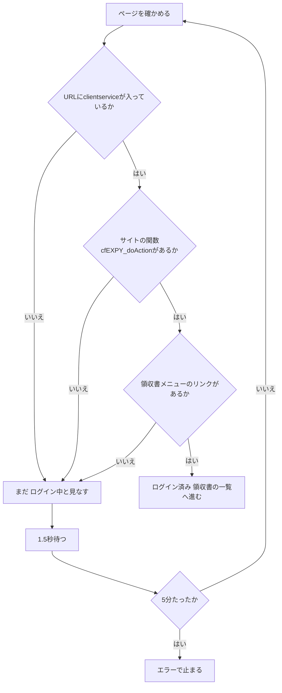
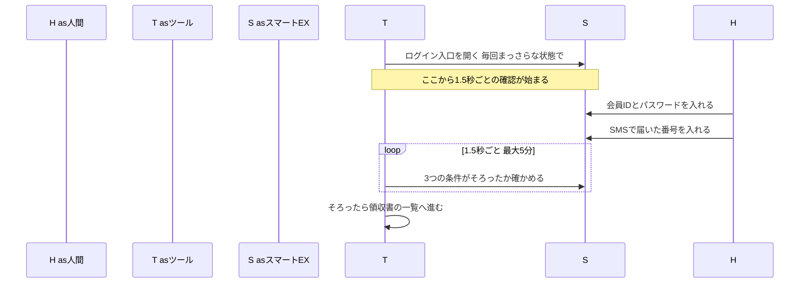

前回は、新幹線の領収書を予約サイトからPDFで取ってくるツールを、AI（Claude Code）に作らせた経緯を書きました。URLだけを渡して作らせたら途中で止まったので、画面を1枚ずつスクショで渡し、ブラウザを直接プログラムで操作させるやり方に切り替えた、という話です。

## この回の入口

| 困っていた画面                                                               | AIに伝えた指示            | AIが作った仕組み                        | 動かした結果                                    |
| --------------------------------------------------------------------- | -------------------- | --------------------------------- | ----------------------------------------- |
| ログインにはSMS認証の画面がある。ツールがエラーの画面を「ログイン済み」と取り違えて、先へ進もうとした（6月18日のコミットの記録） | ログインとSMS認証は自分の手でやる | 1.5秒ごとに3つの条件を確かめ、3つそろったら領収書の一覧へ進む | ログインは約2分。その先は自動で進み、ひと月分が5分かからない（どちらも私の概算） |

この回は、スマートEX（JR東海の新幹線の予約サービス）のログインの話です。私が使うのはほとんどがスマートEXで、領収書はひと月に約20枚あります（私の概算）。

## ログインとSMS認証は人がやると決めた

ツールを動かすと、ブラウザが開いてスマートEXのログイン入口が出ます。私が会員IDとパスワードを入れ、スマホに届いたSMSの番号を入れます。そのあと、領収書の一覧を開き、期間を選び、1件ずつPDFにするところはツールが進めます。

ここで線を引いた理由は2つです。

- パスワードをツールに預けたくなかった
- SMSの番号は、私のスマホにしか届かない

ここは人がやるしかありません。

この線は、旧版（前回書いた、AntigravityのClaude Codeプラグインで作った最初の版）のときから変わっていません。旧版も「ブラウザでIDとパスワードを入力してログインしてください」と表示して待つ作りでした（`旧版/index.js:248`）。

今の版のコードにも、人が入る前提が残っています。まず、設定にIDとパスワードを書く欄がありません。`config.py:29`に「ログインは常に『ブラウザを表示して手入力』。資格情報は保持しない。」というコメントがあり、設定の見本（`.env.example:4`）にも「ID/PWの設定は不要」と書いてあります。

次に、ヘッドレス（ブラウザを画面に出さずに裏で動かす使い方）で動かすと、ログインに進まずにエラーで止まります（`agents/login_agent.py:30-32`）。画面がなければ、人は入力できません。

ログインを待つ間は、ターミナルに「SMS認証（ワンタイムパスワード）が表示されたら、それも入力してください」「手動でEnterを押す必要はありません」と案内を出します（`agents/login_agent.py:44-49`）。


*画面1：EX予約のログイン画面（スマートEXもほぼ同じ）。IDとパスワードは人が入れる*


*画面2：ログインのあとに出るワンタイムパスワード（SMS認証）の画面。ここまでが人の番*

人がやる所を決めると、次に要るのは「人の番が終わった」をツールが知る方法です。この判定は、今の版の最初の日に何度も書き換わりました。

## パスワード欄が消えたら「ログイン済み」と見なしていた旧版

旧版は、ログインが終わったかどうかをこう判定していました。画面にパスワードの入力欄がなく、URL（ページの住所）に`login`も`top.php`も入っていなければ、ログイン済みと見なします。

次の部分は、ログインが終わるまで1秒ごとに同じ確認を繰り返しています。`while`で始まる部分が、条件に合うまで同じ処理を繰り返す「ループ」です。`await`は「ブラウザの操作が終わるまで待つ」という印で、読み飛ばして構いません。

```javascript:旧版/index.js
  // 5. Wait for user to log in
  console.log('[待機中] ログイン完了を待っています...');
  let loggedIn = false;
  while (!loggedIn) {
    const hasPasswordInput = await page.locator('input[type="password"]').count() > 0;
    const currentUrl = page.url();

    // Check if we're past the login page (no password field and URL changed)
    if (!hasPasswordInput && !currentUrl.includes('login') && !currentUrl.includes('top.php')) {
      loggedIn = true;
      console.log('[検知] ログインが完了しました。');
    } else {
      await page.waitForTimeout(1000);
    }
  }
```

（`旧版/index.js:252-266`）

この判定は、パスワード欄が消えた画面ならどれでも通ります。SMSの番号を入れる画面にパスワード欄がなければ、URLの条件しだいで、そこで先に進んでしまうおそれがあります（推測。旧版で実際にこの画面で先に進んだかは、記録がありません）。

## Python版の最初の日に、判定を書き換えていった

今の版（Python版）も、最初から今の形だったわけではありません。gitの記録を見ると、最初のコミット（変更を記録した1回分の単位）から同じ日の夜までに、ログインの判定が次のように変わっています。

| 時刻（6月18日） | コミット | 判定の変化 |
|---|---|---|
| 13:26 | `33c60b9` | 最初の版。URLに`ClientService`（スマートEXの会員ページのURLに入る文字）が入ったらログイン済み。ターミナルでEnterを押しても先に進める。保存しておいたログイン状態があれば、パスワード欄がないことを確かめて使い回す |
| 16:36 | `748decc` | URLに加えて、サイトの関数があるかも見る。期限切れのときに出る簡易なページを「ログイン済み」と取り違えないため |
| 18:26 | `508fd38` | ログイン状態の保存をやめ、毎回まっさらな状態からログインする |
| 18:59 | `37113fb` | 領収書メニューのリンクがあるかを足して、3つの条件にする。Enterで先に進む作りをやめる |

4つのコミットにはどれもClaudeとの共著の記録があり、コードはAIに書かせています。コミットの説明には「何を直したか」はありますが、私が何を見せてこう直したのかは残っていません。私のやり方は、動かして止まったら画面を撮ってClaude Codeに貼り、直してもらう、というものでした（#1で書いたとおりです）。

## URL・サイトの関数・領収書メニューの3つがそろうまで待つ

今の判定では、次の3つを順に確かめます（関数は、決まった手順をひとまとめにして名前を付けたもの）。

1. URLに`clientservice`が入っている。会員メニューのページの印です
2. ページの中に`cfEXPY_doAction`という関数がある。スマートEXのサイトが画面を切り替えるときに使う関数で、エラーのページや切り替わりの途中のページにはありません（`agents/login_agent.py:86`のコメント）
3. 「ご利用履歴・領収書の発行」などの文字を持つリンクが、ページの中に1つ以上ある。探す文字の候補は`config.py:112-117`に4つ並んでいて、どれか1つがあれば通ります

どれか1つでも欠けたら「まだ」と答えます。



コードでは、次の部分が3つの条件を上から順に確かめています。

```python:agents/login_agent.py
async def _at_member_menu(page: Page) -> bool:
    """会員メニューに居るか: ClientService の URL ＋ cfEXPY_doAction ＋ 領収書メニュータイル。"""
    try:
        url = (page.url or "").lower()
    except Exception:
        return False
    if "clientservice" not in url:
        return False
    # エラー/過渡ページには cfEXPY_doAction が無い。
    try:
        if not await page.evaluate("typeof cfEXPY_doAction === 'function'"):
            return False
    except Exception:
        return False
    # 「ご利用履歴・領収書の発行」等のメニュータイルが実際に表示されているか。
    for text in config.SELECTORS["menu_receipt_link"]:
        try:
            if await page.locator(f"a:has-text('{text}')").count() > 0:
                return True
        except Exception:
            continue
    return False
```

（`agents/login_agent.py:78-99`）

1か所だけ、書き方の違う行があります。`page.evaluate(...)`の行です。この行は、カッコの中の短い命令をブラウザの中で動かします（ブラウザの中で動く言葉はJavaScriptです）。ここでは「`cfEXPY_doAction`は関数として存在するか」をブラウザに聞いています。サイトの中に関数があるかどうかは、ブラウザの中でしか分からないからです。

3つ目の条件のコメントには「実際に表示されているか」とありますが、コードがしているのは、ページの中にそのリンクがあるかを数えることです（`count() > 0`）。画面に見えているかまでは確かめていません。

3つにした理由は、`37113fb`のコミットの説明に書いてあります。「SMS認証画面や過渡/エラー画面で誤って先に進まない」ためです。その前の、URLだけの判定では、期限切れのときに出る簡易なページを取り違えていました（`748decc`の説明）。

## Enterで先に進む作りをなくした

最初の版（`33c60b9`）には、ツールが判定できないときに、ターミナルでEnterを押せば先に進める作りがありました。`37113fb`で、AIはこれを外しました。今は、条件がそろうまで1.5秒ごとに確かめ続け、5分たってもそろわなければエラーで止まります。このように一定の間隔で何度も確かめるやり方を、ポーリングと呼びます。

次の部分が、その待ち方です。

```python:agents/login_agent.py
async def _wait_for_menu(page: Page, timeout_sec: int) -> bool:
    """会員メニュー（領収書メニューのタイルが出る画面）への到達をポーリング検知する。

    過渡状態やエラー画面で先に進まないよう、Enter による強制続行は行わない。
    """
    import time

    deadline = time.monotonic() + timeout_sec
    while time.monotonic() < deadline:
        if await _at_member_menu(page):
            return True
        await asyncio.sleep(1.5)
    return False
```

（`agents/login_agent.py:63-75`。5分の値は、呼び出し側の`agents/login_agent.py:51`で`timeout_sec=300`と渡しています）

使う側から見ると、3つの条件がそろうまで、ツールは先へ進みません。私がSMSの番号を入れている間も、ツールは待っています。会員メニューが出ると、何も押さなくても次へ進みます。

ツールと人とサイトの順番を図にすると、こうなります。



## 古いcookieを読むと「お取扱いできませんでした」になった

cookieは、ログインしていることなどをブラウザが覚えておくための小さなデータです。最初の版（`33c60b9`）は、一度ログインしたらそのときの状態（cookieなど）をファイルに保存し、次に動かすときに使い回す作りでした。保存した状態が使えれば「ログインをスキップします」と出して、ログインを飛ばします。

ところが、古いcookieを読み込むと、スマートEXのサーバーが「お取扱いできませんでした」というエラーのページを返しました。ツールはそのページを「ログイン済み」と取り違えていました（`508fd38`のコミットの説明）。

そこでAIは保存そのものをやめ、毎回まっさらな状態からログインする作りにしました。理由は、ファイルの先頭の説明文にも残っています。

```python:browser_manager.py
"""
Playwright のブラウザ/コンテキストを 1 つだけ管理する。

JR系サイトはサーバ側に画面遷移状態を持つため、単一コンテキストを逐次的に使う。

セッションの保存・再利用(storage_state)は行わない。古い cookie を読み込むと
ログイン時にサーバが「お取扱いできませんでした」エラーになるため、毎回まっさらな
コンテキストでログインする。
"""
```

（`browser_manager.py:1-9`。Playwrightはブラウザをプログラムから動かすための部品、コンテキストはcookieなどを持つ入れ物です）

旧版にも、毎回cookieを消す行がありました（`旧版/index.js:224-225`）。コメントは「JR東海のサーバーで、古い・期限切れのセッションのエラーが出るのを防ぐため」という意味です。旧版で実際にこのエラーが出たかの記録はありません。今の版は、実際にこのエラーで取り違えが起きました（`508fd38`）。結果として、旧版と同じ「古いcookieを持ち込まない」作りに落ち着いています。

保存をやめたので、ログインの手間は毎回残ります。ログインに約2分、ひと月分の全体で5分かからない、というのはこの作りでの数字です（私の概算）。

えきねっと（JR東日本）は、作りが逆です。えきねっと専用のプロファイル（Chromeの設定やcookieを入れておくフォルダ）を使っていて、Chromeを閉じてもcookieは残ります（`providers/ekinet.py:41`、`providers/ekinet.py:121`）。ログインの判定も別の作りで、URLに入る文字や「ログアウト」の文字があるかなどを見ています（`providers/ekinet.py:270-280`）。えきねっとは6月22日にあとから足したサービスで、その経緯は #4で書きます。

えきねっとでも毎回ログインと追加認証を求められる可能性を考慮して、念のためにcookieが残っていても、毎回ログインするようにしています（そのほうが安全なため）。

## この回の人間の判断

人間が決めたこと：ログインとSMS認証は自分の手でやり、パスワードはツールに預けない、と決めました。旧版から変えていない線です。止まったときは、止まった画面を撮ってAIに渡して直させました。6月18日の判定の直しもこの流れの中だったと見ています（推測。私が渡した画面はコミットに残っていません）。

AIが作ったこと：

- 「ログインが終わった」を知る3つの条件（URL・サイトの関数・領収書メニューのリンク）の設計。`748decc`で2つ、`37113fb`で3つになった
- Enterで先に進む作りをやめ、条件がそろうまで1.5秒ごとに最大5分待つ作り（`37113fb`）
- スマートEXでは、ログイン状態を保存しない作り（`508fd38`）

コードに残った場所：

- IDとパスワードの欄がない：`config.py:29`、`.env.example:4`
- 画面を出さないとログインに進まない：`agents/login_agent.py:30-32`
- 3つの条件と待ち方：`agents/login_agent.py:63-99`
- ログイン状態を保存しない理由：`browser_manager.py:1-9`

## 次回

次回は、ログインのあとの本体、スマートEXの領収書を1件ずつ開いてPDFにし、一覧へ戻る流れを書きます。

連載の目次（公開後にURLを入れる）

- #1 URLだけでは止まる。画面を見せればAIは作れる
- #2ログインだけは、人間がやる（この記事）
- #3人がクリックする順番を、そのままAIに書かせる
- #4止まった画面は、撮ってAIに見せればいい
- #5レビューとは、動かした結果を見て判断すること

## 参考

- Playwright for Pythonのログイン状態の保存（Authentication）：https://playwright.dev/python/docs/auth
- Mermaidのシーケンス図：https://mermaid.js.org/syntax/sequenceDiagram.html
- Mermaidのフローチャート：https://mermaid.js.org/syntax/flowchart.html
