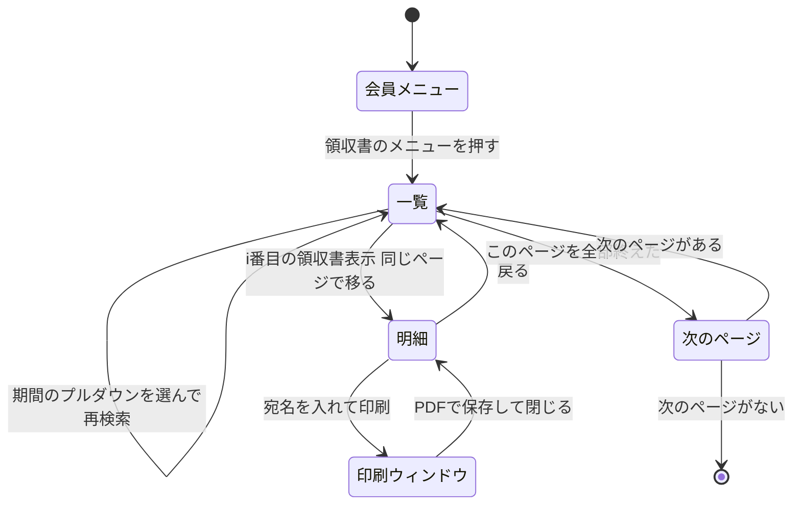
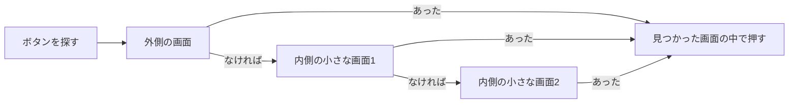

今回の最も重要なポイントを結論から申し上げます。それは、手でクリックしていた順番を、画面ごとにそのままAIに伝えることです。

前回は、ログインとSMS認証だけを人間がやり、ログインが終わったことをツールが3つの条件で確かめる作りを書きました。今回はログインのあとの本体です。スマートEXの領収書を1件ずつ開いてPDFにする部分を、私がAIに渡した画面とあわせて書きます。

## この回の入口

| 困っていた画面                              | AIに伝えた指示                            | AIが作った仕組み                                     | 動かした結果                  |
| ------------------------------------ | ------------------------------------ | ---------------------------------------------- | ----------------------- |
| 一覧から1件ずつ明細を開き、印刷して、一覧へ戻る。これをひと月に約20回 | 画面を1枚ずつスクショで渡し、どこを押してどの画面に移るかを文章で伝えた | 一覧 → 期間 → 1件ずつ開く → 宛名 → PDF → 戻る、を決まった順に繰り返す処理 | ひと月分が5分かからない。うちログインが約2分 |

## 手でやっていた順番

スマートEXで領収書を手で保存するときの順番は、次のとおりでした。

1. 会員メニューで「ご利用履歴・領収書の発行」を押す
2. 一覧で照会する期間を選び、「再検索」を押す
3. 1件目の「領収書表示」を押すと、明細の画面に移る
4. 明細で宛名を入れて「印刷」を押すと、別のウィンドウに正式な領収書が出る
5. それをPDFで保存して一覧に戻り、2件目の「領収書表示」を押す

これを、ひと月に約20回くり返します（私の概算）。手でやっていたころの手間は、#1で書いたとおりです。

## 渡した画面と、伝えた言葉

この順番を、私は画面のスクショを1枚ずつAI（AntigravityのClaude Codeプラグイン）に貼り、「この画面のこのボタンを押すと、次はこの画面に移る」と文章で伝えました。スクショへの書き込みはしていません。

当時のスクショは残っていないので、記事用に撮り直したものを並べます。氏名・予約番号・乗車区間・乗車日・金額は隠しています。


*画面1：会員メニュー。「ご利用履歴・領収書の発行」を押す*


*画面2：ご利用履歴の一覧。照会期間を選んで、各行の「領収書表示」を押す*


*画面3：領収書の表示。宛名を入れて「印刷」を押す*


*画面4：「印刷」で開く正式な領収書。PDFに保存する*


*画面5：保存の画面。手作業のときは、1枚ずつこの画面で保存していた*

このとき渡した画面は何枚かあります。AIが書いたコードのコメントには、私が渡した画面の番号が「明細ページ(緑の画面 ⑤)」「正式な領収書(⑥)」の形でいまも残っています（`agents/download_agent.py:5-7`）。この記事の画面番号は撮り直しにあわせて1から振り直したので、コードの番号とは合いません。

## 手でやっていた順番を、そのまま画面の移り方にする

AIが書いたツールは、上の手順をそのままの順番で動かします。画面の移り方として描くと、図1のようになります。



一覧 → 明細 → 印刷ウィンドウ → 明細 → 一覧、と1周するのが1件分の処理です。ブラウザを動かしているのはPlaywright（ブラウザをプログラムから動かすための部品）で、どの画面で何を押すかの順番はコードに直接書いてあります。動かしている最中にAIに判断させる所はありません。

ここからは、この流れを作るときにつまずいた所を順に書きます。

## 「領収書」で探すと、メニューのボタンに当たる

プログラムが画面のボタンを押すには、そのボタンを見つけるための目印が要ります。これをセレクタと呼びます。

一覧の各行にあるボタンの文字は「領収書表示」です。「領収書」という文字で探すと、会員メニューの「ご利用履歴・領収書の発行」にも当たってしまいます。画面を見せて『押したいのは領収書表示の方』と伝えたら直った記憶があります。gitでは最初のコミット（6月18日）からこの形で入っていて、いつ誰が気づいたかは記録に残っていません。

AIは、セレクタを1つのファイルにまとめ、候補を上から順に試す形にしました。次の部分は、一覧の「領収書表示」ボタンを探す目印の候補です（`config.py:131-139`）。

```python:config.py
    # 領収書一覧の各行に出る「領収書表示」ボタン/リンク
    # 注意: メニュータイル「ご利用履歴・領収書の発行」に誤マッチしないよう「領収書表示」に限定。
    "receipt_button": [
        "a:has-text('領収書表示')",
        "button:has-text('領収書表示')",
        "input[value*='領収書表示']",
        "input[type='button'][value*='領収書']",
        "input[type='submit'][value*='領収書']",
    ],
```

上の3つは「領収書表示」という文字で探します。メニューを押さないためだと、2行目のコメントにあります。下の2つは、ボタンに「領収書」の文字を含めば当たる形のまま残っています。スマートEXの一覧のボタンは上から3つ目の候補で見つかるので、いまの画面では下の2つまで進みません（推測）。

セレクタはすべて`config.py:105-162`にまとまっていて、冒頭のコメントに「上から順に試し、最初に一致したものを使う」とあります（`config.py:106`）。ボタンの文字が変わったときは、このファイルの候補を直せば済みます。画面の作りや移り方が変わったときは、ほかのファイルも直すことになります（次の節がその例です）。

## 1枚に見える画面が、何枚かの小さな画面でできていた

6月23日に、一覧の画面にたどり着けずに止まる不具合を直しています（コミット`735c10e`）。原因はフレームセットでした。フレームセットは、1枚に見える画面を、複数の小さな画面を組み合わせて作る作りです。

スマートEXの画面は、場面によってこの作りになっていて、期間のプルダウンや「領収書表示」のボタンが内側の小さな画面に置かれることがあります。Playwrightのふつうの探し方では外側の画面しか探さないので、ボタンが見つからずに止まっていました（`agents/discovery_agent.py:12-15`）。

AIはこれを、図2のように、外側の画面から順に内側の小さな画面まで全部を探す形に直しました。



探す順を決めている部分は`agents/discovery_agent.py:125-131`です。

## 期間は「1日」と「末日」をプルダウンで選ぶ

一覧の照会期間は、Fromの年月・Fromの日・Toの年月・Toの日、の4つのプルダウン（押すと選択肢の一覧が開く入力欄）で選びます（`agents/discovery_agent.py:212`）。

AIは、プルダウンを名前ではなく中の選択肢の文字で見分ける作りにしました。選択肢に「年」と「月」があれば年月のプルダウン、「日」があれば日のプルダウンです（`agents/discovery_agent.py:234-239`）。見分けたあと、4つを次のように選びます（コードの`await`は「ブラウザの操作が終わるまで待つ」という印で、読み飛ばして構いません）。

```python:agents/discovery_agent.py
    if selects is not None and len(ym_idx) >= 2 and len(day_idx) >= 2:
        a = await _select_label(selects.nth(ym_idx[0]), from_ym)        # From 年月
        b = await _select_label(selects.nth(day_idx[0]), "1日")          # From 日
        c = await _select_label(selects.nth(ym_idx[1]), to_ym)          # To 年月
        d = await _select_label(selects.nth(day_idx[1]), f"{last}日")    # To 日
        done = a and b and c and d
        if done:
            print(f"[Discovery] 照会期間設定: {from_ym}1日 〜 {to_ym}{last}日")
```

Fromは1日、Toはその月の末日を選びます（`agents/discovery_agent.py:245-252`）。末日は月によって28日から31日まで変わるので、暦から計算しています（`agents/discovery_agent.py:219`）。

最初のコミット（6月18日）では、選べるのは1か月だけでした。FromとToの年月を別々に指定できるようにしたのは6月22日です（コミット`dfccf59`）。


*画面6：照会期間の4つのプルダウン（Fromの年月・日、Toの年月・日）*

## 明細は、同じページに移る

#1で書いたとおり、旧版は「領収書表示」でポップアップ（別に開く小さなウィンドウ）が開く前提でした。実際のスマートEXでは、同じページが明細に切り替わります（`agents/discovery_agent.py:8-10`）。そのため、1件保存するたびに一覧へ戻る処理が要ります。旧版の手順には、この戻るステップがありませんでした。

一覧へ戻る部分は、次のようになっています（`agents/discovery_agent.py:85-106`のうち、3段の見出しにあたる行だけを残しました）。

```python:agents/discovery_agent.py
async def return_to_list(page: Page, from_year: int, from_month: int,
                         to_year: int, to_month: int) -> bool:
    """明細ページから一覧へ戻る。戻るボタン→ブラウザバック→再照会の順で試す。"""
    # 1) 明細ページの「戻る」系ボタン
    for text in ["一覧へ戻る", "ご利用履歴に戻る", "ご利用履歴へ戻る", "戻る"]:
        if await _click_by_text(page, [text]):
            # （中略）
    # 2) ブラウザバック（POST結果のキャッシュ復帰を期待）
    try:
        await page.go_back(wait_until="domcontentloaded", timeout=config.TIMEOUT)
        # （中略）
    # 3) 最終手段: メニューから再照会（ページ位置は1ページ目に戻る点に注意）
    await open_and_filter(page, from_year, from_month, to_year, to_month)
    return await _has_receipt_buttons(page)
```

戻り方は3段です。

1. 明細の「戻る」系のボタンを押す
2. ブラウザの「戻る」ボタン（コメントの「ブラウザバック」）を使う
3. 会員メニューから一覧を開き直し、期間を選び直す

1段目と2段目は、戻ったあとに「領収書表示」のボタンがあるかを見て、一覧に戻れたかを確かめています。3段目は、一覧が2ページ以上あるときは1ページ目に戻ってしまう、とコメントにあります（`agents/discovery_agent.py:104`）。

1件ずつの繰り返しは`pipeline.py:90-109`で、一覧の上から番号の順に開いていきます。3段とも一覧に戻れなければ、そこで処理をやめます（`pipeline.py:105-109`）。ページの最後まで終わると「次へ」を探し、あれば次のページに進みます（`pipeline.py:111-113`）。

次のページがあるかの確認は毎回していますが、私の使い方では一覧が2ページ以上になったことがないので、次のページへ実際に進んだことは一度もありません。

## 印刷ボタンの先を、そのままPDFにする

明細で「印刷」を押すと、別のウィンドウに正式な領収書が出ます。手でやるときは、ここでOSの印刷ダイアログ（印刷先や部数を選ぶ小さな画面）が開き、「PDFとして保存」を選びます。このツールの作りでは、この印刷ダイアログは自動で操作できない、とコメントにあります（`agents/download_agent.py:11`）。

AIは印刷ダイアログを使わず、別のウィンドウに出た正式な領収書を、ChromeのPDF化の機能（Page.printToPDF）で保存する作りにしました。画面を、印刷したときと同じ見た目のPDFファイルにする機能です。ダイアログが印刷するのも同じウィンドウなので、できるPDFは同じだとコメントにあります（`agents/download_agent.py:12`）。印刷の命令でダイアログが開いて止まらないよう、ページ側の印刷の命令は止めてあることも、同じ行に書いてあります。

1件を保存する流れは、次のとおりです（`agents/download_agent.py:35-58`の要点）。

```python:agents/download_agent.py
async def save_current_receipt(page: Page, recipient_name: str, seq: int) -> Path:
    """明細ページに宛名を入れ、印刷ポップアップ(正式な領収書)を PDF 保存する。"""
    await _fill_recipient(page, recipient_name, seq)
    date_str, amount = await _extract_meta(page)  # 明細から乗車日・金額
    # （中略）
    popup = await _open_print_popup(page)
    target = popup if popup is not None else page
    # （中略）
    file_path = _unique_path(config.OUTPUT_DIR / _build_filename(date_str, amount, seq))
    file_path.write_bytes(await _print_to_pdf(target))

    if popup is not None:
        try:
            await popup.close()
        # （中略）
    print(f"[Download #{seq:03d}] PDF保存: {file_path.name}")
    return file_path
```

宛名を入れる → 明細から乗車日と金額を読む → 「印刷」で別ウィンドウを開く → PDFにして保存する → 別ウィンドウを閉じる、の順に進みます。宛名は画面か設定ファイルで指定し、何も指定しなければ「上様」です（`config.py:31-32`）。

保存するファイルの名前は「領収書_乗車日_連番_金額円.pdf」の形です（`agents/download_agent.py:153-159`）。同じ名前のファイルがあれば、末尾に番号を足して上書きを防ぎます（`agents/download_agent.py:162-169`）。ツールは一覧の1件目から番号の順に開いて、全部を保存します。同じ月をもう一度動かすと、番号の付いたファイルがもう1組できます。

## この回の人間の判断

人間が決めたこと：手でやっていた順番を、画面のスクショ1枚ずつと文章でAIに渡しました。押す場所はスクショに書き込まず、文章で伝えています。でき上がったものは、動かしてデスクトップに保存されたPDFを開き、宛名や金額などの中身を確かめました。

AIが作ったこと：

- セレクタを1つのファイルにまとめ、「領収書表示」で探す形（`config.py:131-139`）
- 内側の小さな画面まで探す形（`agents/discovery_agent.py:125-131`）
- プルダウンを選択肢の文字で見分けて、1日と末日を選ぶ処理（`agents/discovery_agent.py:208-266`）
- 一覧への3段の戻り方（`agents/discovery_agent.py:85-106`）
- 印刷ダイアログを使わないPDF化とファイル名（`agents/download_agent.py:78-101`、`agents/download_agent.py:137-159`）

コードに残った場所：

- 私が渡した画面の番号⑤⑥：`agents/download_agent.py:5-7`のコメント
- 「同一ページが明細へ遷移する（ポップアップではない）」という画面の事実：`agents/discovery_agent.py:8-10`
- 4つのプルダウンの並び（「sel-1=From年月, sel-2=From日, sel-3=To年月, sel-4=To日」）：`agents/discovery_agent.py:212`

順番を決めたのは私で、その順番をコードにしたのはAIです。

## 次回

次回は、決まった順番でクリックする作りが、予定にない画面が出て止まった話と、止まった画面を撮ってAIに渡して直した流れを書きます。

連載の目次

- #1 URLだけでは止まる。画面を見せればAIは作れる
- #2ログインだけは、人間がやる
- #3人がクリックする順番を、そのままAIに書かせる（この記事）
- #4止まった画面は、撮ってAIに見せればいい
- #5レビューとは、動かした結果を見て判断すること

## 参考

- Playwrightのフレーム：https://playwright.dev/python/docs/frames
- Playwrightのロケーター（目印の探し方）：https://playwright.dev/python/docs/locators
- Mermaidの状態遷移図：https://mermaid.js.org/syntax/stateDiagram.html
