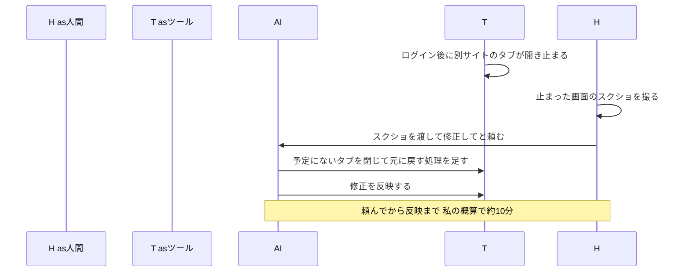
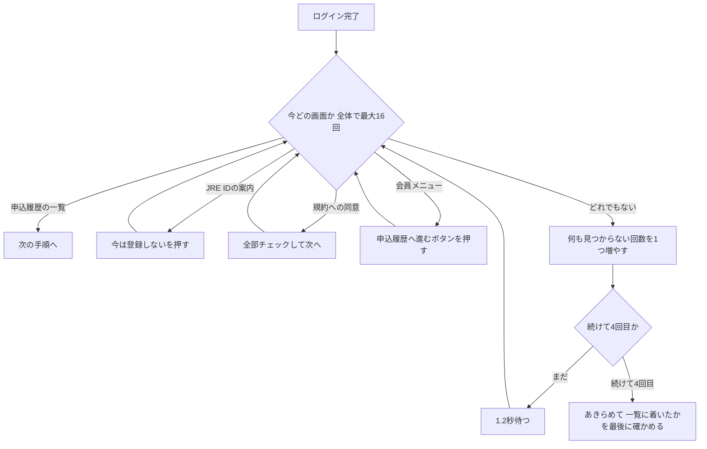

前回は、人がクリックする順番をそのままAIに書かせ、スマートEXの領収書を1件ずつPDFにする仕組みを書きました。今回は、その「決まった順番」が崩れて止まった場面と、どう直したかを書きます。

## この回の入口

| 困っていた画面                                            | AIに伝えた指示             | AIが作った仕組み                                   | 動かした結果                                           |
| -------------------------------------------------- | --------------------- | -------------------------------------------- | ------------------------------------------------ |
| ログインのあと、予定にないタブや、出たり出なかったりする画面が出て、ツールが止まったまま動かなくなる | 止まった画面のスクショを渡して「修正して」 | 出てきた画面の種類を見分けて、それに応じて処理する。予定にないタブは閉じて元のタブに戻る | 使えるようになってから、毎月の利用で止まったのは9月の1回。頼んでから修正を反映するまで約10分 |

## 決まった順番でクリックする作りの弱いところ

このツールは、私が画面を1枚ずつ見せて伝えた順番どおりにクリックします。ログイン、会員メニュー、領収書の一覧、1件ずつ開いて保存、一覧へ戻る。順番が決まっているので、毎回同じように動き、どこで何をしているかも追いやすくなっています。

その代わり、予定にない画面が途中に出ると、そこで止まります。プログラムは「次はこのボタンを押す」と決めて待っているので、別の画面が出ても、そのボタンを探し続けるだけです。人なら「何か出てきたな」と気づいて閉じるところを、プログラムは自分では判断できません。

予定にない画面や、出たり出なかったりする画面が出る条件は、使う側からは分かりません。毎回出るわけではないので、作ったときに試した範囲では動いても、何日か後に急に止まることがあります。この回では、実際に止まった例を2つ取り上げます。1つ目はスマートEX（9月）、2つ目はえきねっと（6月）です。

## スマートEX：ログインのあと、別のサイトのタブが開いた

9月、いつものようにスマートEXで領収書を取ろうとしたときのことです。ログインとSMS認証を済ませたあと、いきなり別の画面に移り、そこで止まったまま動かなくなりました。月末の精算でひと月分を取ろうとしたときでした。

開いていたのは、JR CYBER STATIONなど、予約サイトの中にある案内のリンク先でした。サイトの側が、ログインのあとに別のサイトを新しいタブで開くことがあったのです。新しいタブが前に出ると、ツールが操作していた元のタブは後ろに回ります。ブラウザは後ろに回ったタブの動きを抑えるので、ログインが済んだことの確認や、その先のクリックが進まなくなっていました（コミットの説明文と、コード中のコメントによる）。

### 止まってから直るまで

私は止まった画面のスクショを撮ってAIに渡し、「修正して」と頼みました。AIがコードを直し、その修正を反映するまで、約10分でした。この修正は9月4日の1回の変更として記録されています。6月に使えるようになってから、毎月の利用でツールが止まったのはこの1回だけです。



### AIが足した仕組み

AIが足したのは、新しいタブが開いたら中身を確かめ、予約サイトと同じドメイン（URLの「jr-central.co.jp」のような住所の部分）でなければ閉じて、元のタブを前に戻す仕組みです。ログインを待ち始める前に、この見張りを付けています。

```python:agents/login_agent.py
    # サイトが広告/案内等の外部リンクを新規タブで自動的に開くことがあり、前面に出ると
    # 自動操作中の主タブがバックグラウンド化して不安定になる。想定外タブは自動で閉じる。
    browser_manager.set_primary_page(page)
    browser_manager.guard_unexpected_popups(config.popup_allowed_domains(service_cfg))
```

`agents/login_agent.py`の34〜37行目です。コメントの「主タブ」は、ツールが操作している元のタブのことです。3行目（`set_primary_page`の行）で元のタブを覚えさせ、4行目（`guard_unexpected_popups`の行）で「予約サイトのドメイン以外のタブは閉じる」見張りを付けています。

閉じる部分は次のとおりです。

```python:browser_manager.py
    if _is_allowed_domain(url, allowed_domains):
        return

    print(f"[Guard] 想定外のタブを検知したため閉じます: {url}")
    try:
        await new_page.close()
    except Exception:
        pass
    if _primary_page is not None:
        try:
            await _primary_page.bring_to_front()
        except Exception:
            pass
```

`browser_manager.py`の141〜153行目です。許可したドメインならそのままにし、そうでなければ「想定外のタブを検知したため閉じます」と表示して閉じ、元のタブを前に戻します。

AIが加えた処理では、印刷用のタブを閉じないようにしています。領収書をPDFにするときに開く印刷用のウィンドウも、新しいタブとして開きます。これを閉じると、領収書が取れなくなります。そこで、開いたばかりでURLがまだ決まっていないタブはすぐには判断せず、約8秒までURLが決まるのを待ってから確かめます（同じファイルの125〜139行目）。印刷用のウィンドウは予約サイトと同じドメインなので、閉じません。

この見張りはスマートEX側の仕組みです。えきねっとは別の流れで動いていて、この部分は使っていません（`pipeline.py`の50〜56行目）。

## えきねっと：ログインのあとに出る画面

### えきねっとに対応した経緯

えきねっとの領収書は月に数枚です。6月22日に対応を始めました。

最初は、プログラムが自動操作のために用意したブラウザで動かしましたが、「Access Denied」と表示されて止められました。そこで私は「いつものChromeで動かして」と頼みました。普段から使っているからそのまま、というだけの理由で、特に狙いはありませんでした。いつものChromeにすると、止められずに進めるようになりました。えきねっとにはボット（自動で動くプログラム）を見分ける仕組みがあり、いつものChromeなら普通のブラウザとして扱われる、という理由は、あとからAIがコードの説明文に書いています（`providers/ekinet.py`の4〜6行目）。ログインとSMS認証は、スマートEXと同じく私が手で行います。

この日の作業は1時間ぐらいでした。変更の記録は7回あります（17時台から18時台）。えきねっとの対応を足す、いつものChromeで動かす、画面の取り違えを直す、期間の指定をできるようにする、前回のChromeが残っているとつながらない不具合を直す、といった変更です。

### 出るときと出ないときがある画面

えきねっとでは、ログインのあと、会員向けのページに入る前に、別の画面が挟まることがあります。利用規約への同意を求める画面と、JRE ID（JR東日本の共通の会員ID）への登録を案内する画面です。どちらも、私がAIに渡した手順の3番目と4番目に入っていました。

```text:providers/ekinet.py
  3. 規約合意ページ: 各「同意する」にチェック →「次へ」
  4. JREIDページ:「今は登録しない」
```

`providers/ekinet.py`の11〜12行目です。この手順の見出しには「フロー（ユーザー指定）」とあり、私が指定した手順だと分かります（8行目）。

ただ、この2つの画面は毎回出るわけではありません。出るときと出ないときがあり、出ない日に試すとうまく動き、出る日に止まる。一度作ったあとに直す、を何回もやり直した記憶があります。

### 画面を取り違えた

止まった理由の1つは、画面の取り違えでした。JRE IDの案内の画面にも、下の方に「利用規約」という文字とチェックボックスがあります。そのため、ツールがJRE IDの案内を規約への同意の画面だと思い込み、チェックを入れて「次へ」を探し続けていました（6月22日の変更の説明文による）。

AIの直し方は2段階です。まず、画面のURL（アドレスバーに出る住所）に規約の画面の印があれば、規約の画面と決めます。URLで分からないときだけ、画面の中身を見ます。

```python:providers/ekinet.py
async def _is_agreement_page(page: Page) -> bool:
    if SEL["url_agreement"] in (page.url or "").lower():
        return True
    # 内容判定: チェックボックス＋「次へ」系ボタン＋「規約」が揃うときのみ規約合意とみなす
    # （JREID案内ページ等の誤判定を防ぐ）。
    try:
        if await page.locator(SEL["agreement_checkbox"]).count() == 0:
            return False
        if await _find_text_locator(page, SEL["agreement_next"]) is None:
            return False
        return await _has_text(page, ["規約"])
    except Exception:
        return False
```

`providers/ekinet.py`の347〜359行目です。2〜3行目がURLでの判定、7行目からが中身での判定です。チェックボックス、「次へ」のボタン、「規約」という文字の3つがそろったときだけ、規約の画面とみなします。あわせて、JRE IDの案内かどうかを先に確かめる順番にしました。

### 出てきた画面に応じて処理する

もう1つの理由は、会員向けのページの表示が遅れることでした。画面が出きる前にメニューを探すと、見つからずに止まります。この不具合は翌日の6月23日に直しています。

直したあとの流れは、決まった順に進むのではなく、今どの画面にいるかを毎回見て、それに応じて処理する形です。

```python:providers/ekinet.py
        if await _is_history_page(page):
            return True
        # JREID を先に判定（URLが確実）。規約合意の誤判定を避ける。
        if SEL["url_jreid"] in url or (stuck < 2 and await _is_jreid_page(page)):
            await _handle_jreid(page)
            noop = 0
            continue
        if SEL["url_agreement"] in url or (stuck < 2 and await _is_agreement_page(page)):
            await _handle_agreement(page)
            noop = 0
            continue
        # （中略：会員メニューから申込履歴へ進むボタンを押す部分）
        # 何も該当しない: マイページSPAの描画前に履歴メニューが未出の可能性。
        # 数回まで待って再試行する（後からメニューが現れることがある）。
        noop += 1
        if noop >= 4:
            break
        await page.wait_for_timeout(1200)
```

`providers/ekinet.py`の293〜303行目と310〜315行目です（間の304〜309行目は省きました）。上から順に、申込履歴の一覧に着いていれば終わり、JRE IDの案内なら「今は登録しない」を押す、規約の画面なら同意して進む、と確かめます。どれでもなければ「何も見つからない」回数を1つ増やし、続けて4回目ならあきらめ、そうでなければ1.2秒待ってもう一度見ます。途中でどれかの画面を処理できたら、この回数は0に戻ります（`noop = 0`の行）。コードではJRE IDを「JREID」と書いています。`stuck < 2`は、同じ画面のままの状態が続いたら、中身での判定をやめてURLだけで判定する、という意味です。

この確かめ全体も、最大16回までと決まっています。最後に、申込履歴の一覧に着いたかどうかをもう一度確かめて終わります（284〜316行目）。



## この回の人間の判断

えきねっとを「いつものChromeで」動かすと決めたのは私です。普段使っているからそのまま、というだけで、特に意図はありませんでした。9月の件では、止まった画面をそのまま撮ってAIに見せ、「修正して」と頼みました。この回で人間が決めたのは、この2つです。

AIが作ったのは、画面の種類を見分けて、出てきた画面に応じて処理する仕組み（えきねっと）と、予定にないタブを閉じて元のタブに戻す見張り（スマートEX）です。いつものChromeがボットの見分けの面でも効いた、という理由の説明も、AIがあとから書いたものです。

コードに残った場所は、`providers/ekinet.py`の8〜15行目「フロー（ユーザー指定）」と、9月4日の変更で足された`agents/login_agent.py`の34〜37行目です。

決まった順にクリックする作りは、予定にない画面に弱いままです。9月の1回は、止まった画面を撮って渡すことで直りました。

## 次回

次回は最終回です。動かした結果と止まった画面を見て判断する、というレビューのやり方を、この連載の全体を通して振り返ります。

連載の目次（公開後にURLを入れる）

- #1 URLだけでは止まる。画面を見せればAIは作れる
- #2ログインだけは、人間がやる
- #3人がクリックする順番を、そのままAIに書かせる
- #4止まった画面は、撮ってAIに見せればいい（この記事）
- #5レビューとは、動かした結果を見て判断すること

## 参考

- Playwrightのページとポップアップ（新しいタブの扱い）：https://playwright.dev/python/docs/pages
- Mermaidシーケンス図：https://mermaid.js.org/syntax/sequenceDiagram.html
- Mermaidフローチャート：https://mermaid.js.org/syntax/flowchart.html
