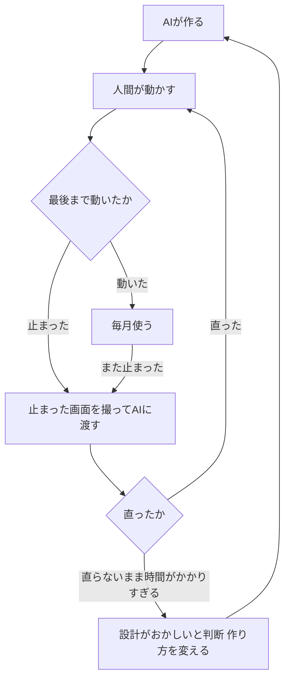
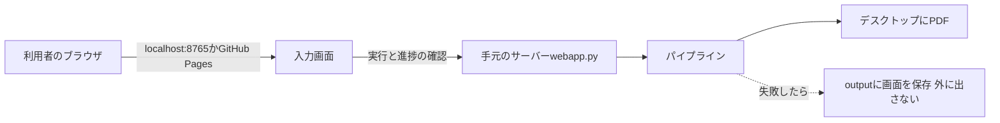

前回は、予定にない画面でツールが止まったとき、止まった画面を撮ってAIに見せて直した話を書きました。最終回の今回は、この連載で私がしてきた「レビュー」が何だったのかを振り返ります。

## この回の入口

| 困っていたこと          | AIに伝えた指示                                          | AIが作った仕組み                                             | 動かした結果                                          |
| ---------------- | -------------------------------------------------- | ------------------------------------------------------ | ----------------------------------------------- |
| 動かすと止まる。原因が分からない | 止まった画面のスクショを渡して直してもらう。直らないまま時間がかかりすぎたら、頼み方そのものを変える | 止まった所の画面を自動で保存する。ターミナルから手で動かして1件も取れなかったときは、ブラウザを閉じずに待つ | 作るのにかけた時間は合計3〜4時間。使えるようになってから、毎月の利用で止まったのは9月の1回 |

## 私が見ていたのは、動かした結果と止まった画面

この連載で「レビュー」と呼んできたものの中身は、次の2つです。

- AIが作ったツールを実際に動かし、最後まで領収書が保存されたかを見る
- 止まったら、止まった画面をスクショで撮り、Claude Codeに貼り付けて、どうすればよいかを聞く

私がしたのは、この繰り返しです。

細かい設計をAIに任せたのには理由があります。このツールが毎回変える値は、領収書を取る年月の範囲と、領収書の宛名の2つだけです。処理そのものはそれほど難しくなく、ログインさえうまくいけば自動にできるはずだ、と考えていました。そこで私は、動いたかどうかと、止まった画面を見ることに時間を使いました。

これは、プログラムの中身を確かめなくてよい、という話ではありません。私が確かめられたのは、目に見える結果だけです。その結果、見えないところに残っていたものもありました。それは後の節で書きます。

## 「時間がかかりすぎる」で作り方を変えた

1回目に書いた話を、判断の基準という目で見直します。

最初は、予約サイトのURLだけを渡して作ってもらいました。動かすと途中で止まり、原因をAIに調べてもらいました。このやり取りは5回近く続いた記憶があります。それでも原因ははっきりしませんでした。

このとき私が見ていたのは、回数ではなく時間です。直してもらっては止まる、を繰り返すうちに、原因の特定に時間がかかりすぎていると感じました。そこで、作り方そのものがおかしいのだろうと判断し、画面を1枚ずつスクショで渡して、どこを押すかを文章で伝えるやり方に変えました。



作り直してからも、同じ流れで直しています。変更の記録（コミット）を日付で並べると、次のとおりです。

- 6月18日：8回。ログインが済んだことの見分け方を何度か直した（#2で書いた内容）
- 6月19日：3回
- 6月22日：7回
- 6月23日：10回
- 9月4日：1回。#4で書いた、ログインのあとに別のサイトのタブが開いて止まった件。止まった画面を撮って渡し、頼んでから修正を反映するまで約10分

6月の修正のそれぞれで、止まった画面を渡したかどうかまでは記録に残っていません。私の記憶では、動かして止まったら画面を見せる、という同じやり方でした。

## 止まったときの材料を、AIが残していた

止まった画面を撮るのは私の役目でしたが、AIの側でも、止まったときの材料を残す仕組みを作っていました。たとえば、一覧の画面にたどり着けなかったときや、期間を選ぶプルダウンが見つからなかったときには、そのときの画面を自動で保存します（`browser_manager.py`の188〜196行目）。

```python:browser_manager.py
    if not (config.DEBUG or force):
        return
    path = config.DEBUG_DIR / f"debug_{name}.html"
    try:
        html = await page.content()
        path.write_text(html, encoding="utf-8")
        print(f"[DEBUG] HTML保存: {path}")
    except Exception as e:
        print(f"[DEBUG] HTML保存失敗 ({name}): {e}")
```

HTMLは、ウェブページの中身を書いた文書のことです。ふだんは保存しませんが、失敗した所では`force`（強制して保存する、という合図）を付けて呼ぶので、止まった画面の中身が`output`というフォルダに残ります。スクショも同じように保存します。

保存された画面には、氏名や予約の内容が入ります。そのため`output`フォルダは、プログラムを共有するときに外へ出さない設定にしてあります（`.gitignore`の6〜8行目）。

もう1つは、ターミナルから手で動かして1件も取れなかったときに、ブラウザを閉じない仕組みです（`pipeline.py`の64〜72行目）。

```python:pipeline.py
            # 1件も取得できなかった場合は、原因確認のためブラウザを即閉じない。
            # 対話実行ならユーザーが画面を確認してから Enter で閉じられるようにする。
            if not self.downloaded and _is_interactive():
                try:
                    input("\n[一時停止] 取得0件のためブラウザを開いたままにしています。"
                          "画面を確認し、output/debug_*.html も保存済みです。Enterで閉じます... ")
                except Exception:
                    pass
            await browser_manager.stop()
```

3行目の条件は、「1件も取れていない」かつ「ターミナルから手で動かしている」ときだけ、という意味です。このときは、画面を見てからEnterキーで閉じられるように止まって待ちます。止まった画面を人が見られるように、AIが用意した仕組みです。

主に使ったのは自分で撮ったスクショでした。

## まず動かすことを優先した割り切り

このツールには、わざと作っていない所が2つあります。

- えきねっとの領収書の一覧が、2ページ以上になったときの処理
- エクスプレス予約のメニュー

1つ目は、えきねっとの領収書の一覧が2ページ以上になったときの処理です。えきねっとの処理を書いたファイルには、次のページへ進む関数が用意されています（`providers/ekinet.py`の655行目）。ただ、その関数はどこからも呼ばれていません。スマートEXの側は、次のページがあれば進みます（`pipeline.py`の111〜113行目）。

これは見落としではありません。私は毎月ツールを動かしているので、えきねっとの領収書（月に数枚、私の概算）は1ページに収まります。今まで2ページ以上になったことはありません。もし2ページにまたがったら、おそらくそこで止まります。そのときに直せばよい、と考えています。完璧を目指すより、まずは動かすことを最優先して、スピードを重視しました。

2つ目は、エクスプレス予約をメニューから隠したことです（`main.py`の112〜114行目）。

```python:main.py
# 対話メニューに出すサービス（エクスプレス予約 expy は予約システムがスマートEXと
# 共通で入口URLだけが違うため、メニューからは隠す。`--service expy` では引き続き使える）。
_SERVICE_CHOICES = {"1": "smart-ex", "2": "eki-net"}
```

サービスを選ぶメニューには、スマートEXとえきねっとの2つだけを出します。隠すと決めたのは私です。理由は2つあります。

- 私がエクスプレス予約を使っていなかった
- エクスプレス予約とスマートEXは結果的に同じ機能だったので、使う人が混乱すると思った

## 公開の前に、AIと見直して見つかったこと

ここからは、この連載を書く前（2026年10月）に、AIにツール全体を点検させて見つかったことです。作った当時の私のレビューとは別の話として書きます。

このツールには、ブラウザで開く入力画面があります。入力画面は、私のPCの中だけで動く小さなウェブサーバー（ローカルのサーバー）が出しています。同じ画面をGitHub Pages（ウェブページを無料で公開できるGitHubの仕組み）に置いて開くこともできます。



ほかのサイトから開いた画面が、手元のサーバーを呼び出してよいか。これを決める決まりをCORSといいます。説明書（README）には、許すのは「自分のgithub.ioとlocalhostだけ」と書いてありました。ところが、コードは次のようになっていました（`webapp.py`の42〜46行目。直す前の形）。

```python:webapp.py
def _origin_allowed(origin: str) -> bool:
    if not origin:
        return False
    return (origin.endswith(".github.io")
            or origin in (f"http://localhost:{PORT}", f"http://127.0.0.1:{PORT}"))
```

4行目は「`.github.io`で終わるサイトなら許す」という意味で、直す前は、自分のページかどうかを見ていませんでした。つまり、GitHub Pagesに置かれた他人のページからでも、私のPCのサーバーを呼び出せる作りでした。説明書と違う動きです。

### 直したあと

見つかったあと、AIに直させました（2026年10月）。直したのは2か所です。

- 許す相手の決め方
- 直している途中でAIが見つけた、もう1つの穴

1つ目は、許す相手の決め方です。「`.github.io`で終わるか」で決めていたのを、許す相手とまったく同じかどうかで決めるようにしました。自分のGitHub Pagesのアドレスは、コードに書かずに設定ファイルで渡します。設定がなければ、許すのはlocalhostだけです。直したあとのコードです（`webapp.py`の44〜50行目）。

```python:webapp.py
def _origin_allowed(origin: str) -> bool:
    if not origin:
        return False
    allowed = {f"http://localhost:{PORT}", f"http://127.0.0.1:{PORT}"}
    if PAGES_ORIGIN:
        allowed.add(PAGES_ORIGIN)
    return origin in allowed
```

`PAGES_ORIGIN`が、設定ファイルで渡す自分のページのアドレスです（41行目）。

2つ目は、直している途中でAIが見つけた、もう1つの穴です。CORSは「ほかのサイトに、返事を読ませない」決まりで、呼び出しそのものを止めるものではありません。この入力画面が実行を始めるときの送り方（フォームの形で送るPOST）は、ブラウザが事前の確認をせずにそのまま送ります。

そのため、許す相手を絞っても、ほかのサイトから「実行」を送られると、私のPCでツールが動き出す作りでした。そこで、許していない相手からの実行の依頼は、サーバーの側で断るようにしました（`webapp.py`の58〜62行目）。

直したあと、他人のページのつもりのアドレスから呼び出す試験をして、断られること、実行が始まらないことを確かめました。いつもの使い方（localhostの画面とターミナル）は、これまでどおり動きます。

ほかにも、説明とコードが合っていない所が見つかりました。

| 場所 | 説明に書いてあること | 今のコード |
|---|---|---|
| `webapp.py`の14行目 | 「ポート5000を開く」 | 8765を使う（40行目）。5000はmacOSのAirPlayという機能が先に使っているので変えた（39行目のコメント） |
| READMEの129行目 | えきねっとでは宛名の入力を使わない | 1行目に宛名を入れている |
| READMEの130行目 | えきねっとのChromeは実行後も開いたまま | 終わると閉じる |
| `providers/ekinet.py` | （説明なし） | どこからも呼ばれていない関数が残っている。前の節の2ページ目の関数（655行目）のほか、`_date_range`（624行目）など |

私はどれにも気づいていませんでした。私のレビューは目に見える結果だけを相手にしていたので、こうしたずれは残りました。今回は、AIに全体を点検させて、私が見ていなかった所が見つかりました。

## この回の人間の判断

人間が決めたこと：

- 止まったら画面を撮って渡し、直らないまま時間がかかりすぎたら作り方を変える、という判断の基準
- えきねっとの2ページ目を作らずに、まず動かすことを優先する
- エクスプレス予約をメニューから隠す

AIが作ったこと：

- 止まった所の画面を、自動で保存する仕組み
- ターミナルから動かして1件も取れなかったときに、閉じずに待つ仕組み
- 公開前の点検で、CORSの許し方のずれを見つけた

コードに残った場所：

- メニューの2つ：`main.py`の112〜114行目
- 割り切りの痕跡（呼ばれていない関数）：`providers/ekinet.py`の655行目

## 連載のまとめ

5回を通して、人間が決めたこととAIが作ったことを並べると、次のようになります。

| 回 | 人間（私）が決めたこと | AIが作ったこと |
|---|---|---|
| #1 | URLだけのやり方をやめ、ブラウザをPythonで直接操作させる。画面を1枚ずつ渡し、押す順番を文章で伝える | 決まった順に1件ずつ処理するプログラムの形 |
| #2 | ログインとSMS認証は自分でやる | ログインが済んだことを見分ける3つの条件 |
| #3 | 人がクリックする順番を画面と文章で伝える | 目印の探し方、一覧へ戻る3段の方法、PDFにする方法 |
| #4 | いつものChromeで動かす。止まった画面を撮って渡す | 出てきた画面に応じて処理する仕組み、予定にないタブを閉じる見張り |
| #5 | 時間で作り方を変える基準。まず動かす割り切り。メニューを2つにする | 止まったときの材料を残す仕組み、公開前の点検 |

数字で振り返ると、次のとおりです（すべて私の概算）。

- 手作業ではひと月分（スマートEXで約20枚）に30分以上かかっていた作業が、今は5分かからない
- 作るまでにだいたい10日。そのうちAIとのやり取りと動作確認は、合計3〜4時間
- 使えるようになってから毎月の利用で止まったのは、9月の1回だけ。頼んでから修正を反映するまで約10分
- 使ったのはAntigravityの中で動くClaude Codeのプラグイン（エディタに足す追加の機能）で、ClaudeはProプラン（月額3,000円程度）

変更の記録は29回あり、すべてにClaudeと共同で作業したという記録が付いています。設計と細かい作りはAIが担い、私は動かした結果と止まった画面を見て、どこで何を変えるかを決めました。

連載の目次（公開後にURLを入れる）

- #1 URLだけでは止まる。画面を見せればAIは作れる
- #2ログインだけは、人間がやる
- #3人がクリックする順番を、そのままAIに書かせる
- #4止まった画面は、撮ってAIに見せればいい
- #5レビューとは、動かした結果を見て判断すること（この記事）

## 参考

- MDN CORS：https://developer.mozilla.org/en-US/docs/Web/HTTP/CORS
- Mermaidフローチャート：https://mermaid.js.org/syntax/flowchart.html
- Claude Codeの概要：https://code.claude.com/docs/en/overview
