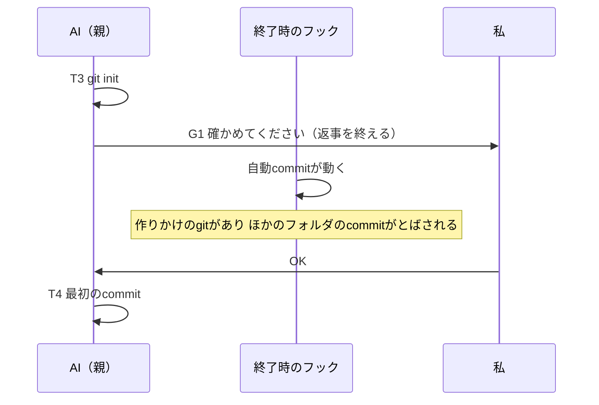

今回の最も重要なポイントを結論から申し上げます。それは、AIに頼むとき、まず段取りを1枚書かせ、私がOKを出すまで止めることです。

## この回の4点

| 困っていたこと | 人間が決めたこと | AI部下がやったこと | 結果 |
|---|---|---|---|
| 雑に頼むと、意図の取り違え・作り話・確かめていない完了が起きる。防ぐために毎回細かく書くと、対話だけで時間が過ぎる。Orcaに任せるだけでは、流れ・作業・レビューが見えない | すべての依頼と質問を段取り（フロー）に通す。小さな依頼でも承認で止まる。規模は作業の数で決める。段取りを書くのは賢いモデル | 設計書、手で試した3件の書き直し、見直し6つ、検査のスクリプトと試験 | 10月7日の1日で、設計から最初の本番まで進んだ。手で試した3件で、実際に聞き直した点の多くを、前もって拾えた |

「非エンジニアのAI業務自動化」の別編です。前の2つの編（Orcaマルチエージェント編、読書カード編）では、AIに任せる仕組みを書きました。今回は、その手前の「頼み方」の仕組みです。

全3本で、1回目は、なぜ作ったかと、最初の1日でどう作ったかを、作業の記録をたどって書きます。

## この編について

この仕組みを、私は「フロー化」と呼んでいます。私が雑に頼むと、AIはまず「フロー」と呼ぶ段取りのファイルを1枚書き、私に見せて止まります。私がOKを出すと、あとは最後まで進みます。

使ってみた手応えは、noteに書きました。Qiitaでは、どう作り、どこで直したかを、設計書の変更履歴とフローの記録でたどります。

この編は、次の3本です。

- #1なぜ作ったか、最初の1日でどう作ったか（この記事）
- #2フローのファイルと検査のスクリプトの実物
- #3使いながら直した履歴と、4日間のフロー38本の数字

## 雑に頼むと、3つ間違える

AIに雑に頼んだときの間違いを、私の仕組みの全体設計書では3種類に分けています。

| 間違い | 例 | 対策 |
|---|---|---|
| 意図の取り違え | 「保険まとめて」を、一覧表と読むか、解約の判断材料と読むか | 段取り（依頼票と作業の表）と、私の承認 |
| 事実の作り話 | 年数や金額を、もっともらしく埋める | 正本から読む、出典を書く、根拠のないものは「要確認」にする |
| 確かめていない完了 | 確かめていないのに「できました」と言う | 完了条件を機械で確かめる、2人でレビューする |

フロー化は、この表の1つ目を止めるための仕組みです。2つ目と3つ目も、段取りの欄で減らします。「使うソース」と「分からないこと」の欄で作り話を、「完了条件」の欄で確かめていない完了を、それぞれ減らします。

## 対話だけで時間が過ぎていた

この3つを防ぐために、私はこれまで、毎回細かく指示を書いていました。AIと何往復もして、ようやく作業が始まります。それだけで時間が過ぎていました。

任せるところは任せたい。でも、任せきりにすると、AIが何をどういう順番でやって、どこで何を確かめたのかが見えません。

前の編で書いたOrcaで、複数のAIを動かせるようにはなっていました。ただ、Orcaに任せるだけだと、どういう流れで、どういう作業をして、どういうレビューをしたのかが見えませんでした。

見えないので、見えるようにすることにしました。それがフロー化です。

## ひとことで言うと

仕組みの入口は、Claude Codeが最初に読む指示書（`CLAUDE.md`）の、次の1文です。

```markdown:CLAUDE.md（一部）
本人は「ToDo の番号＋やりたいこと」か質問を書くだけでよい。**すべての依頼と質問は `.claude/commands/flow.md` の手順を通す**（`/flow` と打たれなくても）。依頼は、最初の返事でフロー（`.claude/flows/<日付>_<名前>.md`：依頼票＋作業の表＋流れの図）を書き、`python3 .claude/flows/flow_check.py` に通してから見せ、**規模を問わず本人の承認で止まる**。依頼から決められないことは【要確認】として承認のときに聞き、推測で埋めない。
```

`.claude/commands/`は、Claude Codeのコマンド（手順書）を置く場所です。ここに置いた`flow.md`が、フロー化の手順書になります。

手順書の冒頭は、次のとおりです。

```markdown:.claude/commands/flow.md（冒頭）
# flow — やりたいこと・質問をフローに書き直し、承認を受けてから実行する（すべての依頼の入口）

引数: $ARGUMENTS（やりたいこと・質問。ToDo の番号があれば添える）

設計の正本は `999.AllDesign/フロー化_設計書.md`（2026-10-07 本人承認。ToDo A-7）。この手順書はそれを実行の手順に絞ったもの。
```

大事なのは「`/flow`と打たれなくても」の所です。私がコマンドを打つのを忘れても、AIは必ずこの手順を通します。質問も同じです。質問には止まらずに答え、そのやり取りをフローに記録します。

## 段取りの流れ

設計書には、流れをこう書きました。

```text:フロー化の全体の流れ（設計書より）
本人：やりたいこと（ToDoの番号があれば添える）
   │
① 規模を決める（小・中・大）
   ↓
② フローのファイルを書く
   ↓
③ 検査（機械）→ 通らなければ直す
   ↓
④ 本人の承認（規模にかかわらず、ここで必ず止まる）
   ↓
⑤ 実行（作業ごとに：そのまま／/orchestrate、モデル、作業場所）
   ↓
⑥ 結果をフローのファイルに書き戻し、commit・ToDoを更新して報告
```

①〜④と⑥は、親のAI（司令塔）が受け持ちます。モデルはClaude Opusです。フロー化は全体でいちばん難しい作業なので、賢いモデルにすると決めました。⑤の実行は、作業ごとに、そのまま進めるか、前の編の`/orchestrate`で複数のAIに回すかを選びます。


*段取りの流れ（noteの記事の図と同じものです）*

## 1日で作った

フロー化は、10月7日の1日で、設計から最初の本番まで進みました。設計書の変更履歴とgitの履歴から、その日の流れをたどると、次のとおりです。


いきなりコマンドを作らず、まず設計書を書かせました。私が読んで、3つ決めました。

- フローのファイルの置き場所は、設計書とは別のフォルダにする
- 小さな依頼でも、フローを書いて承認で止まる
- ToDoの番号がない依頼は、規模にかかわらず「ToDoに足すか」を聞く

2つ目は、小さな依頼でも流れを私が確かめるためです。止まる回数は増えますが、その代わり、どんな依頼でも最初に段取りを見られます。

それまでの決まりでは、AIは最初の返事で、進め方を3つの中から選んで理由を言っていました。フロー化のあとは、最初の返事でフローのファイルを書いて見せます。進め方は、作業ごとに表の「進め方」の欄で選びます。依頼全体で1つ選ぶのではなく、作業ごとに選ぶ形に変わりました。

## 質問は止まらずに答える

依頼だけでなく、質問もフローの対象にしました。質問への答えによって、やることが変わることがあるからです。

ただし、質問のたびに止まると、往復が増えます。そこで、質問には止まらずに答え、そのやり取りを記録することにしました。

- 進行中のフローに関わる質問なら、そのフローの「質問と答え」の欄に足す
- 関わらなければ、質問だけの短いフローを作る
- 記録するのは、何を聞かれたと受け取ったか、使った資料、答えの要点、フローへの影響
- 答えによって作業が増える・変わるときだけ、フローを書き直して止まる

## 規模で変わるもの

規模（小・中・大）で、フローの深さと、途中の報告の仕方が変わります。

| 規模 | 箱の数 | フローの深さ | 途中の報告 |
|---|---|---|---|
| 小 | 1〜3 | 依頼票＋作業の表＋流れの図 | 最後にまとめて |
| 中 | 4〜5 | ＋止まるところ | 段が終わるごとに1行 |
| 大 | 6以上 | ＋止まるところ＋段の区切りでのcommit | 段が終わるごとに報告し、commitする |

仕組みを変える、外に出す（pushや公開）、お金や経歴や方針の判断を含む、のどれかに当たれば、1段上げます。前の2つは、書くファイルと人の確認の欄から、検査が見分けます。判断を含むかは機械では見分けられないので、親のAIが理由を書きます。

箱が13以上になったら、フローを2つに分けることを勧める警告を出します。1回の承認で見通せる大きさに保つためです。

## 承認のほかに止まるとき

承認のほかにも、次のときは止まります。

- 取り消せない操作（削除・上書き・push・デプロイ・外への送信）の前
- 実行の途中で、依頼の前提が崩れたとき。たとえば、資料を読んだら、数字が依頼と違った
- 前の編の`/orchestrate`で、5回やり直しても合格しないとき

2つ目は、手で試したローンの件から入れました。資料を読むと、私が伝えた数字と違っていました。こういうときは、勝手に直して進めず、何が違ったかを見せて、続けるか直すかを聞きます。

新しい仕組みを初めて使うときは、最初の作業が動き始めたところでも止まります。動きを私が自分の目で確かめるためです。

## まず手で3件試した

コマンドにする前に、設計書の書式で、前の2日間にした実際の作業3件を、フローに書き直させました。実際に起きた聞き直しや間違いを、フローの形なら前もって拾えたかを確かめるためです。

| 件 | 実際に起きた聞き直し・間違い | 前もって拾えたか |
|---|---|---|
| ローンの計算の見直し | 聞き直しが3つ。資料の数字と、私の伝えた数字の食い違い | すべて拾えた。ただし1つは、見直し2（下）の決まりがあって初めて拾える |
| ToDoの見える化 | 「全部」の範囲。引き継ぎのメモにだけあった作業。作業中に気づいた食い違い | 範囲と引き継ぎのメモは拾えた。作業中の気づきは、前もっては拾えない |
| 全体設計書 | フォルダ名の違い。私のメモと実態の違い。数字の誤り | フォルダ名とメモの違いは拾えた。数字は、見直し3（下）の決まりがあれば拾える |

2つ目の「ToDoの見える化」は、ToDoの一覧の書き方を直した作業です。書き直したフローの「分からないこと」の欄には、次の3つが出ました。

```markdown:手で試したフロー（ToDoの見える化）の「分からないこと」
- 分からないこと：
  - 【要確認】1 「全部」の範囲：今ある長いチェックの行も1行に書き直すか、これからの決まりだけにするか
  - 【要確認】2 「完了ログ」（項目ごと終わったもの）も `ToDo_完了.md` へ移すか
  - 【要確認】3 30項目の「次の一手・誰・期限」は、Claude が案を書いてよいか（あとで本人が直す）
```

実際の作業では、1つ目の「全部」の範囲を、AIが自分で「書き直さない」と決めて、報告で伝えていました。フローの形なら、承認のときに私が決められていました。

同じフローの「フローと実際の比較」には、こう書かれていました。

```markdown:同じフローの「フローと実際の比較」（一部）
| 実際に起きたこと | フローで事前に拾えたか |
|---|---|
| 「全部」の範囲（長い行を書き直すか）を、私が「書き直さない」と決めて報告で伝えた | 拾えた（【要確認】1）。承認のときに本人が決められた |
| 一覧の行を書く途中で、済んでいる項目と食い違いに気づいた | 事前には拾えない（書いてみて初めて分かる）。実行の記録に「見つけたこと」の欄を足し、最後の報告で本人に聞く形にする |
| フックを登録する前に止まらなかった（そのまま入れた） | フローなら T5 で止まる。新しい仕組みを初めて入れる所が承認で見える |
```

この「比較」の欄は、今のフローにも残っています。終わったら、聞き直したことや想定と違ったことを書き、次のフロー化に活かします。

ローンの件は、お金の話なので中身は書きません。聞き直した3つが、3つともフローの「分からないこと」の欄に出た、ということだけ書いておきます。最初に3つ答えておけば、途中で止まらずに済んでいました。

試作の検査も、3件に当ててみました。3件とも合格しました。わざと間違いを入れた写しでは、決まった言葉でない書き方、存在しない作業への依存、「要確認」の印が残ったままの承認を、ちゃんと止めました。

## 試して出た見直し6つ

手で試した結果から、AIは見直しを6つ出しました。私は6つとも承認しました。

- 規模の基準を変える。書くファイルの数では測れない。全体設計書はファイルが1本で「小」になったが、方針を決める重い作業だった
- 最初の作業（T1）を決まった形にする。どのフローでも、まず使う資料を読み、依頼の前提（数字・名前・場所）と突き合わせる
- 数字を書く作業には、数えて確かめる作業を付ける
- 実行の記録に「見つけたこと」の欄を足す
- 「並列」の列を、人に書かせない。依存から計算する
- 存在しない依存を指したときに、検査そのものが落ちないようにする

5つ目は、試作で実際に起きたことからです。表に「直列」と書いた作業が、実際には別の作業と同時に動き、同じファイルを書き換えるのを見落としました。人が書くと、表と実際の動きが食い違います。そこで、依存（どの作業の結果を使うか）だけを書かせ、順番は検査が計算することにしました。#2で、その計算のコードを見せます。

規模も、ファイルの数ではなく、作業の数（流れの図の箱の数）で決めることにしました。箱が1〜3なら小、4〜5なら中、6以上なら大です。人が決めないので、ぶれません。

## 1日で作ったもの

見直しを入れたあと、AIはその日のうちに、次のものを作りました。

| 作ったもの | 中身 |
|---|---|
| 手順書（`flow.md`） | フロー化の手順。Claude Codeが読んで従う |
| ひな形（`_template.md`） | フローのファイルの書式 |
| 検査のスクリプト（`flow_check.py`） | 検査と、流れの図（Mermaid）の書き出し |
| 検査の試験（`test_flow_check.py`） | よい例と悪い例。この日は35件 |
| 指示書や手順の案内 | 入口をフロー化に替える書き換え |

今の試験は、手で試した3件も含めて、置き場所にあるフローを全部、本物の例として当てています。手で試した3件も、今の検査に通ります。

## 最初の本番で、矛盾が見つかった

検査のスクリプトと試験35件ができたところで、最初の本番に使いました。作業フォルダのルートを、手元だけのgitにする作業です。

フローの最初の形は、こうでした。

- T3：gitのリポジトリを作る（git init）
- G1：私が確かめる（ここで止まる）
- T4：最初のcommitをする

実行の途中で、AIがこの計画の矛盾に気づきました。私の環境では、AIが返事を終えるたびに、自動でcommitするフックが動きます。G1で止まった返事の終わりにも、このフックが動きます。そのとき、作りかけのgitがあると、ほかのフォルダの自動のcommitがとばされてしまいます。



AIは、git initをG1のあと（T4）に移して進めました。

この本番では、ほかにも記録に残ったことがあります。

- T1（前提の突き合わせ）で、設計書の除外の一覧にない隠しフォルダが見つかった。モデルの一覧のキャッシュや、プラグインのデータ置き場など。gitに入れないものとして足した
- 終了時のフックの順番が「自動commit → 生成物の更新」だったので、gitにすると、毎回生成物の変更でcommitを促される。順番を入れ替えた
- 自動commitのフックを書き直したとき、件数の判定が失敗の扱いになり、フックが黙って終わる誤りを入れてしまった。試験で見つけて直した

1つ目は、見直し2で決めたT1の決まった形が、さっそく効いた所です。実行の途中で私に聞き直したことはなく、聞いたのは承認のときの3問だけでした。そのうえで、「止まる所」と「途中で止めずに続ける所」がぶつかっていないかを、フローの段階で確かめる見直しを出しました。

私はこれを承認し、その日の20時51分に、検査に入りました。今の試験には、この本番の形がそのまま入っています。

```text:検査の試験の出力（一部）
OK  続けて行う作業の途中に人の確認があれば止める（A-11の最初の形）
OK  人の確認より後だけなら通る（A-11の直した形）
OK  範囲の最初の作業が人の確認なのはよい
```

最初の形のフローを今の検査に通すと、止まります。直した形は通ります。実際に起きた矛盾を、次から機械で止められるようにしました。

## 承認で止まると、こう見える

今は、どんな依頼でも、最初の返事でフローを書いて止まります。私の画面には、フローのファイルの場所、作業の数と規模、そして「決めていただきたいこと」が並びます。

承認のあとも、私の確認の箱（ひし形）に来ると止まります。下の画面は、別の記事の図を作るフローで、読み直しの確認で止まったところです。作ったもの、確かめたこと、そして私に決めてほしいことが、番号付きで並んでいます。


*確認で止まった返事です（手元のフォルダ名などは隠しています）。私は、番号ごとに直すかどうかを答えるだけです*

私がすることは、ここで答えてOKを出すことだけです。答えた内容は、フローの「分からないこと」の欄に、日付と私の言葉で書き込まれます。

OKを出すと、フローの状態は「下書き」から「承認済み」に変わります。実行が始まると「実行中」、終われば「完了」です。やめたときは「中止」にします。どのフローが今どこにいるかは、この1行を見れば分かります。

## この回のマネージャーの仕事

この回で、人間（私）が決めたことと、AIがやったことを分けて書きます。

私が決めたのは、次のことです。

- すべての依頼と質問を、フローに通す。コマンドを打たなくても通す
- 質問には止まらずに答え、記録する。作業が変わるときだけ止まる
- commitは親のAIだけがする（子のAIが同時にcommitすると、gitのロックでぶつかるため）
- 小さな依頼でも、承認で止まる
- フロー化は賢いモデル（Claude Opus）で行う
- 手で試した結果からの見直し6つと、最初の本番からの見直し2つを、入れる

AIがやったのは、設計書を書くこと、前の作業3件をフローに書き直して比べること、見直しの提案、検査のスクリプトと試験を書くこと、最初の本番で計画の矛盾に気づいて直すことです。

10月7日は、私がしたことの多くが「読んで、決める」でした。設計書を読んで3つ決め、見直しを読んで承認し、本番の途中で出た提案を承認しました。書いたのは、すべてAIです。

## 次回

次回は、フローのファイルの実物と、検査のスクリプトのコードを見せます。依頼票・作業の表・流れの図の書き方、段と規模の計算、検査の11項目です。

連載の目次

- #1AIに頼む前に、段取りを書かせる（この記事）
- #2段取りは表に書き、図は機械が描く
- #3段取りは、使いながら直す

## 参考

- Claude Codeのスラッシュコマンド：[https://code.claude.com/docs/en/slash-commands](https://code.claude.com/docs/en/slash-commands)
- Claude Codeのフック：[https://code.claude.com/docs/en/hooks](https://code.claude.com/docs/en/hooks)
- 前の編（Orcaマルチエージェント編）#1：[https://qiita.com/horiken1977/items/7a3437f61b74b064f13c](https://qiita.com/horiken1977/items/7a3437f61b74b064f13c)
- Mermaidシーケンス図：[https://mermaid.js.org/syntax/sequenceDiagram.html](https://mermaid.js.org/syntax/sequenceDiagram.html)
