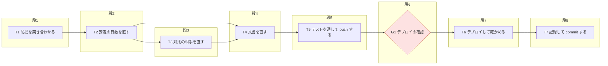
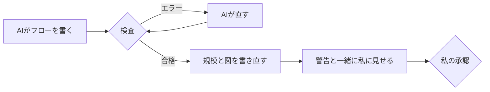

今回の最も重要なポイントを結論から申し上げます。それは、段取りは人が読む表に書き、流れの図と規模は機械に計算させることです。

## この回の4点

| 困っていたこと | 人間が決めたこと | AI部下がやったこと | 結果 |
|---|---|---|---|
| 手で試したとき、表に「直列」と書いた作業が実際には同時に動き、同じファイルを書き換えるのを見落とした。規模を人が決めると、ぶれた | 並列かどうかは書かせない（依存から計算する）。規模は箱の数で決める。図は表の写しで、手で直さない。同時に動く作業は3つまで | フローのひな形、検査のスクリプト（11項目と警告）、流れの図の書き出し、試験 | 試験は89件すべて合格。そのうち38件は、実際に使ったフロー38本をそのまま当てたもの |

前回（#1）は、なぜフロー化を作ったかと、10月7日の1日でどう作ったかを書きました。今回は、フローのファイルと検査のスクリプトの実物を見せます。

## この回で見せるもの

例にするのは、読書カード編の#3で書いた「設計とずれていた2つを直す」作業のフローです。実際に使ったフローを、手元のパスだけ短くして載せます。読書カード編の#3で見つかったずれを、私が「全部オススメでお願いします」と答えて直すことにしたあと、AIが書いたフローです。

フローのファイルは、Markdownのファイル1つです。上から順に、次の節が並びます。

- ファイルの頭（種類・ToDoの番号・規模・状態）
- 依頼票（6項目）
- 作業の表（10列）
- 流れの図（検査が書く）
- 続けて行う作業、止まるところ
- 質問と答え、実行の記録、見つけたこと、フローと実際の比較

上の4つが、承認の前に私が読む所です。下の4つは、実行しながらAIが書き足していく所です。

下の4つにも、それぞれ役目があります。

- 質問と答え：実行中に私が聞いたことと、AIの答え。答えで作業が変わったかも書く
- 実行の記録：作業ごとの結果と、その根拠（数えた数や試験の結果）、commit
- 見つけたこと：作業中に気づいた食い違いや、すでに済んでいた項目。最後の報告で私に聞く
- フローと実際の比較：終わったあとに、聞き直したことや想定と違ったことを書く。次のフロー化に活かす

1枚のファイルに、頼んだことから終わったことまでが全部残ります。あとで「あのとき何を決めたか」を探すときも、このファイルを開けば済みます。

## ファイルの頭の7行

ファイルの頭には、次の7行を置きます。

```yaml:フローのファイルの頭
---
type: flow
kind: 依頼            # 依頼・質問
todo: なし            # ToDoの番号。なければ「なし」（承認のときに「ToDoに足すか」を聞く）
raise: なし           # 1段上げる理由。お金・経歴・方針の判断を含むときだけ親が書く
size: 小              # 検査が箱の数と raise から決めて書く。手で直さない
status: 下書き        # 下書き → 承認済み → 実行中 → 完了／中止
created: 2026-10-09
---
```

`size`（規模）は、AIも私も書きません。検査が、作業の数から計算して書き直します。AIが「小」と書いておいても、作業が8つあれば、検査が「大」に直して知らせます。

`raise`だけは、親のAIが書きます。お金や経歴や方針の判断を含むかは、機械では見分けられないからです。

`kind`は、依頼か質問かです。質問のフローは、作業の表がなくてもかまいません。答えたことを記録するのが目的だからです。

`todo`には、私のToDoの番号を書きます。番号がなければ「なし」と書き、承認のときにAIが「ToDoに足しますか」と聞きます。

## 依頼票の6項目

依頼票には、6つの項目を書きます。例のフローの依頼票を、少し短くして載せます。

```markdown:例のフローの依頼票（一部を短くした）
## 依頼票

- 目的：記事を書く前の事実の試験で、設計とコードの食い違いが2件見つかった。本人の決定で、設計どおりにコードを直す
- 成果物：api/grade.py・scripts/lib.py・tests/ のテスト・設計書と運用ルールの該当の節
- 完了条件：①初めて安定になると30日後、安定のまま合格すると60日後になることを、テストで確かめる ②対比の相手が、別の本の記入済みカードから選ばれ、日付ごとに変わることを、テストで確かめる ③全部のテストが通る ④設計書と運用ルールに、直した決まりが書いてある ⑤本番の採点のAPIが動いている
- 使うソース：api/grade.py・scripts/lib.py・tests/・設計書・運用ルール
- やってはいけないこと：カード本体の状態を書き換えない。合格の線は変えない。本人に聞かずにデプロイしない
- 分からないこと：
  - 【決定】1 対比の相手の選び方（本人「全部オススメ」）：同じ本以外の記入済みカードから、カードの名前と日付で決まる1枚を選ぶ
```

#1の「3つの間違い」との対応は、次のとおりです。

- 意図の取り違えは、「目的」「成果物」「分からないこと」で止める
- 作り話は、「使うソース」で止める。どの正本を読むかを先に書かせる
- 確かめていない完了は、「完了条件」で止める。何で確かめるかを、コマンドや数で書かせる

「分からないこと」には、依頼から決められないことを、「要確認」の印を付けて並べます。推測で埋めさせないためです。私が答えると、印が「決定」に変わり、日付と私の言葉が入ります。「要確認」の印が1つでも残っていると、検査は「承認済み」にさせません。

完了条件には、「適切に」「十分に」のような言葉だけの書き方を許しません。検査が警告します。何で確かめるかが書いていないと、「できました」が確かめられないからです。

## 作業の表の10列

作業の表は、次の10列です。

| 列 | 書くこと |
|---|---|
| ID | T1、T2…。私の確認だけの作業はG1、G2… |
| 作業 | 最初の「。」までが箱の名前（20字以内）。そのあとに詳しく |
| 入力 | 何を読むか |
| 出力 | 書いてよいファイル。作業ごとにパスで書く |
| 完了条件 | 何で確かめるか |
| 依存 | 前のどの作業の結果を使うか |
| 作業場所 | 同じフォルダか、別の作業場所（worktree）か |
| モデル | Opus（判断）かSonnet（実行・検証） |
| 進め方 | そのまま進めるか、複数のAIで回す（/orchestrate）か |
| 人の確認 | なし・push・デプロイ・削除・外への送信・機密・本人の決定 |

最初の作業（T1）は、いつも同じ形です。使う資料を読み、依頼の前提（数字・名前・場所）と突き合わせます。違っていれば、そこで止まって知らせます。

「並列」の列はありません。#1で書いたとおり、人が書くと実際の動きと食い違うからです。

作業場所は、ふだんは「同じフォルダ」です。別の作業場所（gitのworktree）を使うのは、同じリポジトリを2つの作業が同時に書くときだけにしています。worktreeは、同じリポジトリの別の写しを作り、別々に書き換えてから、あとで1つに合わせる仕組みです。

モデルは、判断の重い作業をOpus、決まった作業をSonnetにします。例のフローでは、コードを直すT2〜T4をOpus、テストやデプロイの確かめをSonnetにしました。

人の確認の欄が「なし」以外なら、その作業の前で必ず止まります。例のフローのG1は「デプロイ」なので、本番に出す前に私に聞いてきました。

例のフローの作業の表は、こうなりました（パスは短くし、完了条件は番号だけにしました）。

| ID | 作業 | 出力（書いてよいファイル） | 完了条件 | 依存 | モデル | 人の確認 |
|---|---|---|---|---|---|---|
| T1 | 前提を突き合わせる。直す2つの関数と、それを呼ぶ所・今のテストを読む | なし | 呼ぶ所の一覧がそろう | なし | Opus | なし |
| T2 | 安定の日数を直す。前の状態で30日と60日を分ける。テストを足す | api/grade.py・scripts/lib.py・tests/ | ① | T1 | Opus | なし |
| T3 | 対比の相手を直す。T2 と同じファイルを書くので T2 のあと | scripts/lib.py・tests/ | ② | T2 | Opus | なし |
| T4 | 文書を直す | 設計書・運用ルール | ④ | T2, T3 | Opus | なし |
| T5 | テストを通して push する | なし | ③ | T4 | Sonnet | なし |
| G1 | デプロイの確認 | なし | 本人の OK | T5 | Opus | デプロイ |
| T6 | デプロイして確かめる | なし | ⑤ | G1 | Sonnet | なし |
| T7 | 記録して commit する | ToDo | 未 commit が0件 | T6 | Sonnet | なし |

T3の依存は、最初はT1でした。T2とT3が同時に動く形です。検査に通すと、こう止められました。

```text:検査の出力（最初の形）
エラー 3 段2で同時に動く T2 と T3 が同じファイルを書く：90.mybrain/cards/scripts/lib.py・90.mybrain/cards/tests/test_lib_select.py
20261009_cards-review-fix.md：不合格（エラー 1件・警告 1件）
```

同じファイルを2つの作業が同時に書くと、片方の書き換えが消えるおそれがあります。AIはT3の依存をT2にし、T2のあとに動く形に直しました。これが、#1で書いた「人が並列を書くと見落とす」を、機械が止めた例です。

## 図は表から作る

検査に通ると、作業の表から「流れの図」の節が書き直されます。例のフローの図は、次のとおりです。



見方は3つです。

- 枠（段）が、実行の順番。左から右へ進む
- 同じ枠に箱が2つ以上あれば、同時に動く
- ひし形は、私の確認で止まる所

箱の文字からは、Mermaidで壊れやすい記号（`"`や`|`や括弧など）を外してから書きます。作業の名前に括弧が入っていても、図が崩れません。図にならない画面で開いても、コードブロックとして文字のまま読めます。

図は表の写しです。手で直しません。表を直して検査に通せば、図も変わります。ToDoの「いまの一覧」と同じ考え方にしました。

このMermaidの図は、Orcaでフローのファイルを開くと、図として表示されます。承認の前に、表を読まなくても、この図で流れを確かめられます。


*この連載（#3で見せるフロー）の流れの図を表示したところです。段ごとの枠と、私の確認で止まるひし形（G1・G2）が見えます*

最初の図には、段の枠がありませんでした。10月7日に図を見た私が、「実行の順番が分からない」と伝えて、枠を足してもらいました。

## 段は依存から計算する

段は、依存から計算します。依存のない作業が段1、段1の作業だけに依存する作業が段2、という数え方です。

```python:flow_check.py（段の計算）
def stages(tasks):
    """ID → 段（1から）。存在しない依存は無視する（エラーは別に出す）。循環しているものは None。"""
    ids = {t["ID"] for t in tasks}
    graph = {t["ID"]: [d for d in deps_of(t) if d in ids] for t in tasks}
    level, state = {}, {}

    def visit(n):
        if state.get(n) == "done":
            return level[n]
        if state.get(n) == "busy":
            raise ValueError(n)
        state[n] = "busy"
        level[n] = 1 + max([visit(d) for d in graph[n]] or [0])
        state[n] = "done"
        return level[n]
```

ある作業の段は、依存している作業の段の一番大きいものに、1を足した数です。

例のフローで数えると、T1は依存がないので段1です。T2はT1に依存するので段2、T3はT2に依存するので段3です。T4はT2とT3の両方に依存するので、大きいほうのT3の段3に1を足して、段4になります。依存がぐるぐる回っていると、計算の途中で同じ作業に戻ってくるので、そこで見つけます。

「存在しない依存は無視する」の一文は、#1の見直しの6つ目から来ています。試作の検査は、存在しない作業を依存に書くと、検査そのものが落ちていました。今は落ちずに、エラーとして知らせます。

同じ段に、私の確認以外の作業が4つ以上並ぶと止めます。同時に動かすAIの子は3人まで、という決まりに合わせました。

## 規模は箱の数で決める

規模の計算は、次の15行ほどです。

```python:flow_check.py（規模の計算）
def size_of(tasks, raise_value):
    n = len(tasks)
    base = 0 if n <= 3 else 1 if n <= 5 else 2
    reasons = []
    if raise_value and raise_value not in ("なし", ""):
        reasons.append(raise_value)
    if any(SYSTEM_PATH.search(f) for t in tasks for f in files_of(t)):
        reasons.append("仕組みを変える（検査が見分けた）")
    if any(confirms(t) & OUTWARD for t in tasks):
        reasons.append("外に出す（検査が見分けた）")
    if reasons:
        base = min(2, base + 1)
    return "小中大"[base], reasons
```

箱が3つまでなら小、5つまでなら中、それより多ければ大です。仕組みのファイル（指示書や設定や台帳）を書く作業があるか、人の確認にpush・デプロイ・外への送信があれば、1段上げます。

#1で書いた「手で試した3件」に当てると、ローンの件は箱7で大、ToDoの見える化は箱6で大になります。全体設計書は箱2で小ですが、方針を決める作業なので、親のAIが`raise`に理由を書いて中に上げます。ファイルの数で決めていたときの食い違いが、なくなりました。

例のフローは箱が8つで、もともと大です。デプロイがあるので「外に出す」も見分けられ、検査はこう出しました。

```text:検査の出力（例のフロー）
20261009_cards-review-fix.md：合格（警告 0件）。箱8・段8・規模大。1段上げた理由：外に出す（検査が見分けた）（size を 小 から 大 に直した）
```

AIはひな形のまま`size: 小`と書いていましたが、検査が「大」に直しています。#1の表のとおり、大のフローは、段が終わるごとに報告し、commitします。

## 検査の11項目

検査は、次の11項目のどれかに当たると止めます。

- 依頼票の6項目のどれかが空
- 作業の表の欄のどれかが空。IDが重なる
- 同じ段の作業の間で、書いてよいファイルが重なる
- 依存が、ないIDを指している。依存がぐるぐる回っている
- 別の作業場所（worktree）なのに、対象がgitのリポジトリの中にない
- モデル・進め方・人の確認が、決まった言葉でない
- 書いてよいファイルに、秘密の値の置き場所が入っている
- pushする作業の対象が、push先のないリポジトリ
- 同じ段の作業が3つを超える
- 「要確認」の印が残ったまま「承認済み」になっている
- 続けて行う作業の途中に、私の確認の箱がある

止めはしないけれど、承認のときに私に見せる警告もあります。警告は見せるだけで、直すかどうかは私が決めます。箱の名前が20字を超える、箱が13以上ある、T1が前提の突き合わせになっていない、進行中のほかのフローと書くファイルが重なる、などです。

検査の流れは、次のとおりです。



AIは、エラーが0になるまで私に見せません。私が見るのは、いつも検査に通ったフローです。

検査の終わり方は3つです。エラーがあれば終了コード1、警告だけなら0、フローの書式そのものが読めなければ2を返します。手順書には「1なら直して、もう一度。0になるまで本人に見せない」と書いてあります。書き直さずに確かめるだけのときは、`--dry-run`を付けて動かします。

## 途中で止めない所を守る

11項目目は、#1で書いた最初の本番の矛盾から入れたものです。フローに「続けて行う作業」の範囲（たとえばT4〜T6）を書くと、その途中に私の確認の箱がないかを調べます。

```python:flow_check.py（続けて行う作業の途中の確認を見つける）
            label = f"{g[1]}〜{g[2]}" if g[0] == "range" else "・".join(g[1])
            for t in tasks:
                if t["ID"] in group and t.get("人の確認", "なし") != "なし" and any(p in group for p in parents[t["ID"]]):
                    errors.append(f"11 続けて行う作業 {label} の途中に、人の確認の箱 {t['ID']} がある（確認で止まった返事の終わりに、終了時のフックが動くため）")
```

範囲の最初の作業に確認があるのは、かまいません。始める前に止まるだけだからです。止めるのは、範囲の途中にある確認だけです。エラーの文には、なぜ止めるのか（返事の終わりにフックが動くため）も書くようにしました。

例のフローでは、T2〜T5を「続けて行う作業」にしました。コードを直してからpushするまでの間に、私の確認はありません。デプロイの確認（G1）は、その範囲の外です。

## 検査の結果の見え方

検査を動かすと、ターミナルにはこう出ます。

検査は、ターミナルに1行で結果を出します。合格か不合格か、警告の件数、箱と段の数、規模です。この記事の前半で見せた、例のフローの出力が、それです。不合格のときは、どの項目に当たったかが「エラー」と項目の番号付きで1行ずつ出ます。警告は「警告」で始まる行で出ます。エラーと警告は、それぞれ何件あったかも最後の行に出ます。

警告は、たとえば次のように出ます。どちらも、この連載のフローで実際に出たものです。

```text:検査の警告（実際に出たもの）
警告 T9 の箱の名前（最初の「。」まで）が20字を超える：画像を push して、記録して commit する
警告 進行中のほかのフロー 20261009_cards-draft-tone.md（承認済み）と書くファイルが重なる
```

1つ目は、箱の名前を短く直しました。2つ目は、前のフローが私のOK済みだったので、「前のフローが先、このフローが後」と順番を決めて、フローの「質問と答え」に書きました。

## 試験は本物にも当てる

検査のスクリプトには、試験が付いています。10月7日は35件でした。今は89件です。

```text:検査の試験の出力（一部）
OK  並列の列は書かせない
OK  存在しない依存で落ちない
OK  同じ段で同じファイル
OK  人の確認だけの箱は数えない
OK  規模：箱6で大
OK  外に出すは検査が見分けて上げる
OK  13以上で分ける警告
OK  続けて行う作業の途中に人の確認があれば止める（A-11の最初の形）
OK  本物のフロー 20261007_todo-visibility.md が合格
89/89 合格
```

89件のうち51件は、決まりごとの試験です。よい例が通り、わざと間違いを入れた例が止まることを確かめます。

残りの38件は、置き場所にある本物のフローを、そのまま検査に当てるものです。

10月8日には、ほかのフローと書くファイルが重なるときの警告を足しました。このとき、その日までにあった本物のフロー13本を全部当て直して、どれも不合格にならないことを確かめています。検査を直したときに、これまでのフローが急に不合格にならないかを確かめます。フローが増えるたびに、この数も増えます。

## この回のマネージャーの仕事

この回で、人間（私）が決めたことと、AIがやったことを分けて書きます。

私が決めたのは、次のことです。

- 並列かどうかは書かせず、依存から計算させる
- 規模は、流れの図の箱の数で決める
- 流れの図は作業の表から自動で作り、手で直さない
- 図に、実行の順番が分かる段の枠を足す
- 同時に動く作業は3つまで

AIがやったのは、ひな形、検査のスクリプト、流れの図の書き出し、試験です。依存がぐるぐる回ったときや、存在しない作業を指したときの扱いも、AIが決めて試験にしました。

## 次回

次回は、使いながら直した履歴を書きます。出典の必須化、依頼を並べて出すとき、複数のAIへの渡し方、質問の選び方、4日間のフロー38本の数字、そしてこの連載自体のフローです。

## 参考

- Mermaidフローチャート：[https://mermaid.js.org/syntax/flowchart.html](https://mermaid.js.org/syntax/flowchart.html)
- Claude Codeのスラッシュコマンド：[https://code.claude.com/docs/en/slash-commands](https://code.claude.com/docs/en/slash-commands)
