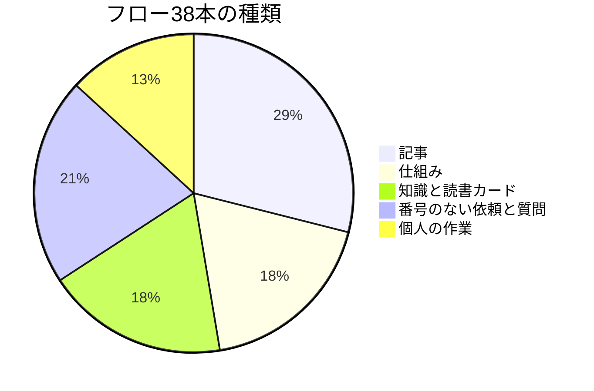
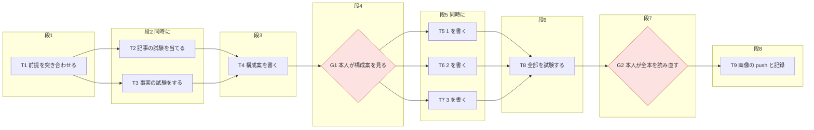

今回の最も重要なポイントを結論から申し上げます。それは、段取りの仕組みも、使って記録を残し、その記録を見て直すことです。

## この回の4点

| 困っていたこと | 人間が決めたこと | AI部下がやったこと | 結果 |
|---|---|---|---|
| 使い始めると、出典のない事実、並べて出す依頼、複数のAIへの渡し方、浅い記事、といった困りごとが順に出てきた | 文書の事実には出典を付ける。依頼は1つの会話で順に進める。複数のAIにはフローの表を渡す。記事は書く前に試験をする | 手順書と検査の直し、試験の追加、フローの記録（実行の記録・見つけたこと・フローと実際の比較） | 4日間でフロー38本。「見つけたこと」は23本に57件。この連載も、フローで書いた |

前回（#2）は、フローのファイルと検査のスクリプトの実物を見せました。今回は、使い始めてから直した履歴と、4日間のフロー38本の数字を書きます。最後に、この連載自体をどんなフローで書いたかも見せます。

## 4日間に直したこと

フロー化を使い始めた10月7日から10月9日までに、主に次のことを直しました。どれも、フローの記録と、gitの履歴から拾ったものです。

| 日付 | 起きたこと | 直し方 |
|---|---|---|
| 10月7日 20時51分 | 最初の本番で、止まる所と続ける所がぶつかった | 続けて行う作業の途中に、私の確認を置けなくした（#1） |
| 10月7日 22時37分 | 文書の事実に、出典を付ける決まりがなかった | 文書を作る作業の完了条件に「事実に出典」を入れた |
| 10月8日 朝 | 複数のAIに渡すとき、別の分解の表を作り直していた | `/orchestrate`が、フローの作業の表をそのまま読む形にした |
| 10月8日 夜 | 依頼を並べて出すと、同じファイルを2つのフローが書くおそれがあった | ほかの進行中のフローとの重なりを、検査が警告する |
| 10月9日 | 承認のときの質問を、選択肢の画面でも聞くようになった | 答えた所に「決定」の印を付ける |
| 10月9日 | 記事が浅かった | 書く前に、記事の試験と事実の試験をするフローにした |

#1で書いたとおり、フロー化は10月7日の1日で作りました。そこから2日で、これだけ直しています。どれも、実際に使って困ったことから来ています。

## 出典を必須にした

10月7日の夜、最初の本番が終わったあとに、出典の決まりを入れました。#1の「3つの間違い」のうち、作り話を減らすためです。

それまでは、最初の作業で前提を突き合わせることと、文書の数字を数えて確かめることしか決まっていませんでした。文書のすべての事実に出典を付ける決まりは、ありませんでした。

今の決まりは、次のとおりです。

- ファイルに書く文書（設計書・分析・報告・記事の下書き・フローの記録）に事実を書くときは、出典を添える
- 数字・日付・金額・人や会社の名前・引用は、ファイルの場所と行。それ以外はファイルの場所だけ。外の情報はURL
- 出典が見つからないものは書かずに、「要確認」の印を付ける
- 過去の文書には、さかのぼって付けない

手順書には、こう書いてあります。

```markdown:.claude/commands/flow.md（出典の決まり）
- 文書を作る作業は、完了条件に「事実に出典が付いている」を入れる。**出典の決まり**（2026-10-07〜）：ファイルに書く文書（設計書・分析・報告・記事の下書き・フローの記録）に事実を書くときは**出典を添える**。数字・日付・金額・人や会社の名前・引用は `パス:行`、それ以外はパスだけ、外の情報は URL。出典が見つからないものは書かずに【要確認】を付ける。
```

検査では見張りません。文章の中の「事実」を機械で見分けるのは難しいからです。その代わり、文書を作る作業の完了条件に「事実に出典が付いている」を必ず入れ、作業の終わりとレビューで確かめます。

この連載の出典も、本文には出さず、構成案のファイルの表にまとめています。書き終えたあとで、その表と本文を突き合わせます。

## 依頼を並べて出すとき

10月8日の夜には、依頼を並べて出すときの決まりを入れました。

1つの会話に、依頼を2つ3つまとめて書くことがあります。フロー化は、1つの依頼に1つのフローを書く決まりです。そこで、最初の返事で、フローの一覧と、どれが先かの表を見せることにしました。

このとき、私に選んでもらいました。いくつかの案のうち、私が選んだのは「1つの会話に複数の依頼を投げる形だけ整える」案です。複数の会話を同時に動かす使い方は、前提にしないことにしました。

自動でcommitする仕組みが、ほかの会話の変更まで拾ってしまう作りのままだったからです。

検査には、ほかの進行中のフローと書くファイルが重なると知らせる警告を足しました。止めはしません。#2で見せた「前のフローが先、このフローが後」と決めた警告は、これです。

このとき、AIは自分の書いたコードの誤りを、試験を書く前に見つけています。ファイルの場所を比べる前に、先頭の「./」を取る処理を書いたのですが、`.claude`のように「.」で始まるフォルダの「.」まで落としていました。読み直して気づき、直してから、試験を足しました。

```text:検査の試験の出力（このとき足したもの。一部）
OK  重なり：実行中のほかのフローと同じファイルなら警告
OK  重なり：.claude の下も正しく比べる（先頭の . を落とさない）
OK  重なり：claude と .claude は別のフォルダ
OK  重なり：完了したフローとは比べない
OK  重なり：ToDo.md は数えない
```

このときの試験は全部で64件になり、その日までにあった本物のフロー13本も、合格のままでした。フローの「フローと実際の比較」には、「パスを扱う処理は、`.claude`のような「.」で始まる名前を試験に入れる」と、次への教訓が書かれています。

## 複数のAIに渡す

10月8日の朝には、前の編で書いた`/orchestrate`（複数のAIで設計とレビューを回す手順）と、フロー化をつなぎました。

それまでの`/orchestrate`は、自分で指示を分解した表を作り、私のOKをもらってから子のAIを立ち上げていました。フロー化のあとは、フローの作業の表をそのまま分解の表として読みます。承認はフローで済んでいるので、そこではもう止まりません。

同じ日に、1つの作業に1つの作業場所（worktree）を割り当てる形も試しました。読書カードの仕組みの2つの直しを、2人の子のAIに、別々の作業場所で同時に進めさせました。

ここで、つまずきがありました。Orcaの、子を立ち上げるときに作業場所も一緒に作る指定が、手元の版では使えませんでした。AIは、作業場所を先に作ってから、その場所を指定して子を立ち上げる形に変えました。

```bash:作業場所を先に作り、そこで子を立ち上げる（手順書に書いた形）
orca worktree create --name <名前> --repo id:<repo id> --setup skip --no-parent
orca worker-start --worktree path:<作ったパス> ...
```

途中で、Orcaが作業場所のセットアップのスクリプトを動かすかを聞く画面を出しました。AIが中身を調べて「要らない」と判断し、私が画面で飛ばしました。手順書と設計書も、この形に直しています。

2人の子は、どちらも書いてよいファイルだけを直し、試験を足して合格しました。親のAIが2人の結果を1つに合わせました。前から残っていた古い作業場所も、私のOKで片付けています。

## 質問は選んでもらう

10月9日には、承認のときの質問の出し方も変わりました。

私は、一度に聞くのは3つまでにしてもらっています。この日、承認の返事のあとに私が「3つの質問をください」と頼むと、AIは選択肢の画面で聞いてきました。

選択肢の画面では、質問ごとに、おすすめの案と説明が並びます。読み直しの確認で止まったときも、決めてほしいことが番号付きで並ぶので、番号ごとに答えれば済みます。


*確認で止まった返事です（#1と同じ画面。手元のフォルダ名などは隠しています）。下のほうに、決めてほしいことが番号付きで並んでいます*

おすすめの案には「Recommended」が付いて、先頭に並びます。私が選んだ答えは、そのままフローの「分からないこと」の欄に、日付と私の言葉で書き込まれます。

この日のフローから、答えた所には「決定」の印を付けるようにもなりました。それまでは、答えで「要確認」の印を消していました。答えた所に印が残るので、何を聞かれて何と答えたかを、あとから探せます。

## 38本の数字

10月9日の夕方の時点で、フローは38本になりました。この連載のフロー自身も入れた数です。

| 項目 | 数 |
|---|---|
| フローの本数 | 38本（依頼33本・質問5本） |
| 日ごとの本数 | 10月6日1本、10月7日7本、10月8日13本、10月9日17本 |
| 状態 | 完了29本、実行中3本、承認済み1本、下書き2本、試し3本 |
| 規模 | 大29本、中4本、小5本 |
| 箱の数 | 全部で228個（1本あたり最小2個・最大13個） |
| 私の確認の箱 | 全部で49個（本人の決定37・デプロイ3・削除3・push 2・外への送信2・機密1・pushとデプロイの両方1） |
| 質問と答えの記録があるもの | 29本 |
| 見つけたことがあるもの | 23本（全部で57件） |
| 複数のAIで回したもの | 4本（作業場所を分けたものは1本） |

最初の日（10月6日）の1本は、#1で書いた「手で試した3件」の1つで、前の日の作業をあとから書き直したものです。

種類で分けると、次のとおりです。



「個人の作業」は、お金や転職の作業です。中身は書きません。こうした作業も、ほかと同じ形のフローで進めています。

私の確認の箱49個のうち37個は「本人の決定」で、構成案や下書きを読んで決める所です。pushやデプロイ、削除、外への送信のような、取り消せない操作の前で止まる箱は、合わせて11個でした。

## 質問からも依頼が生まれる

フロー38本のうち5本は、質問だけのフローです。質問には止まらずに答え、答えを記録します。

10月8日に、「読書カードで自分の言葉にした内容を、Kindleのハイライトの元のファイルに戻せるか」と聞いたことがあります。AIは、元のファイルは毎朝の取り込みで書き直されるので、戻しても消えてしまうと答えました。そのうえで、写し先の案をいくつか出しました。

私は、wikiの本のページに写す案を選びました。これは、質問のフローから、別の依頼のフローになりました。今は、Claude Codeを起動するたびに、カードの要点が本のページに写ります。

質問の答えで作業が生まれるときは、こうして新しいフローを書いて、承認で止まります。

## 公開の途中で止まったとき

10月8日には、前の2つの編の記事8本を、Qiitaに公開するフローを回しました。公開の前に「画像の見る所を赤枠で囲んで」と頼むと、AIは19枚の画像に赤枠をそろえ、1枚の一覧にまとめて止まりました。私が確かめて、公開に進みました。

途中で、Qiitaの投稿の上限に当たって止まりました。AIは、公開できた記事と止まった所を報告してきました。

私は、残りの4本を「明日の夜中（1時〜4時）に出す」と決めました。AIはこれを、フローの作業の表に1行足しました。そのうえで、出し方を2つの案から選ぶよう聞いてきました。このMacで夜中まで待って起動する案と、GitHubの定時実行に任せる案です。定時実行は混むと数時間遅れることがあり、4時を過ぎて出るおそれがある、という説明付きでした。

私はMacで待つ案を選び、間隔はAIのおすすめどおり、1本ごとに45分空けることにしました。その日の夕方、4本を2分で続けて出した直後に止められていたためです。夜中も止められたら、翌日の13時以降に回す、と私が1つ付け足しました。

フローの「質問と答え」には、こう残っています。

```markdown:公開のフローの「質問と答え」（一部を短くした）
- 2026-10-08 19:30ごろ 本人：orca-multi-agent の4本は、明日の 1:00〜4:00 に出すよう予約する。今日中はすべて上限で蹴られると思う
  - 対応：今日の出し直しは止めた。T7 を足した
    - 1 方式＝案A（2026-10-08 本人）。案A（おすすめ）：この Mac で 1:00 まで待って起動する。案B：GitHub の定時実行。定時実行は混むと数時間遅れることがあり、4:00 を過ぎて出るおそれがある
    - 2 間隔＝45分（2026-10-08 本人）。1本ごとに45分空ける。今日は4本を2分で続けて出した直後に止められたため
    - 4（本人の追加）：夜中も止められたら、明日の 13:00 以降に回す
```

```markdown:公開のフローに足された作業（1行）
| T7 | orca の4本を明日の夜中に出す。10/9 1:00〜4:00 JST に、1本ずつ間を空けて手でワークフローを起動し、上限なら待って出し直す。4:00 を過ぎたら新しく出さない | T5 | なし | 出せた記事の URL が開ける。二重の公開なし。出せなかった記事を報告に書く | T5 | 同じフォルダ | Sonnet | そのまま | 外への送信 |
```

途中で計画が変わっても、表に1行足して検査に通せば、図と規模も書き直されます。「外への送信」の確認が付いているので、この作業の前でも、私に聞いてから動きます。

## 終わったら、想定と比べる

どのフローにも、最後に「フローと実際の比較」の欄があります。想定していたことと、実際に起きたことを並べ、次のフロー化に活かす欄です。

たとえば、読書カード編の連載のフローには、こう書かれています。書いたあとに出典を当て直すと、私の気持ちや理由を推測で書いた文が19か所あった。次からは、書く作業の完了条件に「理由と気持ちは、出典か本人の言葉があるものだけ」を入れる。

この連載を書くときも、同じことが起きました。#1から#3まで、書いたあとに出典を当て直し、推測で書いた文を直しています。前のフローの「比較」が、次のフローのやり方を変えています。

## 「大」ばかりになった

数えてみて、気づいたことがあります。38本のうち29本が「大」です。

#2で書いたとおり、規模は箱の数で決め、仕組みを変える・外に出すときは1段上げます。箱が6つ以上あると、それだけで大です。記事を書くフローは、試験・構成案・下書き・読み直し・記録と箱が多く、公開につながる確認もあるので、ほとんどが大になります。

規模で変わるのは、途中の報告の仕方と、段ごとのcommitです。大ばかりだと、小・中・大を分けた意味が薄れます。

ただ、これは数えて初めて分かったことです。直すかどうかは、まだ決めていません。数字を記録に残しておけば、決めるときの材料になります。

## 見つけたことは57件

フローには、作業中に気づいたことを書く「見つけたこと」の欄があります。#1で書いた、手で試したときの見直しで足した欄です。

38本のうち23本に、全部で57件が書かれていました。多いのは、最初の本番のルートのgit化の7件、Orcaの記事の直しの6件です。

最初の本番の「見つけたこと」から、1件を抜き出します。

```markdown:ルートのgit化のフローの「見つけたこと」（1件）
- 終了時のフックの順番が「自動 commit → 全体図・ファイル地図」だったので、ルートを git にすると毎回、生成物の変更で commit を促される。並べ替えと、生成物だけなら止めずに commit する処理を足した
```

何が起きて、どう直したかが1件ずつ残ります。中身は、たとえば次のようなものです。

- 設計書の除外の一覧にない隠しフォルダがあった
- 終了時のフックの順番が、gitにしたあとでは合わなくなった
- 子を立ち上げる指定が、手元の版のOrcaでは使えなかった
- 規模が「大」ばかりになっている（この連載のフロー）

「見つけたこと」は、最後の報告で私に聞く決まりです。その場で直すもの、別の依頼にするもの、そのままにするものを、私が決めます。

## この連載もフローで書いた

この連載も、フローで書きました。私の依頼は「内容が薄いので、他の記事と同じように複数の本数に分け、作業の履歴をたどり、画像も使いながら書き直して。フローを使ってやることが大事」というものです。

AIは、これを11の作業に分けました。流れの図は、次のとおりです。



承認のときに聞かれたのは、本数・画像・履歴の出し方の3つでした。私は3つともおすすめの案で答えました。フローには、こう書き込まれています。

```markdown:この連載のフローの「分からないこと」（答えたあと。一部を短くした）
- 分からないこと：
  - 【決定】1（2026-10-09 本人「OK」）本数：Orca・読書カードと同じ量（1本 約1万字）にすると、材料から3本。おすすめ：3本の連載
  - 【決定】2（2026-10-09 本人「OK」）画像：本人に撮ってもらうスクショと、note の図1の流用
  - 【決定】3（2026-10-09 本人「OK」）履歴の出し方：お金・転職・保険の作業は、中身は出さず、件数と種類だけにする
```

承認のあとで止まるのは、構成案を見るとき（G1）と、全部を読み直すとき（G2）の2回です。

書く前に、2つの試験を当てています。

- 記事の試験：前の版の記事を当てると、19項目で不合格。字数・節・図の数・冒頭の結論などが足りなかった
- 事実の試験：検査の試験89件がすべて合格。フロー38本を数え、この記事の表の数字にした

書いたあとも、全部の本に試験を当てました。字数が足りない所は、設計書やフローの記録にある事実で足しています。そのとき、私の気持ちや理由を推測で書いた文がいくつか見つかり、出典のある文に直しました。

## 書く前の試験が効いた

書く前の試験は、前の編（読書カード編）で始めたものです。私が「試験をしてから作成するように」と頼みました。

読書カード編では、書く前の事実の試験で、設計書とコードがずれている所が2つ見つかりました。テストはすべて通っていたのに、そのテストが今の動きをそのまま決め込んでいたのです。記事を書く前に直して、本番に出しました。

フロー化の連載では、ずれは見つかりませんでした。検査の試験89件と、設計書の決まりが合っていました。その代わり、「大」ばかりになっているという気づきが出ました。

どちらも、書く前に数えて、試したから分かったことです。

## この回のマネージャーの仕事

この回で、人間（私）が決めたことと、AIがやったことを分けて書きます。

私が決めたのは、次のことです。

- 文書の事実には出典を付ける。見つからないものは書かずに「要確認」にする
- 依頼は1つの会話で順に進める。複数の会話を同時に動かすことは前提にしない
- `/orchestrate`は、フローの作業の表をそのまま読む
- 記事は、書く前に記事の試験と事実の試験をする
- 承認のときの質問には、選んで答える

AIがやったのは、手順書・検査・試験の直し、フローごとの記録、そして38本の数え上げです。困りごとのいくつか（フックの順番や、Orcaの指定が使えなかったことなど）は、AIがフローの「見つけたこと」に書いて、私に知らせてきたものでした。

フロー化は、作って終わりではありませんでした。使って、記録を残して、その記録を見て直す。38本のフローは、そのための材料になっています。

## 次回

この回で、フロー化編は終わりです。

## 参考

- 前の編（Orcaマルチエージェント編）#2：[https://qiita.com/horiken1977/items/b03ab195e90e27a31479](https://qiita.com/horiken1977/items/b03ab195e90e27a31479)
- Mermaidの円グラフ：[https://mermaid.js.org/syntax/pie.html](https://mermaid.js.org/syntax/pie.html)
- gitのworktree：[https://git-scm.com/docs/git-worktree](https://git-scm.com/docs/git-worktree)
