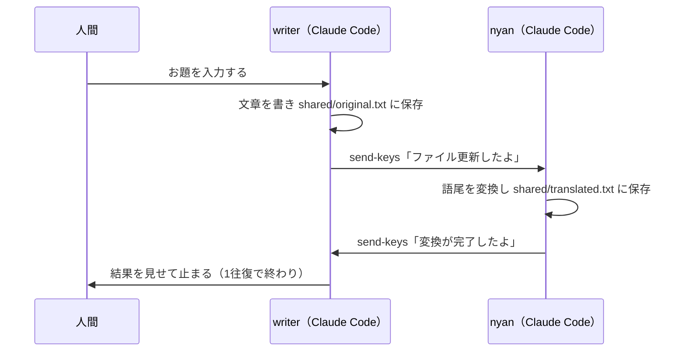
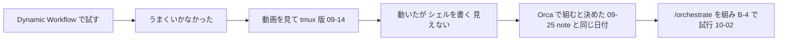

今回の最も重要なポイントを結論から申し上げます。それは、1人のAIに任せるより、役割の違う複数のAIに対話させることです。

## この回の4点


| 困っていたこと                                                                                            | 人間が決めたこと                           | AI部下がやったこと                       | 結果                                                                |
| -------------------------------------------------------------------------------------------------- | ---------------------------------- | -------------------------------- | ----------------------------------------------------------------- |
| Dynamic Workflowで試したが、うまくいかなかった。tmuxで組んだ版は最後まで動いたが、シェルを1つずつ自分で書く必要があり、どのAIが動いていてどれが止まっているのかが見えなかった | 複数のAIを対話させて仕事を回す。tmuxをやめ、Orcaで組み直す | 役割ごとの子エージェントとして、設計書を書き、2人でレビューした | 10月2日に、読書カードの採点APIの堅牢化（ToDoの番号でB-4）で初めて試した。設計書は4版目で、レビューの2人とも合格した |


「非エンジニアのAI業務自動化」の別編です。前の編（EX領収書自動出力編）では、AIは1人でした。

今回は複数のAIに役割を分けて対話させ、私はマネージャーとして基準を決め、チェックに回ります。全4本。


1回目は、きっかけから、tmuxで組んだ最初の版、Orcaで組み直すまでです。

---

## noteに書いた結論への答え

2026年9月25日に、noteに「AIの値崩れが始まりコレからどうなるのか？」という記事を書きました。

[https://note.com/horiken1977/n/n8185a5c0b75d](https://note.com/horiken1977/n/n8185a5c0b75d)


結論は次の2つです。

- 「『1人の天才に考えさせる』から『複数の秀才に対話させて考えさせる』、つまりマルチエージェント」
- 「トークン単価ではなく、仕事単位で成果を測る時代」


この編では、1つ目を実際に動く仕組みで見せます。2つ目には、試した仕事の記録で答えます（#4）。


一番伝えたいことを、ひとことで言うとこうです。


**「超優秀なAI部下さん複数名で対話させれば品質と生産性爆上がり　私はマネージャー。チェックはちゃんとやろうね」**


ここでいう「生産性」は、速く終わるという意味ではありません。終わるまでには、かなり時間がかかる印象です。意味は2つあります。


- AIに任せている間、私の手が空くこと
- 1人のClaudeに任せるより、やり直しや手戻りが減ること


2つ目は比べて測ったわけではなく、私の実感です。

---

## 最初はDynamic Workflowで試した

最初に試したのは、Claude CodeのDynamic Workflowです。複数のエージェントで回せそうだと思ったのですが、なんだかうまくいきませんでした。どこで詰まったのかは、控えていません。


Dynamic Workflowでうまくいかなかった別の例は、EX領収書自動出力編の#1に書きました。

[https://qiita.com/horiken1977/items/59c31d162419ab7da8f8](https://qiita.com/horiken1977/items/59c31d162419ab7da8f8)

## 動画を見て、tmuxで2人のAIを対話させた

次に、海外Yパパラジオさんの動画を2本見ました。

- 「【AI実務中級】僕たちがAI組織をデザインする時代は終わった。今、AIを下僕にするために必要な力は？」 [https://youtu.be/1y3EMWCUqZ8](https://youtu.be/1y3EMWCUqZ8)

- 「(グダグダですまん) agent同士を直接会話させる方法」 [https://youtu.be/xnVltY6wd-8](https://youtu.be/xnVltY6wd-8) 


2本目の動画で紹介されていたのが、tmuxを使って複数のClaude Codeを対話させる方法です。tmuxは、1つのターミナル（黒い画面）の中で、複数の作業画面を動かし続けるための道具です。


9月14日に、この方法を使い回せる形にしたフォルダを作りました。サンプルは2つの役です。writerが200字ほどの文章を書き、nyanが語尾をすべて「〜にゃん」に変えます。役ごとにフォルダを分け、それぞれのフォルダでClaude Codeを1つずつ起動します。役割は、各フォルダの`CLAUDE.md`に書いて固定しました。`CLAUDE.md`は、そのフォルダで起動したClaude Codeが最初に読む指示書です。


writer役の`CLAUDE.md`から、手順の部分（5〜12行目）を載せます。

```markdown:writer/CLAUDE.md
1. ユーザーからお題を受け取ったら、200字程度の文章を作成する。
2. 作成した文章を `../shared/original.txt` に保存する。
3. 保存が完了したら、以下のコマンドを実行して「nyan」セッションに通知する。

   tmux send-keys -t nyan "ファイル更新したよ。処理してね" Enter

4. nyanから `tmux send-keys` で通知（「変換が完了したよ」等）が届いたら、`../shared/translated.txt` を読み込み、内容をユーザーに提示する。
5. 提示したら処理を終了し、次のユーザー指示を待つ。**nyanへの再通知や新しい文章の作成は行わない**（無人で往復が続かないようにするための停止条件）。
```


writerは文章を`shared/original.txt`に保存し、`tmux send-keys`でnyanの画面に「ファイル更新したよ。処理してね」と打ち込みます。

`send-keys`は、別の作業画面にキー入力を送るtmuxのコマンドです。本文はファイルで渡し、相手の画面に打ち込むのは短い知らせだけにしています。最後の5が止める条件です。nyanから返事が来て結果を見せたら、それ以上は往復しません。nyan役の`CLAUDE.md`も同じ形で、変換を終えたらwriterに知らせて止まります。


2人を立ち上げるシェルスクリプトは、海外Yパパさんがありがたいことに動画の概要欄にすべて用意してくださっていたので拝借しました。

```bash:start.sh
tmux new-session -d -s writer -c "$DIR/writer"
tmux new-session -d -s nyan -c "$DIR/nyan"

tmux send-keys -t writer "claude" Enter
tmux send-keys -t nyan "claude" Enter
```


やっていることは単純です。tmuxの作業画面（セッション）をwriter用とnyan用に2つ作り、それぞれのフォルダで`claude`（Claude Codeを起動するコマンド）を打ち込むだけ（`start.sh`の7〜11行目）。


1往復の流れは次のとおりです。



動かすときは、ターミナルを2つ開いてwriterとnyanの画面を映し、writerにお題を打ちます。最後まで、ちゃんと動きました。初めて動かしたのは、たしか9月15日です。

下の画面は、10月3日に同じサンプルを動かし直したときのものです。左がwriter、右がnyan。writerが文章を保存して「ファイル更新したよ。処理してね」と知らせると、nyanが語尾を「〜にゃん」に変えて保存し、「変換が完了したよ。確認してね」と返します。writerは結果を見せて、次の指示を待っています。

実はこの回、writerの保存が失敗したまま、知らせだけが先に届いていました。nyanは、前から残っていた文章を変換しています。writerが保存し直してもう一度知らせたので、nyanには「ファイル更新したよ」が2回届きました。


*tmux版を動かした画面。左がwriter、右がnyan。nyanが「〜にゃん」に変えて保存し、writerがその結果を見せて止まっている*

---

## シェルを自分で書き、どれが動いているか見えなかった

あとでOrcaに替えて、よかったと感じたことが2つあります。


- Shellを自分で一個一個書かなくていいこと
- どこでどのエージェントが今動いているのか止まっているのかがわかること


tmux版では、この2つができていませんでした。


役を1つ足すには、フォルダを作り、`CLAUDE.md`を書き、`start.sh`にセッションを足します。毎回、手作業です。新しい役の組を作るためのひな形（`_template/`）も用意しましたが、埋める所（役の名前、セッション名、タスク、出力ファイル、止める条件）は結局自分で書きます。


画面を見るには、役の数だけターミナルを開いて`tmux attach`を打ちます。2人なら2つ。どの画面のAIが動いていて、どれが待っているのかは、ぱっと見では分かりませんでした。


ひな形の説明（`README.md`の19〜21行目）には、止める条件をこう書いていました。

```markdown:_template/README.md
## 必ず守ること：停止条件を入れる

tmuxの`send-keys`で通知し合う仕組みは、放置すると無人で何往復も回り続けてAPIコストが積み重なるリスクがある。**必ずどこかで人間の確認を挟むか、往復回数の上限を`CLAUDE.md`に明記する**こと。`../sample-writer-nyan/`は「1往復で止まり、ユーザーに結果を提示してから次の指示を待つ」という最小構成にしている。参考にすること。
```


tmux版の止め方は、「1往復で止まる」と指示書に書くことだけでした。Orca版では、レビューの合格の基準と、やり直しの回数の上限で止めます。この基準を誰がどう決めたかは、#3で書きます。

---

## Orcaが出て、組み直した

tmuxで回せそうだと考えていたところで、Orcaがリリースされました。Orcaは、複数のAIエージェントをタブに並べて動かせるアプリです。親のエージェントが子のエージェントを自動で立ち上げ、仕事を渡し、報告を受け取る機能（オーケストレーション）があります。


Orcaは、次の動画を見ながら試しました。


- セイト先生 by AIプログラミングスクールSiiD「AIツール『Orca』が神。海外のエンジニアが皆使っているADEの魅力を徹底解説｜Claude Code, Codexにも対応」 [https://youtu.be/vpvW7I968RQ](https://youtu.be/vpvW7I968RQ)


Orcaでやってみようと決めたのは、たしか9月25日。noteの記事と同じ日です。手順書`/orchestrate`を組み、自分で使っている読書カードの採点APIの堅牢化（B-4）で試したのは10月2日でした。感覚では、半日もかからずにできています。ただ、その半日が手順書を組むまでなのか、B-4を通すまでなのかは、時間を控えていませんでした。



## Orca版では、司令塔が子エージェントに仕事を渡す

Orca版の中心は、`/orchestrate`という手順書です。冒頭の8行（`orchestrate.md`の1〜8行目）を載せます。

```markdown:orchestrate.md
# orchestrate — 1つの指示を分解し、複数のエージェントで「設計 → レビュー → やり直し」を回す

引数: $ARGUMENTS（やりたいこと。`A-3` のような ToDo 番号でもよい。先頭か文中で**子の構成**を選べる：`--agents claude`／「全部Claudeで」「Claudeだけ」＝Claude だけで回す、`--agents mixed`／「Codex・Geminiも」＝レビューを Codex と Gemini にする。指定がなければ mixed。`--precheck` を付けると、レビューの前に Jev で必須項目の有無を確かめる＝手順 4）

あなた（このファイルを読んだ Claude）は**司令塔**。Orca のオーケストレーション機能で子エージェントを立ち上げ、指示を渡し、報告を受け取り、合否を判断して、ユーザーに結果を返す。
**司令塔は自分でファイルを書かない**（例外は手順 1〜2 の分解案と precheck のチェックリスト、手順 7 の ToDo・log の更新だけ）。書くのは子の役目。

方針（2026-10-02 決定。ToDo A-3）：設計・実行・検証は Claude、レビューは**2人が毎回同時に、まず互いの結果を見ずに**行い、そのあと2人で対話してから判定する（10-03 追加。§4 の手順 3）／やり直しは5回まで自動、超えたら人に聞く／分解案を見せて OK をもらってから子を立ち上げる。
```

Claude Codeに`/orchestrate`と打つと、Claudeがこのファイルを読み、司令塔になります。司令塔は仕事を分けて子エージェント（司令塔が立ち上げる別のAI）に渡し、報告を受け取って合否を決めます。自分ではファイルを書きません。設計書もコードも、書くのは子です。引用の中のA-3は、私のToDo（作業の一覧）の番号です。`--precheck`の説明に出てくるJevは、#2で説明します。


最後の「方針」の段落が、仕事の回し方です。設計・実行・検証はClaudeの子が受け持ちます。レビューは2人が同時に、まずお互いの結果を見ずに行い、そのあと2人で対話してから判定します。


この「2人で対話してから判定する」は、10月3日の夜に足したものです。B-4から使ってきた最初の版では、レビューの2人は直接やり取りしていませんでした。2人がそれぞれ書いた結果を、司令塔が読んで突き合わせていただけです。気づいた経緯と、対話させてみた結果は#3と#4で書きます。


レビューの2人の組み合わせは、指示を出すときに選びます。


- mixed（指定しないとき）：Codex（OpenAI）とGemini（Google。Antigravity CLI）
- claude：Claude Opus／Sonnet（Anthropic）の2人。モデルと、見る観点を分ける


tmux版のwriter×nyanは2人でしたが、Orca版は司令塔のほかに、設計、レビューの2人、検証が加わります。役割は役ごとのフォルダで固定せず、司令塔が仕事ごとに指示を書いて渡します。子が立ち上がると、Orcaの画面にタブが1つずつ開き、左の一覧（左ペイン）にも並びます。どの子が動いていて、どの子が止まっているかは、ここで見ます。


*上が司令塔のタブ、下の左右がCodexとGeminiの子のタブです。左ペインに子の一覧が並びます。下の2つは、司令塔とのやり取りの承認を求めて止まっているところです（#3で書きます）。端末の番号とフォルダ名は隠しています*


この流れの中で、人間（私）がいる場所は3か所です。


1. 指示を出し、司令塔が作った分解案（仕事の分け方の表）にOKを出す。OKを出すまで、子は立ち上がりません
2. レビューのやり直しが5回を超えたら、判断ゲート（人が選ぶまで先に進まない仕組み）で私に聞いてきます
3. push（手元の変更をGitHubなどへ送ること）のうち台帳で「聞く」としたもの、デプロイ（作ったものを本番に出すこと）、削除、外部への送信は私が決めます


レビューの合格は「2人とも重大な指摘なし」です。重大な指摘は、レビューした子が「直さないと受け入れ条件（仕事を頼むときに決めた、できあがりの条件）を満たさない」とした指摘のことです。


B-4は、設計書の4版目で2人とも合格しました。1〜3版目は、毎回Codexだけが重大な指摘を出して不合格です。私はその指摘を読み、見逃してよいかを考えたうえで、見逃さずにやり直させました。それでも、特にこれが効いたという印象はありません。数字と印象の両方を、#3と#4でくわしく書きます。

---

## この回のマネージャーの仕事

この回で、人間（私）が決めたことと、AIがやったことを分けて書きます。


Dynamic Workflowでつまずき、動画を見てtmuxで組み、それが動いたところで、Orcaで組み直すと決めたのは私です。組み直す前に、Orca版の条件を書き出しました。10月2日にToDoに書いたものです。

```text:ToDo.md
ローカルで動かす／push するリポジトリだけ push する／指示1つで自動分解し、エージェントも自動で立ち上げたい／エージェント同士が対話してループする（tmux のイメージ）／親子のやり取りを画面で見たい
```

ToDoは私の作業の一覧で、全部の「次にやること」をここにまとめています。最後の「親子のやり取りを画面で見たい」は、tmux版で困った「どれが動いているか見えない」と重なります。書いたときにそこまで意識していたかは、はっきりしません。それでも、tmux版の困りごとが条件に表れたのだと思います。


一方で、4つ目の「エージェント同士が対話してループする」は、最初の版では満たせていませんでした。ループは回っていましたが、やり取りはいつも司令塔と子の間で、子どうしは話していませんでした。10月3日の夜、子のタブにClaudeしか立ち上がっていないのを見て、仕組みを点検したときに気づきました。そこで、レビューの2人が直接やり取りしてから判定する形を足しました。


手順書`orchestrate.md`の文面は、Claude Codeに書かせました。AIがやったことは、この手順書の文面を書いたことと、B-4で司令塔として仕事を分け、子として設計書を書き、2人でレビューしたことです。


この回で出てきたものは次のとおりです。

- 手順書：`orchestrate.md`
- tmux版：writer×nyanのサンプル（`writer/CLAUDE.md`・`nyan/CLAUDE.md`・`start.sh`）と、ひな形（`_template/`）を入れたフォルダ
- B-4で子が書いた設計書とレビューの結果：B-4のRun（作業のまとまり）ごとに残るフォルダ

---

## 次回

次回は、司令塔が子エージェントを立ち上げて仕事を渡し、報告を受け取るまでを、実際のコマンドで書きます。

連載の目次

- #1 1人の天才より複数の秀才に対話させる：tmuxで組んで、Orcaで組み直した（この記事）
- #2対話ループをOrcaで簡単に実装
- #3マネージャーの仕事は「基準を決めて、チェックする」：AI部下のレビューに合格の線を引く
- #4仕事単位で測る：AI部下の対話レビューを4つの仕事で数えた

---

## 参考

- note「AIの値崩れが始まりコレからどうなるのか？」：[https://note.com/horiken1977/n/n8185a5c0b75d](https://note.com/horiken1977/n/n8185a5c0b75d)
- 海外Yパパラジオ「【AI実務中級】僕たちがAI組織をデザインする時代は終わった。今、AIを下僕にするために必要な力は？」：[https://youtu.be/1y3EMWCUqZ8](https://youtu.be/1y3EMWCUqZ8)
- 海外Yパパラジオ「(グダグダですまん) agent同士を直接会話させる方法」：[https://youtu.be/xnVltY6wd-8](https://youtu.be/xnVltY6wd-8)
- セイト先生 by AIプログラミングスクールSiiD「AIツール『Orca』が神。海外のエンジニアが皆使っているADEの魅力を徹底解説｜Claude Code, Codexにも対応」：[https://youtu.be/vpvW7I968RQ](https://youtu.be/vpvW7I968RQ)
- Claude Codeの概要：[https://code.claude.com/docs/en/overview](https://code.claude.com/docs/en/overview)
- tmux：[https://github.com/tmux/tmux/wiki](https://github.com/tmux/tmux/wiki)
- Mermaidシーケンス図：[https://mermaid.js.org/syntax/sequenceDiagram.html](https://mermaid.js.org/syntax/sequenceDiagram.html)
