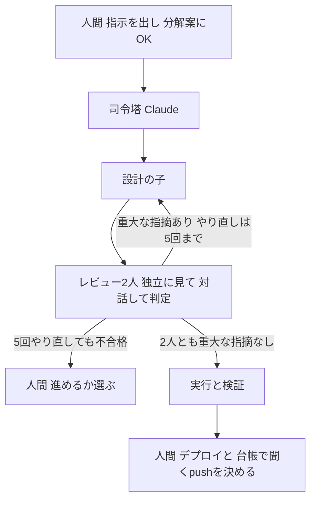
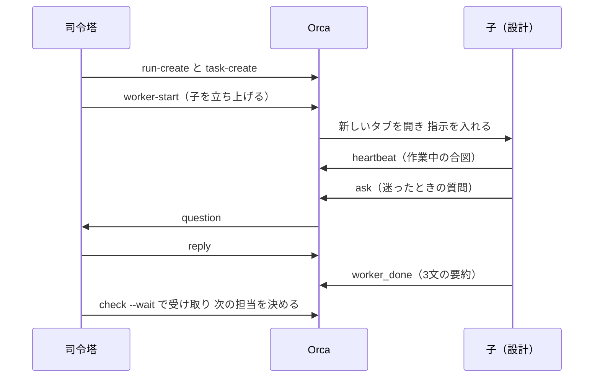

今回の最も重要なポイントを結論から申し上げます。それは、人が入るのは、分解案へのOK・判断ゲート・pushの3か所だけです。

前回（#1）は、tmuxで2つのClaude Codeを対話させた版を作り、Orcaで組み直すまでを書きました。今回は、Orcaの上で回している「設計 → レビュー → やり直し」のループを、手順書とコマンドの実物で見せます。

## この回の4点

| 困っていたこと | 人間が決めたこと | AI部下がやったこと | 結果 |
|---|---|---|---|
| tmux版では、役割ごとのシェルと受け渡しを自分で書いていた。どのエージェントが動いているかも見えなかった | 役割の分け方。合格の線と、やり直しの上限（5回）。子の構成を選べるようにすること。分解案にOKを出すこと | 司令塔のClaudeが指示を分け、子を立ち上げ、報告を受けて合否をまとめる。子は設計とレビューを受け持つ | 子は`worker-start`で自動で立ち上がり、報告は`worker_done`で戻る。この連載の構成案を作ったRunで立ち上がった子は3人 |

Orcaに替えてよかったのは、次の2つです。

- Shellを自分で一個一個書かなくていいこと
- どこでどのエージェントが今動いているのか止まっているのかがわかること

この回は、書かなくてよくなった部分を、Orcaと手順書のどこが受け持っているのかを見ていきます。

## 誰が何をするか：先頭は人間のマネージャー

この仕組みでは、役割を次のように分けています。司令塔は、手順書を読んで指示を分け、子を動かすClaudeです。子エージェント（以下、子）は、司令塔が立ち上げて仕事を渡すAIです。

| 役割 | 誰が | やること |
| --- | --- | --- |
| マネージャー | 人間（私） | 指示を出す。分解案にOKを出す。5回やり直しても合格しないときに進め方を選ぶ。push（台帳で聞くとしたもの）・デプロイ・削除・外部への送信を決める |
| 司令塔 | Claude（手順書を読んだセッション） | 指示を分ける。子を立ち上げる。報告を受ける。2人の指摘をまとめて合否を出す。自分ではファイルを書かない |
| 設計・実行・検証 | Claudeの子 | 設計書やコードを書く。やり直しは同じ子が版を上げる |
| レビュー（2人） | Codex（OpenAI）とGemini（Google。Antigravity CLI）、またはClaude Opus／Sonnet（Anthropic）の2人 | 同じ成果物を、まず互いの結果を見ずにレビューし、そのあと2往復の対話で指摘を突き合わせてから判定する。直さず、指摘だけ書く |
| 関所 | フック`push-guard.py` | push・デプロイのコマンドを、実行の直前に止めるか、許可を求める |

表の言葉を補足しておきます。

- push：手元の変更をGitHubなどに送ること
- フック：Claude Codeがコマンドを実行する前後に、自動で動く決まった処理
- 関所：私が決めた台帳どおりに、機械が止める仕組み（#3で書きます）

このほか、`--precheck`を付けたときだけ、レビューの前にJev（TypeSafeの判断専用のモデル）が「必須の項目が書かれているか」を確かめます。結果は#4で書きます。

## 人が入るのは3か所

流れの基本形は「設計 → 設計レビュー（くり返し）→ 実行 → コードレビュー（くり返し）→ 検証」です。この中で人間が入るのは、図の3か所だけです。



1. 分解案へのOK：分解案は、指示を「1人の子が1回で終えられる大きさ」に分けた表です。タスク・役割・使うエージェント・書いてよいファイル・受け入れ条件などが並びます。手順書には「OKをもらうまで子を立ち上げない」と書いています
2. 判断ゲート：人が選ぶまで作業を止めるOrcaの機能（`gate-create`）です。5回やり直しても2人が合格を出さないとき、司令塔は「指摘を受け入れて先へ進む／方針を変えてやり直す／中止する」の3択を私に出します
3. push・デプロイ・削除・外部への送信：子にはさせず、司令塔が私の確認をとってから行います。pushで聞かれるのは、台帳で「聞く」としたリポジトリだけ。「pushしてよい」としたリポジトリは、検証に合格すれば聞かずにpushします

合格の線（2人とも重大な指摘がない）と、やり直しを5回までにしたのは私です。なぜ5回にしたかは#3で書きます。

## 手順書`/orchestrate`の冒頭8行

司令塔の動きは、手順書`orchestrate.md`という1ファイルにまとめてあります。Claude Codeでは、決まったフォルダに置いた文書を`/orchestrate`のようなスラッシュコマンドで呼べます。呼ばれたClaudeは、この文書を指示として読み、司令塔として動き始めます。冒頭の8行（1〜8行目）です。

```markdown:orchestrate.md
# orchestrate — 1つの指示を分解し、複数のエージェントで「設計 → レビュー → やり直し」を回す

引数: $ARGUMENTS（やりたいこと。`A-3` のような ToDo 番号でもよい。先頭か文中で**子の構成**を選べる：`--agents claude`／「全部Claudeで」「Claudeだけ」＝Claude だけで回す、`--agents mixed`／「Codex・Geminiも」＝レビューを Codex と Gemini にする。指定がなければ mixed。`--precheck` を付けると、レビューの前に Jev で必須項目の有無を確かめる＝手順 4）

あなた（このファイルを読んだ Claude）は**司令塔**。Orca のオーケストレーション機能で子エージェントを立ち上げ、指示を渡し、報告を受け取り、合否を判断して、ユーザーに結果を返す。
**司令塔は自分でファイルを書かない**（例外は手順 1〜2 の分解案と precheck のチェックリスト、手順 7 の ToDo・log の更新だけ）。書くのは子の役目。

方針（2026-10-02 決定。ToDo A-3）：設計・実行・検証は Claude、レビューは**2人が毎回同時に、まず互いの結果を見ずに**行い、そのあと2人で対話してから判定する（10-03 追加。§4 の手順 3）／やり直しは5回まで自動、超えたら人に聞く／分解案を見せて OK をもらってから子を立ち上げる。
```

「引数」の段落が呼び方（引数と子の構成の選び方）、「あなた」で始まる段落が司令塔の役目、「方針」の段落が仕事の回し方です。その中の太字の1文で、司令塔には自分でファイルを書かせないと決めています。書くのは子で、司令塔は分けて、渡して、まとめる側に回ります。

手順書の文面は、Claude Codeに書かせました。私が決めたのは、方針の段落にあるやり直しの回数と、合格の線です。

## 実物のコマンド：Runを作り、子を立ち上げ、報告を待つ

Orcaには、子を立ち上げて報告を受けるための公式ガイドが付いています（`orca skills get orchestration`で読めます）。基本の流れは次の5行です（ガイドの出力の99〜103行目。Orca 1.4.218の場合で、版が変わると行がずれます）。

```text:orca skills get orchestration（Orca 1.4.218）
orca status --json
orca orchestration run-create --objective "<objective>" --json
orca orchestration worker-start --spec "<worker A task>" --worktree current --agent codex --json
orca orchestration worker-start --spec "<worker B task>" --worktree current --agent claude --json
orca orchestration check --wait --types "worker_done,escalation,question" --timeout-ms 900000 --json
```

元は`ORCA`となっている所を、`orca`に置き換えています。ガイド自身に「`ORCA`を実際の実行ファイルに置き換える」と書いてあるためです。

1行目でOrcaが動いているかを確かめ、2行目でRun（1つの指示に対する作業のまとまり）を作ります。3〜4行目の`worker-start`で子を立ち上げると、Orcaが新しいタブを開き、子に指示を自動で入れます。5行目の`check --wait`は、子からの報告（`worker_done`）・相談（`escalation`）・質問（`question`）を待つコマンドです。

`--agent`の値で、立ち上げるAIが変わります。Orca 1.4.218で選べるのは、claude・codex・cursor・antigravityなど8種類です。手順書では、レビューの2人をClaudeにする構成のとき、`--agent claude --model claude-opus-5-5`と`--agent claude --model claude-sonnet-5-5`で、モデルを分けて立ち上げます。

同時に動かす子は3人までにしています。使用量と、同じフォルダでの書き込みのぶつかりを避けるためです。


*worker-start のあと、Orca に子のタブが自動で開いたところです*

## 子に渡す仕様は5項目

子に渡す仕事の中身（タスク仕様）は、Orcaのガイドで5つの項目が決まっています（ガイドの出力の151〜157行目。Orca 1.4.218の場合。見出しは「Task-spec contract」）。

```text:orca skills get orchestration（Orca 1.4.218）
Every Task spec must be self-contained and name:

- **Target:** the files, component, or environment in scope.
- **Change:** the concrete result to produce.
- **Constraints:** invariants, compatibility rules, and do-not-touch boundaries.
- **Ownership:** what this worker may edit and any coordination boundary.
- **Observable acceptance:** the test, output, or evidence that proves completion.
```

対象（Target）、作るもの（Change）、守ること（Constraints）、書いてよいファイル（Ownership）、完了の確かめ方（Observable acceptance）の5つです。司令塔が子に仕事を渡すときも、この5つの見出しで書かせています。

守ることの欄には、どの仕事にも同じ4つを入れています。

- 秘密の情報は読まない
- push・削除・外部への送信はしない
- 書いてよいファイルだけを書く
- 迷ったら司令塔に聞く

## 子の報告は「3文の要約」、迷ったら`ask`で聞く

子は、仕事が終わると`worker_done`を1回だけ送ります。中身は、成功か失敗かと、3文の要約です。3文は「何をしたか・何が分かったか・何が残っているか」です。中身の詳しいところは、子が書いた成果物のファイルにあります。

子が迷ったときは、`ask`で司令塔に質問し、答えが来るまで止まって待ちます。司令塔は`reply`で答え、分からなければ私に聞いてから答えます。作業中の子は`heartbeat`（動いているという合図）を送るので、司令塔は「考えている最中」と「止まっている」を見分けられます。



tmux版では、相手の画面に`send-keys`で短い文を打ち込んで知らせていました。Orcaでは、報告・質問・合図がメッセージとして残り、司令塔は`check --wait`でまとめて受け取ります。


*司令塔が check --wait で worker_done を受け取り、3文の要約が読めるところです。Gemini が対話後の判定を送ってきた直後のメッセージが見えています*

## レビュー結果は「判定・重大な指摘・軽微な指摘」の3行

レビューの子には、結果を決まった形で書かせています。下は、採点APIを堅くする仕事（B-4）のコードレビューで、Codexが書いた結果の冒頭（`review-c2-codex.md`の1〜5行目）です。

```text:B-4のRunのreview-c2-codex.md
判定: 合格

重大な指摘: なし

軽微な指摘: なし
```

形は手順書で決めています。重大な指摘は「直さないと受け入れ条件を満たさないもの」、軽微な指摘は「直すとよりよいもの」です。合格は、2人とも対話のあとの判定で重大な指摘がないことです。対話のあとも意見が割れたまま残った指摘は、片方だけが重大としたものでも重大として扱います。

B-4の設計のレビューも同じ形でした。私はどれが重大な指摘で、そのせいで不合格になっているのかを確かめ、見逃さずにやり直してもらいました。ただ、振り返っても、とくにこれが効いたという印象はありません。指摘の中身と並べた話は#4で書きます。

## レビューの2人が直接やり取りする

最初の版では、レビューの2人はお互いの結果を見ずに書き、司令塔がそれを突き合わせていました。10月3日の夜から、2人がOrcaのメッセージで直接やり取りしてから判定する形にしました。手順書には、レビューの子に渡す「対話の手順」を次のように書いています（136〜147行目）。

```markdown:orchestrate.md
   ① 独立レビュー：相手のファイルを見ずにレビューし、自分のファイル（review-vN-<自分>.md）に次の形で書く
      判定: 合格 | 不合格
      重大な指摘: （直さないと受け入れ条件を満たさないもの。番号つき。なければ「なし」）
      軽微な指摘: （直すとよりよいもの）
   ② 対話の1往復目：書き終えたら、司令塔から届く「対話の相手」（orca orchestration check --terminal <自分> --json で読む）の宛先に、
      自分の重大な指摘の一覧（番号と1行ずつ）を送る：orca orchestration send --to dispatch:<相手> --type status --subject "vN 指摘" --body "..."
      相手からの「vN 指摘」を待つ（orca orchestration check --terminal <自分> --wait --timeout-ms 600000 --json）。届いたら相手のファイルを読み、
      相手の重大な指摘1つずつに「同意／反論（理由）／補足」を返す（--subject "vN 返答1"）
   ③ 対話の2往復目：自分の指摘への相手の返答を読み、反論されたものは「取り下げ」か「理由を足して残す」かを返す（--subject "vN 返答2"）。往復は2回まで
   ④ 対話後の判定：自分のファイルの最後に「## 対話後の判定」として、判定・重大な指摘（対話で変わったものは何がどう変わったか）・意見が割れたまま残った点を書き、worker_done を送る
   - 相手から10分たっても届かなければ「返事なし」と書いて次の段へ進む（待ち続けない）
   - 相手のファイルは読むだけで書き換えない。対話のメッセージは短く（1通20行まで）
```

流れはこうです。

1. 相手を見ずにレビューを書く
2. 重大な指摘の一覧を送り合い、相手の指摘に「同意／反論／補足」を返す（1往復目）
3. 反論されたものは、取り下げるか、理由を足して残すかを返す（2往復目）
4. 「対話後の判定」を書いて、司令塔に報告する

往復は2回までです。

相手の宛先は、2人が立ち上がったあとに司令塔が送ります。同じRunの子どうしなら、`orca orchestration send --to dispatch:<相手>`でメッセージを送れて、相手は`check`で読めます。「@codex」のようにまとめて宛てる書き方もありますが、Antigravityに届くかを確かめていないので使っていません。

待ち続けて止まらないための決まりも入れました。10分たっても返事がなければ、「返事なし」と書いて先へ進みます。

やり取りは、司令塔のタブを分割した「対話ログ」の画面に流れます。Runのメッセージを5秒ごとに読んで、「Codex → Gemini」のように送り手と受け手を付けて並べるだけの小さなスクリプトです。私はこの画面で対話を追い、最後にできたものだけを確かめます。


*対話ログの画面です。B-5のレビューのやり取りを、記録から送られた時刻のまま流し直しました。上の端は、Geminiが送った「v2d 指摘」の途中です*

この形で初めて回したのは、私の読書ナレッジ（mybrain）の設計案のレビューです。CodexとGeminiが送り合ったのは6通で、最初の1通から最後の1通まで5分ほどでした。Codexが最初に送った「指摘」はこうです。

```text:Codex → Gemini（v2d 指摘）
独立判定: 合格。重大なし。R1〜R6は本文と実物を照合し、Phase 0・1または後続Phaseの具体的な着手前条件として解消を確認しました。軽微として通常運用のgit差分と実装差分の区別、m2/m5の定義、目次の解決先登録、影響表の補足を記載しています。
```

件名の「v2d」は、設計案の2版目を対話つきでレビューした回、という意味で付けた名前です。R1〜R6は、1版目のレビューで出た重大な指摘の番号です。

このときは、2人とも重大な指摘が0件でした。対話は同意と補足が中心で、反論は起きていません。意見がぶつかったときに対話でどう決着するかは、まだ確かめていません。このレビューの数字は#4で書きます。

## 子の構成は`mixed`と`claude`から選ぶ

レビューの2人を誰にするかは、指示のときに選べるようにしました。

| 構成 | 設計・実行・検証 | レビュー | 向いているとき |
|---|---|---|---|
| `mixed`（デフォルト） | Claude | Codex と Gemini | 見落としを減らしたいとき |
| `claude` | Claude | Claude 2人 | まるっと任せたいとき |

`mixed`は、別の会社のモデルを混ぜて見落としを減らしたいときに使います。`claude`は、全部をClaudeにして、まるっと任せたいときに使います。

`mixed`の場合、レビューはCodex（OpenAI）とGemini（Google。Antigravity CLI＝`agy`）が担当します。`claude`の場合は、Claude Opusとソネット（Sonnet）を2人立ち上げ、`--model claude-opus-5-5`と`--model claude-sonnet-5-5`でモデルを分けます。Opusは受け入れ条件と正しさを、Sonnetは抜け・リスク・影響範囲を観点にするなど、役割も分けています。

`claude`の構成を足したのは、Codex・Geminiは毎回Enterを押す必要があって不便で、まるっと任せたいときは全部Claudeにしたいと考えたからです。指示の頭に`--agents claude`を付けるか、「全部Claudeで」と書けば切り替わります。Claude の子は送信が確実で、承認も Claude Code の設定どおりに進む利点もあります。この連載の構成案も、`claude`の構成で作らせ、私がチェックしました。

Codex・Geminiが承認で止まる件は、その後に許す範囲を決めて解きました。#3で書きます。

## 記録はRunのフォルダに残る

手順書の最後は、記録の残し方です（173〜177行目。フォルダ名は伏せています）。

```markdown:orchestrate.md
## 7. 記録

- `ToDo.md` の該当項目を更新する（完了は `- [x]`）
- 変更したフォルダの `log.md`（あれば）に1〜2行
- `●●●/●●●/<run_id>/` に途中の成果物が残る（経緯の記録。不要になったら消してよい）
```

設計書の版（`design-v1.md`、`design-v2.md`…）とレビュー結果（`review-v1.md`…）は、Runごとのフォルダに残ります。#4で出す数字は、このフォルダのファイルとその時刻から数えました。

## この回のマネージャーの仕事

人間（私）が決めたことは次のとおりです。

- 分解案の表を見てOKを出す。EX領収書自動出力編の構成案を作ったRun（ToDoの番号でC-5）では、10月2日に分解案を見てOKを出してから、子が立ち上がりました
- 子の構成（`mixed`か`claude`か）を選ぶ
- レビューの2人を、直接やり取りしてから判定させると決めた（10月3日）
- 合格の線（2人とも重大な指摘なし）と、やり直しの上限（5回）を決めた。5回を超えたときは、判断ゲートで進め方を選ぶ
- push（台帳で聞くとしたもの）・デプロイ・削除・外部への送信を決める

AIがやったことは、指示の分解、子の立ち上げ、報告の受け取り、2人の指摘のまとめと合否（司令塔）、設計書やコードを書くこと（設計・実行の子）、指摘を書くこと（レビューの子）です。

手順書は`orchestrate.md`の1ファイルで、途中の成果物はRunごとのフォルダに残ります。

子が動いている間、私は別の作業をしています。終わるまでには、かなり時間がかかる印象です。それでも任せている間は手が空き、1人でやるより手戻りも減っています。これが私の実感です。

## 次回

次回は、合格の線と5回を私が決めた理由、pushの台帳と関所、GeminiをいったんSonnetに替え、承認を許す範囲を決めて戻した経緯、子のタブを開いて「保持」にしてしまった失敗を書きます。

## 参考

- 私のnote「AIの値崩れが始まりコレからどうなるのか？」：<https://note.com/horiken1977/n/n8185a5c0b75d>
- Orcaの紹介動画（セイト先生 by AIプログラミングスクールSiiD「AIツール『Orca』が神。海外のエンジニアが皆使っているADEの魅力を徹底解説｜Claude Code, Codexにも対応」）：<https://youtu.be/vpvW7I968RQ>
- Claude Codeの概要：<https://code.claude.com/docs/en/overview>
- Mermaidフローチャート：<https://mermaid.js.org/syntax/flowchart.html>
- Mermaidシーケンス図：<https://mermaid.js.org/syntax/sequenceDiagram.html>
