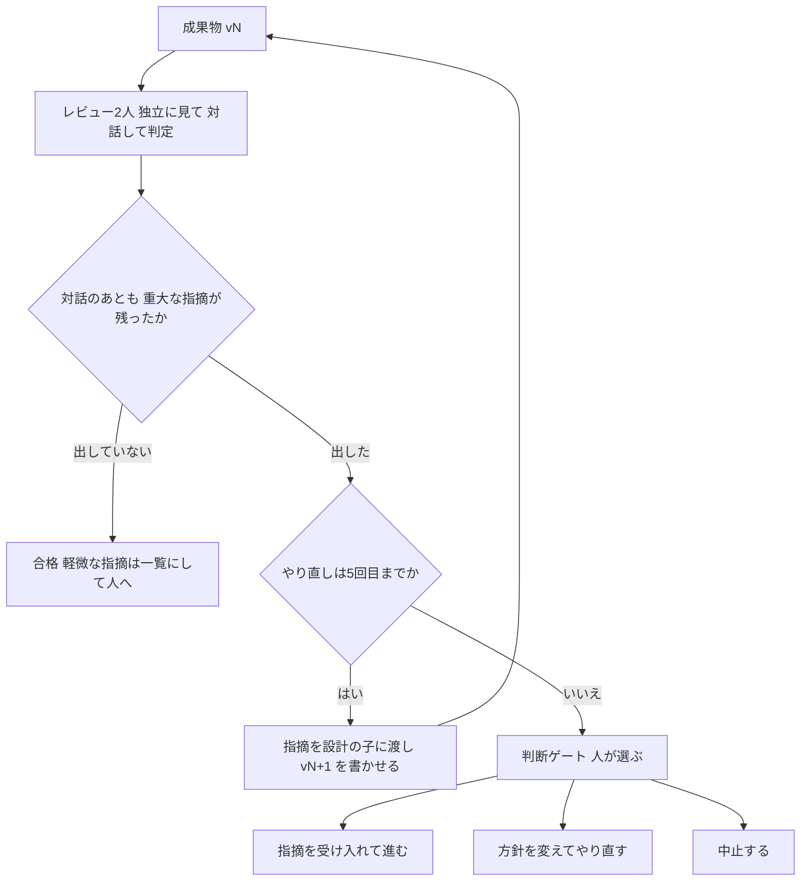
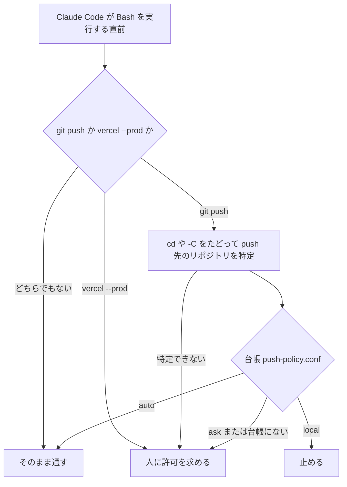

今回の最も重要なポイントを結論から申し上げます。それは、人間の仕事は、合格の基準を決めて、その基準でチェックすることです。

前回（#2）は、司令塔が子エージェントを立ち上げ、報告を受け取るまでを、手順書とコマンドの実物で書きました。今回は、その仕組みに私が決めた基準と、止まった子エージェントの見方を書きます。

## この回の4点

| 困っていたこと | 人間が決めたこと | AI部下がやったこと | 結果 |
| --- | --- | --- | --- |
| 自動で回したいのに、Geminiはコマンドの承認画面で止まった。どの子エージェントが動いているか分からず、タブを開いて「保持」にしてしまった | 合格の線（2人とも重大な指摘なし）、やり直しは5回まで、pushの台帳の3分類。GeminiをいったんSonnetに替え、のちに承認を許す範囲を決めて戻した。左ペインで動いている子だけを見る。本番のデプロイは自分で承認した | 決めた形でレビューを書き、重大な指摘を出した。司令塔は2人の指摘をまとめて合否を出した | B-4は3回の不合格のあと4版目で、C-5は3版目で合格し、どちらも5回に届かなかった。台帳で「pushしない」としたリポジトリへのpushは、フックが実行の直前に止めた。許す範囲を決めたあとは、CodexとGeminiが司令塔とのやり取りで止まらなくなった |

同じ連載の別編（EX領収書自動出力編）の#5では、AIは1人で、私がツールを動かした結果と止まった画面を見て判断しました。この回は、AIの部下どうしのレビューに私が合格の基準を渡し、その基準で回した話です。

この回で使う言葉を、先にまとめておきます。

- 子エージェント（以下、子）：司令塔のClaudeが立ち上げて、仕事を渡すAI
- 重大な指摘：レビューの子が「直さないと受け入れ条件を満たさない」と判断した指摘
- 判断ゲート：人が選ぶまで作業を止めるOrcaの機能（`gate-create`）

## 基準1：合格は「2人とも重大な指摘なし」

レビューは2人の子が同時に行います。B-4からC-6までは、2人がお互いの結果を見ずに書き、司令塔がそれを突き合わせていました。10月3日の夜からは、そのあと2人で対話してから判定します（対話のやり方は#2で書きました）。合格の線は、手順書`/orchestrate`に次のように書いています（149〜150行目）。

```markdown:orchestrate.md
   **合格の条件は「2人とも、対話後の判定で重大な指摘がない」こと**
   司令塔は2人の「対話後の判定」を突き合わせ、重複をまとめて `review-vN.md` にする。意見が割れたまま残った指摘は、片方だけでも重大として扱う（やり直しの指示に「片方の指摘」と書き添える）
```

1人が合格を出しても、対話のあともう1人が重大な指摘を残せば不合格です。この線は私が決めました。対話を足す前も、「片方だけが重大とした指摘も重大として扱う」線は同じでした。

この線で何が起きたかを、読書カードの採点APIを堅くする仕事（私のToDoでの番号はB-4）で見ます。レビューの2人は、Codex（OpenAI）とGemini（Google。Antigravity CLIで動かす）でした。まだ対話のない、最初の形です。1版目の設計書のレビューを、司令塔は次のようにまとめています（B-4の`review-v1.md`の3行目）。

```text:review-v1.md（B-4）
判定: 不合格（Codex＝不合格・重大2件／Gemini＝合格・重大なし。規則により片方の重大指摘も重大として扱う）
```

2版目と3版目も同じ形で、Geminiが合格、Codexが重大な指摘を出して不合格でした。Geminiの判定だけを見れば、1版目から合格です。

Codexの重大な指摘は、次のとおりです。

- 1版目（2件）：補完をやり直すときに、先に保存された内容を壊す。不正なUnicodeの文字（ペアになっていないサロゲート）を含む入力で、サーバーが500エラーを返す
- 2版目・3版目（1件ずつ）：補完済みかどうかの判定が広すぎて、記入済みの回答を上書きする、など

レビューを見返すと、Codexは手を動かして確かめていました。1版目の不正なUnicodeの件は、標準ライブラリだけを使って手元で動かし、エラーになることを確認しています。2版目と3版目も外部と通信せずに問題を再現し、3版目ではPythonを実行していました。

私はこの指摘を当時読んでいました。どこが重要な指摘か、そのチェックで不合格になっているかを見て、スルーしてもいいかを判断しました。結果、スルーはせず、引っかかった部分はやり直してもらいました。

それでも、振り返ってみて、とくにこれが効いたという印象はありません。レビューに残った指摘と、この印象を並べた話は#4で書きます。

## 基準2：やり直しは5回まで。超えたら私が選ぶ

やり直しの上限は5回です。これも私が決めました。AIを信じて3回程度のレビューだと、おそらく自分の満足のいく内容にならない。時間がかかってもいいので、5回にしました。

5回やり直しても2人が合格を出さないとき、司令塔は判断ゲートで私に聞きます。手順書に書いてあるコマンドがこれです（154行目）。

```bash:orchestrate.md
   orca orchestration gate-create --task <task_id> --question "<何が収束しないか>" --options '["指摘を受け入れて先へ進む","方針を変えてやり直す","中止する"]' --json
```

私に出る選択肢は、「指摘を受け入れて先へ進む」「方針を変えてやり直す」「中止する」の3つです。合否から判断ゲートまでの流れを図にしました。



これまでの仕事は、どれも5回に届いていません。2人とも合格するまでは、次のとおりでした。

- B-4：3回やり直して4版目
- C-5（EX領収書自動出力編の記事の構成案づくり）：2回やり直して3版目
- B-5（読書ナレッジの設計案）：1回やり直して2版目

手順書には、ほかにも決まりがあります。同時に動かす子は3人まで。使用量が5時間枠の70%を超えていたら、始める前に私に伝えることになっています。

## 基準3：pushの台帳と、実行の直前に止める関所

pushは、手元の変更をGitHubなどに送ることです。私が最初に出した条件の1つが「pushするリポジトリだけpushする」でした。そこで、どのリポジトリをpushしてよいかを台帳にし、3つに分けました。分け方は私が決めました。台帳の頭の5行（`push-policy.conf`の7〜11行目。フォルダ名は伏せています）です。

```text:push-policy.conf
# 方針:
#   local … リモートがない。commit まで（push 先がない）
#   auto  … レビューと検証に合格したら push してよい（このフォルダの CLAUDE.md・手順書で常時承認されているもの）
#   ask   … push の前に必ず人に聞く（判断ゲート）。本番デプロイ・公開・投稿につながる、または ●●● の「頼まれたときだけ」ルールのもの
# 台帳にないリポジトリは ask として扱う。デプロイ（vercel --prod など）は方針にかかわらず常に人に聞く。
```

この下に10のリポジトリが1行ずつ並び、localが2つ、autoが3つ、askが5つです（名前は載せません）。

台帳のとおりに止めるのは、関所のフック（決まったタイミングで自動で動く処理）です。Claude Codeがコマンドを実行する直前に台帳を引き、止めるか、私に許可を求めます。関所のスクリプト`push-guard.py`の頭の説明（1〜12行目）です。

```python:push-guard.py
#!/usr/bin/env python3
# PreToolUse hook（●●● 共通。matcher: Bash）: git push とデプロイを、push の台帳（●●●/push-policy.conf）どおりに止める。
# （2026-10-02〜、ToDo A-3）
#
#   git push … push 先のリポジトリを特定して台帳を引く
#     local                 → 止める（deny）
#     ask・台帳にない repo  → ユーザーに許可を求める（ask）
#     auto                  → そのまま通す（何も出力しない）
#   vercel --prod / vercel deploy --prod … 台帳にかかわらず常に許可を求める（ask）
#
# `git -C <path> push`、`cd <path> && git push`、`(cd x; git push)` の形も、コマンド中の cd を順にたどってリポジトリを決める。
# 判定できないとき（パスが解決できない等）は ask にする（黙って通さない）。
```

フォルダ名は伏せています。この先のPythonの本体は載せず、判定の流れを図にしました。図の中身は、すべてこの12行に書いてあります。



実際のセッションで、台帳でlocalにしたリポジトリの1つ（個人の記録用のフォルダ）へのpushが、この関所で止まりました。止めたのは、私が決めた台帳を読んだフックです。

ただし、関所が効くのはClaude Codeが実行するコマンドだけです。私が自分のターミナルで打った`git push`や、Geminiが実行するコマンドには効きません。


*台帳で「local」としたリポジトリへのpushを、関所が実行の直前に止めた画面です。pushのコマンドは実行されていません。リポジトリのパスと名前は隠しています*

デプロイ（本番のサーバーに出すこと）は、台帳にかかわらず毎回私に聞きます。B-4の本番デプロイは、私が承認したあと、10月2日の19時09分に行いました。

## 子の承認は自動にしたかったが、仕組みにはできなかった

子は、コマンドを実行する前に「実行してよいか」の承認を求めることがあります。この承認を司令塔に任せたのは私です。今回の取組は「レビューを重ねて、規定した品質基準に合格させる」のが目的なので、最終的に基準に合格すればOK。手間のかかる子エージェント側の手動承認は、自動化したいと考えました。

実際には、次のようになりました。

- C-5では、Codexの子が作業用の囲い（sandbox）の中からOrcaに連絡できず、`check`・`send`・`ask`を使うたびに承認画面で止まりました。司令塔は止まるたびに画面を読み、承認しました
- 司令塔が承認を自動で出す仕組みを作ろうとしたところ、Claude Codeの安全機能に止められました。人を通さない承認になるためです
- Jev（TypeSafeの判断専用のモデル）に「このコマンドを通してよいか」を判定させる案も測りました。危険なコマンドは1件も通しませんでしたが、通すべき読み取りやテストのコマンド10件のうち、通ったのはしきい値0.9で0件、0.8で2件、0.7で3件でした。また、APIキーのファイルを`cat`で表示する操作を「元に戻せる」と判定していて、安全かどうかの境界になりませんでした。そこで、承認の判定には使わないことにしました

承認を自動の仕組みにはできませんでした。その一方で、人が止める場所は別に残っています。

- 分解案へのOK
- 5回を超えたときの判断ゲート
- 台帳でaskか、台帳にないリポジトリへのpush
- デプロイ

## 自動で回せない道具は替える：GeminiをSonnetに

C-5の1版目は、レビューをCodexとGeminiの2人で回しました。Gemini（Antigravity CLI）は、新しい種類のコマンドのたびに承認を求めました。司令塔から送ったキー入力（数字・Esc・矢印）は、その承認画面に届きませんでした。選べるのは人だけです。

子エージェントを使った品質向上は、基準さえ決めていれば、あとは自動でぶん回したい。Geminiはそれができないので、Sonnetに変えました。

C-5の2版目からは、Geminiの代わりにClaude Sonnet（Anthropic）をレビューに入れました。Claudeの子はClaude Codeのauto mode（コマンドを1つずつ人に確認せずに進める設定）で動いていたので、承認画面で一度も止まりませんでした。全部をClaudeで回したC-6（この連載の構成案づくり）でも、止まった回数は0回です。

替えたあとの2版目では、Codexが合格、Sonnetが重大な指摘1件で不合格でした。重大とされたのは「引用の候補に、実在の会社名が入っている」ことで、Codexは同じ点を軽微な指摘として挙げていました。片方の重大も重大として扱う線なので、3版目でやり直し、2人とも合格しました。

このGeminiは、のちに承認を許す範囲を決めたうえで、レビューに戻しました。次の節で書きます。

## 許す範囲を私が決めて、Geminiを戻した

10月3日の夜、レビューの2人を直接対話させるために、CodexとGeminiをもう一度レビューの子にしました。すると、2人とも止まりました。司令塔とのやり取りのコマンド（`orca orchestration check`）を打つところで、承認を求めてきたのです。


*左がCodex、右がGeminiの子です。どちらも、司令塔からの追加の指示を読むコマンドで止まっています。端末の番号は隠しています*

記録を見返すと、それまでは止まるたびに、司令塔が子のタブにキー（`y`や`p`）を送り、私の代わりに承認していました。自動に見えていたのは、これでした。`p`は「このコマンドは今後聞かない」という選び方ですが、許可が端末の番号つきで残るので、新しい子にはまた聞かれます。

そこで司令塔に、「Orcaのやり取りは聞かずに実行してよい」という許可を子の設定に足させようとしました。これは、Claude Codeの安全機能に止められました。AIが別のAIの権限を広げる操作になるためです。

許す範囲は私が決め、設定は自分で1行ずつ足しました。許したのは、`orca`で始まる司令塔とのやり取りだけです。Codexは承認のルールのファイルに、GeminiはAntigravityの設定ファイルに書きました。そのあとは、2人とも司令塔とのやり取りでは止まりません。報告まで、ちゃんと届くようになりました。

それでもGeminiは、許していない操作では承認を求めます。B-5のレビューでも、フォルダの一覧を見るコマンド（`ls`）、ファイルの先頭を見るコマンド（`head`）、レビュー結果のファイルの作成で止まり、そのたびに私が選びました。読むだけのコマンドをどこまで許すかは、まだ決めていません。

承認の自動化は、AIに作らせるものではありませんでした。どこまで許すかを人が決めて、人が設定する。これもマネージャーの仕事だと考えています。

## 止まった所を見る：タブを開きすぎて「保持」にした

Orcaは、子ごとにタブを開きます。最初、複数自動で立ち上がる子エージェントがどれかわからず、タブを全表示しまくっていたため、ダブルクリックして保持になってしまいました。左ペインから動いているエージェントだけチェックすればよい、とあとで気づきました。

保持（user_takeover）は、Orcaが「人がその子を引き継いだ」と判断した状態です。保持になった子のタブは、片付けのときに自動で閉じなくなります。

メモを見返すと、子のタブをクリックして中を見ただけでも保持になったことがありました。ダブルクリックしたと記憶していますが、ダブルクリックでなくても保持になるようです。

もう1つ、子のタブを閉じると子が終了します。B-4では、設計の担当が2回終了し、新しい子に引き継ぎました。

左ペインで動いている子だけを見ればよい。これが私の気づきです。中の画面が必要なら、司令塔に「子の画面を読んで」と頼めば、`worker-read`で読んでくれます。手順書にも「子のタブには入力しない」と書いています。


*左ペインの子の一覧です。2行目のCodexの子には「?」が付き、承認待ちだと分かります。3行目のGeminiの子も同じとき承認を求めていましたが、左ペインでは作業中の印のままでした。1行目は司令塔です。フォルダ名とタブの名前は隠しています*

この画面のとおり、Geminiの子は承認で止まっていても、左ペインでは作業中に見えることがあります。Geminiを使うときは、左ペインだけでは足りず、止まっていないかを司令塔に`worker-read`で確かめさせる必要があります。

## 補足：tmuxに詳しくても、ここは楽にならない

承認の件を振り返って、「tmuxにもっと詳しければ、手で組んで簡単に済んだのでは」と考えました。私の結論は、楽にはならなかった、です。

10月3日に時間を取られたのは、子どうしを対話させる部分ではありませんでした。対話そのものは、Orcaのメッセージの送受信をそのまま使えたので、1時間もかからずに足せて、初回で動きました。時間がかかったのは、その周りです。

| 時間を取られたこと | tmuxに詳しければ防げたか |
| --- | --- |
| CodexとGeminiが承認の画面で止まる | 防げない。承認はCodex・Gemini自身の決まりなので、tmuxで動かしても同じ画面が出る |
| 手順書の形が途中で変わり、どれが正しい形か分からなくなった | 防げない。設計の記録と判断の話 |
| 子どうしの対話を足す | Orcaの送受信を使えたので、ここはすぐだった |

#1のwriter×nyanのように、決まった2人を決まった回数だけ往復させるなら、tmuxでも組めます。ただ、子の数や役割が仕事ごとに変わり、やり直しを5回まで回す形を手で組むと、次のものを自分で書くことになります。

- 知らせ方：相手の入力欄に長い文を打ち込むと、送信が確定しないことがある（Orcaでも、CodexとGeminiの子で起きました）。ファイルで受け渡すと、今度はGeminiがファイルを書くたびに承認を求める
- 終わりの見分け方：書き終えたのか、止まっているのか、考えている最中なのか
- 待ちと時間切れ：相手が返事をしないときに、待ち続けないための決まり
- 記録と見える化：誰が誰に何を送ったか、どの子が動いているか
- 片付け：終わった子の画面を閉じること

Orcaでは、これらを`worker_done`・`heartbeat`・メッセージの記録・左ペインが受け持っています。

苦労を減らしたのは、tmuxの知識ではなく、次の2つでした。

- エージェントごとの承認の決まりを知ること。Claudeの子は自動で進み、CodexとGeminiは許す範囲を設定で決められます。これが分かってからは、早く進みました
- 仕組みを変えた記録を残すこと。手順書を変える直前の控えが残っていたので、元の形に戻せました。逆に、変えた理由が「承認で止まるから」の一行だけだったので、元の形が何だったかを思い出すのに時間がかかりました

どちらも、道具の知識より、マネージャーの仕事に近いと考えています。

## この回のマネージャーの仕事

人間（私）が決めたことは次のとおりです。

- 合格の線（2人とも重大な指摘なし）、やり直しは5回まで、pushの台帳の3分類（local・auto・ask）を決めた
- 「pushするリポジトリだけpushする」という条件を出した
- B-4の重大な指摘を読み、見逃さずにやり直させた
- 承認画面で止まるGeminiを、いったんSonnetに替えた。のちに、承認を許す範囲（司令塔とのやり取りだけ）を決めて自分で設定し、Geminiを戻した
- B-4の本番デプロイを承認した
- 子のタブを開くのではなく、左ペインで動いている子を見ればよいと気づいた

AIの部下がやったことは、決めた形でレビューを書き、重大な指摘を出すこと（レビューの子）と、2人の指摘をまとめて合否を出すこと（司令塔）です。台帳を実行の直前に守らせたのは、AIの部下ではなくフックという機械です。

この回に出てきたファイルは次のとおりです。

- 合格の線と5回：手順書`orchestrate.md`
- 台帳：`push-policy.conf`
- 関所：`push-guard.py`
- レビューの結果：仕事ごとのフォルダに残る`review-vN.md`

## 次回

次回は、B-4・C-5・C-6・B-5の4つの仕事で、何回止めて何回やり直したか、どれだけ時間がかかったか、費用、Jevでレビューの前に確かめた結果を数えます。

## 参考

- Claude Codeのフック：https://code.claude.com/docs/en/hooks
- Mermaidフローチャート：https://mermaid.js.org/syntax/flowchart.html
