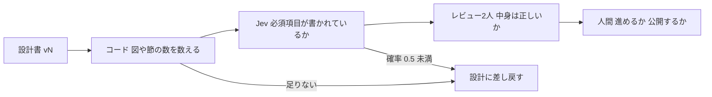

今回の最も重要なポイントを結論から申し上げます。それは、成果はトークン単価ではなく、仕事単位で測ることです。

前回（#3）は、レビューの合格の基準とやり直しを5回までにした理由、止まった子エージェントの見方を書きました。今回は、その仕組みで回した4つの仕事を数えます。

## この回の4点

| 困っていたこと | 人間が決めたこと | AI部下がやったこと | 結果 |
| --- | --- | --- | --- |
| 子エージェントとのやり取りは「かなり時間がかかる」と感じていた | 仕事単位で測る。レビューの前のチェックにJevを試す。レビューの2人を対話させる | B-4・C-5・C-6・B-5の4つの仕事で、設計・レビュー・やり直しを回し、結果をファイルに残した。B-5ではレビューの2人が対話してから判定した | 4つとも1〜3回のやり直しで合格した。Jevのチェックは過去の設計書7本とC-6の4版で、差し戻しは0回。手が空く、1人のClaudeより手戻りが減る、は私の実感で、数字では比べていない |

## noteのもう1つの結論に答える

#1で挙げたnote「AIの値崩れが始まりコレからどうなるのか？」（2026年9月25日）の結論のうち、今回は2つ目に答えます。

「トークン単価ではなく、仕事単位で成果を測る時代」

ここでいう仕事は、1つの指示から合格して片付くまでのまとまりで、OrcaではRun（作業のまとまり）として結果のファイルが残ります。

## 何を測ったか

測ったのは、Runごとの次の数字です。

- 設計書（C-5・C-6では構成案）の版の数と、レビューの回数・合否
- 重大な指摘（直さないと受け入れ条件を満たさないとされた指摘）の数
- 時間
- 使用量（AIの契約ごとの、5時間枠と週の枠の何%を使ったか）

トークン数（AIが読み書きした量）は数えていません。3社とも定額のプランで、トークン数を取れないからです。使用量は`orca account list`で見られる%で示します。

時間はファイルの更新時刻から出しました。子が書き終えた時刻なので、立ち上がりの待ちも含みます。

対象は次の4つの仕事です。

- B-4：読書カードの採点APIの堅牢化。レビューはCodex（OpenAI）とGemini（Google。Antigravity CLI）
- C-5：Qiita連載（EX領収書自動出力編）の構成案づくり。レビューは最初CodexとGemini、2版目からGeminiをClaude Sonnet（Anthropic）に替えた
- C-6：連載の構成案づくり。レビューはClaude OpusとSonnetの2人。レビューの前にJevのチェックも入れた
- B-5：読書ナレッジ（mybrain）の設計案。レビューは最初Claude SonnetとCodex、最後はCodexとGeminiを対話させた

## B-4：Codexが3回止め、4版目で合格した

B-4は10月2日に回しました。設計書の1版目が15:33、4版目のレビューで2人とも合格したのが16:50です。約1時間17分で、やり直しは3回でした。

1〜3版目は、毎回Codexだけが重大な指摘を出して不合格になりました。Geminiは4回とも合格としました。合格の線は「2人とも重大な指摘なし」なので、片方が重大とすれば不合格です。

```mermaid
gantt
  title B-4 設計から本番デプロイまで（2026-10-02）
  dateFormat HH:mm
  axisFormat %H:%M
  section 設計とレビュー
  v1 と レビュー 不合格 : a1, 15:33, 15:40
  v2 と レビュー 不合格 : a2, 15:46, 15:52
  v3 と レビュー 不合格 : a3, 16:05, 16:22
  v4 と レビュー 合格 : a4, 16:31, 16:50
  section 実行と検証（時刻の点だけ）
  設計合格 : milestone, m0, 16:50, 0m
  コードレビュー c1 合格 : milestone, m2, 19:03, 0m
  本番デプロイ 私の承認後 : milestone, m1, 19:09, 0m
  テスト強化の c2 合格 : milestone, m3, 19:22, 0m
```



棒は「設計書の版を書いた時刻から、2人目のレビューが書き終わった時刻まで」です。設計の合格のあと、実装をいつ始め、どこで待っていたかはファイルの時刻からは分からないので、点だけを置きました。コードのレビュー（c1）は1回で2人とも合格し、19:09に私が承認して本番に出しました。テストは83件です。

## C-5：2版目からSonnetに替え、3版目で合格した

C-5の1版目は、2人とも不合格でした。重大な指摘はCodexが6件、Geminiが3件で、Geminiの3件はCodexの1〜3件目と重なっています。1版目のあと、AI部下からの質問に私が答えてから2版目に進んだので、1版目からの時間は比べる材料に使いません。

2版目からは、Geminiの代わりにSonnetをレビューに入れました。Geminiは新しい種類のコマンドのたびに承認を求め、司令塔から送ったキー入力がその画面に届かなかったからです（この判断は#3に書きました）。

2版目はCodexが合格、Sonnetが重大な指摘1件（引用の候補に実在の会社名が入っていた）で不合格。3版目で2人とも合格しました。2版目（10月3日00:03）から合格（00:55）までは約52分です。

## C-6：Claudeの2人とJevのチェックで回した

C-6は、連載の構成案づくりです。構成案をAI部下（設計1人・レビュー2人）に作らせ、私がチェックしました。レビューを全部Claudeの2人にする構成（`--agents claude`）と、レビューの前のJevのチェック（`--precheck`）は、この仕事で初めて使いました。

Runを作ったのは10月3日01:28です。このときClaudeの5時間枠は65%、週の枠も65%を使っていました（Codexは5時間枠13%・週5%）。手順書の決まり（使用量が5時間枠の70%を超えていたら、始める前に私に伝える）の線より下です。それでも私は、04:30に5時間枠が戻るまで、子を立ち上げずに待つことにしました。

構成案の段階の結果は次のとおりです。

| 版 | Opus | Sonnet | 重大な指摘 | Jevのチェック |
| --- | --- | --- | --- | --- |
| 1版目 | 不合格（重大2） | 不合格（重大3） | 5件（2人の指摘は重ならなかった） | 通過 |
| 2版目 | 不合格（重大2） | 合格 | 2件 | 通過 |
| 3版目 | 合格（同じ箇所を軽微とした） | 不合格（重大1） | 1件 | 通過 |
| 4版目 | 合格 | 合格 | 0件 | 通過 |

指示を書いたのが06:11、1版目が06:20、4版目のレビューで2人とも合格したのが06:44です。指示から約33分、1版目から約24分で、やり直しは3回でした。レビュー1回は約2〜6分でした（レビューの前のJevのチェック、1回1.4〜1.6秒を含みます）。

## B-5：対話させて、2版目で合格した

B-5は、私の読書ナレッジ（mybrain）のフォルダ構成とコマンドの設計案です。10月3日の夜に回しました。この仕事の途中で、レビューの2人を対話させる形に変えています。

| レビュー | 誰が | 結果 |
| --- | --- | --- |
| 1版目（20:41〜20:43） | Claude SonnetとCodex。お互いを見ずに | Sonnetは重大1件、Codexは重大6件（1件はSonnetと同じ）で不合格 |
| 2版目（21:36） | 同じ2人。お互いを見ずに | Sonnetは合格、Codexは重大1件で不合格 |
| 2版目の対話つき（22:48〜22:58） | CodexとGemini。お互いを見ずに書いたあと、2往復の対話 | 2人とも合格、重大0件 |

1版目と2版目のCodexは、Orcaの子ではなく、1回だけ呼び出してレビューを返させる形で試していました。

2版目でCodexが出した重大な指摘は、設計案の誤りではありません。原因は指示文でした。司令塔がCodexに渡した指示文では、私の決めごと「mybrainの直下に置いた私のメモは移さない」を、「直下のファイルは触らない」と広く書いていました。Codexはそれを読み、手順書のファイルを直す計画も決めごとに反する、と判断していました。指示文を決めごとどおりに直すと、同じ設計案のまま、2人とも合格しました。レビューの結果は、渡す指示文の書き方にも左右されます。

対話つきのレビューでは、22:52から22:57までに6通をやり取りしました。立ち上げから2人の報告まで約10分です。このときは2人とも重大な指摘がなく、対話は同意と補足だけで終わりました（#2）。Geminiは承認で3回止まり、そのたびに私が選びました（#3）。

なお、1版目から2版目の間と、2版目のレビューのあとには、私が仕組みを直していた時間が入っています。合格までの時間は比べる材料に使いません。

4つの仕事を並べます。

| | B-4 | C-5 | C-6 | B-5 |
| --- | --- | --- | --- | --- |
| 題材 | 採点APIの堅牢化（コード） | 連載の構成案 | 連載の構成案 | 読書ナレッジの設計案 |
| レビューの2人 | Codex＋Gemini | Codex＋Gemini → 2版目からCodex＋Sonnet | Opus＋Sonnet（＋Jevのチェック） | Sonnet＋Codex → 対話つきはCodex＋Gemini |
| 版の数 | 4 | 3 | 4 | 2 |
| 不合格の回数 | 3 | 2 | 3 | 2（1回は指示文の書き方が原因） |
| 重大な指摘の数（版ごと） | 2・1・1・0（すべてCodex） | 6（Geminiの3件は重なり）・1・0 | 5・2・1・0 | 6（Sonnetの1件は重なり）・1・0（B-5はレビューごと） |
| 合格までの時間（起点は仕事ごとに違う） | 1版目から約1時間17分 | 2版目から約52分 | 1版目から約24分 | 途中で仕組みを直していたので比べない |
| レビュー1回 | 4〜19分 | 5〜40分 | 約2〜6分 | 約2分（2版目）・約10分（対話つき） |
| Jevのチェックの差し戻し | 使っていない | 使っていない | 4回とも通過、0回 | 使っていない |
| 使用量（Claude） | 測っていない | 測っていない | Runを作ったとき（01:28）5時間枠65%・週65%。構成案を始めたとき（06:10）6%・週66% → 合格直後（06:45）98%・週80%（C-5のRunと同時）。終了時は測っていない（後の段階が混ぶ） | 測っていない |

C-6のレビュー1回は、B-4・C-5より短く出ています。思い当たるのは承認です。Claudeの子はauto mode（Claude Codeが決まった範囲の操作を自分で進める設定）で動いていて、C-5では承認画面で一度も止まりませんでした。Codexの子は、Orcaと連絡するコマンドのたびに承認画面で止まり、司令塔が画面を読んで承認していました。

ただ、題材も仕事ごとに違うので、この数だけでは時間の差がどこから来たのかを分けられません。同じ会社のモデル2人で見落としの傾向が似るのかどうかも、1回では言えません。C-6の1版目では、2人の重大な指摘は1件も重なりませんでした。


*C-6のRunのフォルダから、構成案の段階のファイルだけを並べた一覧です。時刻は10月3日の06:20〜06:45。ユーザー名は隠しています*

## 「特に効いた印象はない」と、Codexが止めたケース

B-4でCodexが出した重大な指摘は、私も読んでいました。不合格の理由を確かめたうえで、見逃さずにやり直してもらっています。

それでも、とくにこれが効いたという印象はありません。子エージェントとのやり取りは、全体にかなり時間がかかる印象です。基準だけ渡して最も高い確率を瞬時に返すJevを埋め込むのもありか、と考えています。

ただ、指摘を見返すと、Codexは設計の段階で壊れるケースを3回続けて挙げていました。

- 1版目：補完（カードの空欄をAIが埋める処理）をやり直すと、先に保存された内容が壊れる。不正なUnicodeの文字が入ると、400ではなく500のエラーになる
- 2版目：補完済みかどうかの判定が広すぎて、補完済みのカードを未補完と取り違え、上書きが起きる
- 3版目：古い形式のカードの判定が、具体的に書いた回答にも当てはまってしまう

1版目の不正なUnicodeの件は、Codexが標準ライブラリだけで手元で動かし、エラーになることを確かめていました。2版目と3版目の2件も、外部と通信しない実験で問題を再現しています。1版目の補完の件だけは、コードの行を挙げた指摘で、動かして確かめた跡はありません。

B-4のコードのレビュー（c1）は1回で2人とも合格しました。ただ、設計で直したからコードのレビューが1回で通った、とまでは言えません。

Codexは壊れるケースを3回止めました。それでも、私にはとくにこれが効いたという印象がありません。どちらも、このまま書いておきます。

## 「生産性」の意味

#1で書いた「品質と生産性爆上がり」の生産性は、終わるまでの時間が短くなる、という意味ではありません。

意味は2つです。

- 終わるまでの時間は長くかかっても、その間に私の手が空くこと
- 1人のClaudeに任せるより、やり直しや手戻りが減ること

1つ目について、C-6のRunで私が入ったのは、最初にAI部下の質問に答えて連載の形を決めたとき、04:30まで待つと決めたとき、分解案へのOK、構成案が合格したあとに中身を確かめて答えたとき、などです。

2つ目は、1人のClaudeで同じ仕事をして比べてはいません。私の実感です。

## 費用：定額3つに、Claudeのクレジットを少し足す程度

契約は、Claude・OpenAI・Geminiとも月額3,000円程度の定額です。CodexはOpenAIのPlus、GeminiはGoogle AI Pro、ClaudeはProプランで使っています。ふだんの仕事を回すだけなら、この範囲でできる、と感じています。

ただ、`orca account list`で見ると、C-6の構成案が合格した直後（10月3日06:45）に、Claudeの5時間枠が98%、週の枠が80%になっていました。このときはC-5のRunも同じ時間に動いていたので、1つのRunでどれだけ使ったかは分けられません。構成案の段階（06:10〜06:45）のClaudeの使用量の増分は5時間枠で約32%（06:10時点の6%→06:45時点の98%。ただし06:45時点はC-5を含む）、週の枠で14%（66%→80%）です。


*Orcaの画面の下の帯には、契約ごとの使用量が出ます。左からClaude、Codex、Gemini、Antigravityです。10月3日22:21、B-5の対話つきレビューを回していたときのものです*

この時点で、Claudeは5時間枠を使い切っていました（あと1時間18分で戻る表示です）。画面には「Now using usage credits」と出ていて、5時間枠を超えた分を、クレジット（追加の利用分）で使い続けている状態でした。週の枠は38%でした。Codexは5時間枠6%・週1%、GeminiとAntigravityは0%です。この日は昼から夜まで、Claudeで仕組みを直しながら、子エージェントを何人も立ち上げていました。

子エージェント同士が対話する仕組みを作って回すなら、費用の目安は、ClaudeのProプランにクレジットを多少足す程度だと考えています。CodexとGeminiの枠は、ほとんど減っていませんでした。

## Jevへの期待と、測った結果

Jevは、TypeSafeが早期アクセスで出している、判断に特化したAIのモデルです。質問に「はい」の確率で答えます。Jevがうまく使えれば、トークンと時間の両方を減らせるかもしれない、と私は期待しています。

そこで、設計書に必須の項目が書かれているかをレビューの前にJevに聞くチェック（precheck）を入れることにしました。入れると決めたのは私で、チェックの道具はAI部下に作ってもらいました。欠けていれば、レビューの2人を呼ばずに設計担当へ戻します。数えるのはコード、書かれているかを見るのはJev。この分け方を、道具`precheck.py`の説明文（12〜17行目）から載せます。

```text:precheck.py
Jev cannot count, so anything countable (blocks, headings, list items) belongs in `count`. Items with the same `section` go in one
request whose state is only that section (heading through the next heading of the same or higher level);
items without `section` see the whole document. A state over CHUNK_CHARS is split at "## " headings
and the highest probability across the parts counts.
Verdict: "return" if any item's probability < threshold (send back to the author, skip the reviewers),
else "pass". Jev only checks presence; correctness stays with the reviewers.
```

最初の文は「Jevは数えられないので、数えられるもの（ブロック、見出し、箇条書き）は`count`で数える」、`section`の説明の部分は「同じ節（section）の項目は、その節だけを読ませて1回で聞く。節の指定がない項目は文書全体を読ませる。長すぎる文書は『## 』の見出しで分け、分けた中で一番高い確率を使う」、「Verdict」の2行は「1つでも確率がしきい値を下回れば差し戻し。Jevは『あるか』だけを見て、正しいかはレビューの2人に残す」という意味です。しきい値は0.5です。

最初に、B-4とC-5の過去の設計書7本にこのチェックを当てました。試験の結果をまとめたファイル（`results.md`の8〜16行目）から、表を載せます。

| 設計書 | 実際のレビュー | precheck | 一番低い確率 | Jevへの送信 |
|---|---|---|---|---|
| B-4 v1 | 不合格（Codex重大2：補完の再試行で内容が壊れる・不正なUnicodeで500） | 通過 | 0.89 | 1回・16,405トークン |
| B-4 v2 | 不合格（Codex重大1） | 通過 | 0.94 | 1回・24,759 |
| B-4 v3 | 不合格（Codex重大1） | 通過 | 0.95 | 1回・32,303 |
| B-4 v4 | 合格 | 通過 | 0.93 | 2回に分割・38,026（1回では`max_tokens_exceeded`） |
| C-5 v1 | 不合格（重大6：コードと違う説明など） | 通過 | 0.92 | 6回（節ごと）・26,718 |
| C-5 v2 | 不合格（Sonnet重大1：引用に実在の会社名） | 通過 | 0.92 | 6回・28,945 |
| C-5 v3 | 合格 | 通過 | 0.91 | 6回・29,819 |

「Jevへの送信」は、Jevに送った回数と、読ませた量（トークン）です。`max_tokens_exceeded`は、1回に送れる量を超えたという返事で、約3万トークンは通り、約5万トークンは断られました。

7本とも通過です。不合格になった版の理由は、どれも中身の誤り（コードと合わない、壊れるケースの見落とし、会社名）で、必須の項目はそろっていました。このチェックで省けたレビューは0回です。

次に、わざと不完全にした版を当てました。こちらの表は、同じファイルの結果を私の言葉でまとめ直したものです。

| 加工 | 結果 | 見つけたのは |
|---|---|---|
| 必須の節を2つ、見出しごと削除 | 差し戻し（2項目が0.0） | コード（見出しが見つからない） |
| 必須の節の見出しを残し、本文を「（未記入）」に | 差し戻し（0.05） | **Jev** |
| Mermaidの図を9個中8個削除し「各記事に図があるか」と聞く | 通過（0.95） | 見抜けない（Jevは数えられない） |
| Mermaidの図を全部削除 | Jevでは通過（0.96。本文に図の説明が残るため）→ コードで数える項目に替えると差し戻し（0個） | コード |

本文が空の節はJevが差し戻しました。図の数はJevでは数えられず、コードで数えると差し戻せました。この試験は全部で52回Jevに送り、約2円、1回の平均は0.3秒でした。料金は、Jevを呼ぶ部品`jev_client.py`に書いてあります（11行目）。

```text:jev_client.py
Pricing (2026-09): input $0.042 per 1M tokens, output free.
```

読ませた量100万トークンあたり0.042ドルで、返事には料金がかかりません。日本語の判断も事前に試していて、20件・39の判断のうち38がClaudeの判断と一致しました。

C-6では、構成案の4つの版すべてに、レビューの前にこのチェックをかけました。4版目の結果のファイルから、判定と回数・量・時間の部分を載せます（`precheck-v4.json`の3〜4行目と59〜62行目）。

```json:precheck-v4.json
  "verdict": "pass",
  "threshold": 0.5,
  …（中略：項目ごとの確率）
  "requests": 6,
  "input_tokens": 33262,
  "usd": 0.001397,
  "seconds": 1.61
```

4つの版は、どれも6回に分けて送り、すべて通過しました。合わせて24回、124,355トークン、0.005223ドル（1円に届きません）、6.19秒です。一番低い確率は、1版目が0.88、2〜4版目が0.92でした。

省けたレビューは0回です。1・2版目のレビューのまとめを見返すと、重大な指摘はどれも中身の誤りで、precheckでは拾えないものでした。


*4版目のprecheckの結果のファイルです。3〜4行目と59〜62行目を並べ、間は省きました。2行目のファイルのパスは隠しています*

ここまでで分かったのは、役目の分け方です。



Jevのチェックは1本1〜2秒、費用は1円に届きません。レビュー1回は子2人で数分から40分かかるので、必須の項目が抜けた版が出れば、レビュー1回分を省けます。Jevのチェックを入れた仕事では、そういう版は出ませんでした。

## この回のマネージャーの仕事

仕事単位で測ると決め、Jevをレビューの前に試すと決め、C-6を5時間枠が戻るまで待たせたのは私です。数字を読んで、効いたか・効かなかったかを決めるのも私です。今回は、指摘を読んでやり直させたことと、とくにこれが効いた印象はないことを、両方そのまま書きました。

AI部下がやったのは、4つの仕事で設計書や構成案を書き、レビューし、やり直したことです。B-5では、レビューの2人が直接やり取りしてから判定しました。この回の数字は、Runごとに残る版・レビューの結果・precheckの結果のファイルと、Jevの試験の結果`results.md`の時刻と判定から数えました。

## 次回

この回で、Orca編は終わりです。

## 参考

- note「AIの値崩れが始まりコレからどうなるのか？」：https://note.com/horiken1977/n/n8185a5c0b75d
- Claudeの料金：https://claude.com/pricing
- Mermaidガントチャート：https://mermaid.js.org/syntax/gantt.html
